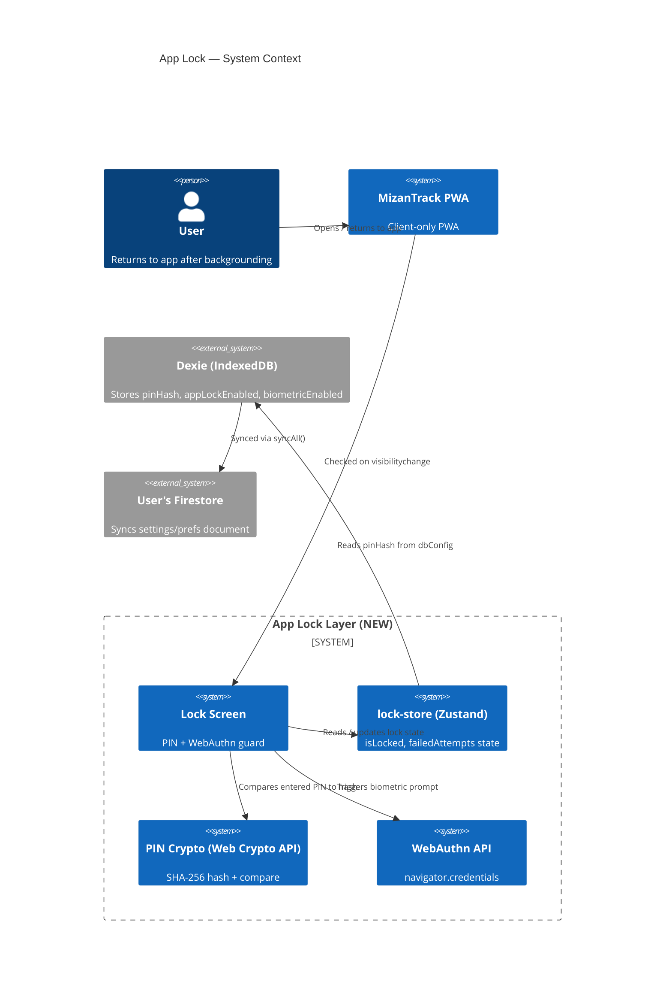
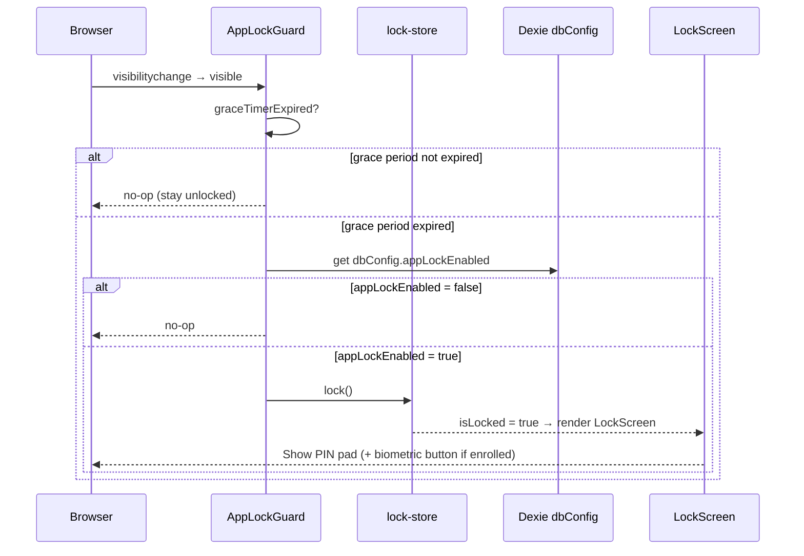
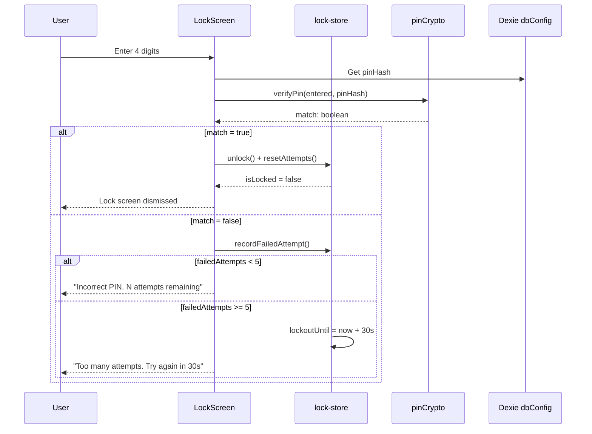
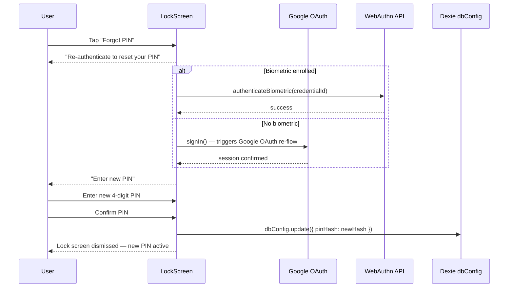
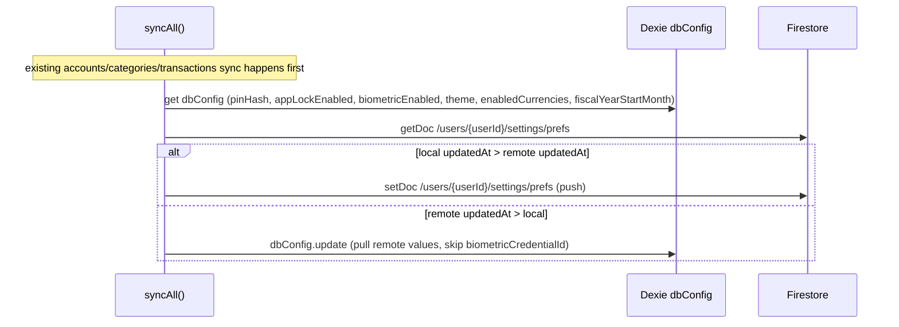

# Technical Design: App Lock — PIN Code & Biometric Authentication

**Document Version:** 1.0  
**Last Updated:** 2026-07-04  
**Mode:** New Feature  
**PRD Reference:** docs/app-lock/prd.md  
**Repository:** mizantrack

---

## Table of Contents

1. [Executive Summary](#1-executive-summary)
2. [Requirements Summary](#2-requirements-summary)
3. [Architecture — Phase 1](#3-architecture--phase-1)
   - [System Context](#31-system-context)
   - [High-Level Architecture](#32-high-level-architecture)
   - [Technology Decisions](#33-technology-decisions)
   - [Key Design Decisions](#34-key-design-decisions)
4. [Data Design](#4-data-design)
5. [Component Design](#5-component-design)
6. [Sequence Diagrams](#6-sequence-diagrams)
7. [Security Considerations](#7-security-considerations)
8. [Testing Strategy](#8-testing-strategy)
9. [Implementation Plan](#9-implementation-plan)
10. [Open Questions & Assumptions](#10-open-questions--assumptions)

---

## Document Change Log

| Version | Date       | Author             | Changes       |
|---------|------------|--------------------|---------------|
| 1.0     | 2026-07-04 | Salman Zahid Latif | Phase 1 draft |

---

## 1. Executive Summary

App Lock adds a **client-side PIN + biometric authentication layer** on top of Google OAuth. Once a user has signed in with Google, reopening or returning to the app after it has been backgrounded triggers a lock screen. The user must enter their PIN (or use Face ID / fingerprint via WebAuthn) to continue.

All lock logic runs entirely in the browser with zero server involvement. The PIN is stored as a SHA-256 hash in Dexie `dbConfig` and synced to the user's own Firebase Firestore alongside financial data. The Google OAuth session is not invalidated — App Lock is a **presentation-layer guard**, not a session gate.

The settings sync extension ensures theme, PIN state, biometric enabled flag, and enabled currencies are restored when the user signs in on a new device.

---

## 2. Requirements Summary

Derived from `docs/app-lock/prd.md`.

**Functional (must-have):**
- Lock screen shown on every app return after background (30-second grace period)
- PIN (4-digit): create, change, remove via Settings
- Biometric via WebAuthn (Face ID / fingerprint) as first-choice on supported devices; PIN fallback
- Max 5 failed PIN attempts → 30-second lockout with countdown
- PIN recovery: sign out + clear local Dexie data (user warned explicitly)
- Settings sync: `pinHash`, `appLockEnabled`, `biometricEnabled`, `theme`, `enabledCurrencies`, `fiscalYearStartMonth` pushed/pulled via existing `syncAll()`

**Non-functional:**
- Lock screen renders < 100ms from app return (purely local, no network call)
- PIN hash comparison synchronous (Web Crypto `digest()` is async but < 1ms)
- Zero financial data visible before authentication
- Full offline support — PIN unlock works without internet

**Constraints:**
- No new server infrastructure
- No third-party auth library for biometrics — Web Authentication API (WebAuthn) only
- WebAuthn requires HTTPS (✅ Vercel provides this)

---

## 3. Architecture — Phase 1

### 3.1 System Context

The App Lock feature adds a **new client-side layer** between the router/middleware and the rendered app shell. No server components are affected.



### 3.2 High-Level Architecture

App Lock sits as a **wrapper component** rendered inside `AppShell` — above all page content. It is invisible when unlocked and covers the full viewport when locked.

```mermaid
graph TD
  subgraph "Next.js App Router"
    MW[proxy.ts\nEdge Middleware\nGoogle session check]
    AppLayout["(app)/layout.tsx\nServer Component\nauth() call"]
    AppShell[AppShell.tsx\nClient Component\nNEW: mounts AppLockGuard]
  end

  subgraph "App Lock Layer (NEW)"
    ALG[AppLockGuard\nvisibilitychange listener\nrenders LockScreen when locked]
    LS[LockScreen\nPIN pad + biometric button]
    LStore[lock-store\nZustand\nisLocked, failedAttempts, lockoutUntil]
    PinCrypto[pinCrypto.ts\nSHA-256 hash / compare\nWeb Crypto API]
    WebAuthn[webAuthn.ts\nregister / authenticate\nnavigator.credentials]
  end

  subgraph "Existing Layers"
    Pages[Page Components]
    Dexie[(Dexie IndexedDB\ndbConfig: pinHash, appLockEnabled)]
    SyncAll[syncAll()\nextended to sync settings/prefs]
    Firestore[(User Firestore\n/users/uid/settings/prefs)]
  end

  MW --> AppLayout
  AppLayout --> AppShell
  AppShell --> ALG
  ALG -->|locked| LS
  ALG -->|unlocked| Pages
  LS --> LStore
  LS --> PinCrypto
  LS --> WebAuthn
  LStore --> Dexie
  PinCrypto --> Dexie
  SyncAll --> Dexie
  SyncAll --> Firestore
```

**Lock trigger mechanism:**
```
document.addEventListener('visibilitychange', () => {
  if (document.visibilityState === 'hidden') {
    startGraceTimer(30_000)           // 30-second grace period
  } else {
    if (graceTimerExpired && appLockEnabled) {
      lockStore.lock()                 // shows LockScreen
    }
  }
})
```

This is mounted in `AppLockGuard` on client-side only.

### 3.3 Technology Decisions

| Concern | Choice | Rationale |
|---|---|---|
| PIN hashing | Web Crypto API (`crypto.subtle.digest('SHA-256', ...)`) | Built-in browser API; no library; HTTPS only (already required) |
| Biometric | Web Authentication API (WebAuthn) — `navigator.credentials.create/get` | Native browser API; triggers OS Face ID / fingerprint; no SDK |
| Lock state | New Zustand `lock-store` | Consistent with existing state pattern; reactive to UI |
| Settings sync | Extend `syncAll()` to push/pull one Firestore document | Reuses all existing sync infrastructure; no new code paths |
| PIN storage | `dbConfig.pinHash: string` (SHA-256 hex) | Fits existing `dbConfig` shape; syncs with same mechanism |

### 3.4 Key Design Decisions

| Decision | Choice | Rationale |
|---|---|---|
| Lock trigger threshold | 30-second grace period after `visibilitychange → hidden` | Prevents annoying lock on accidental tab switch; still protects on genuine background |
| PIN length | 4 digits | Simpler UX; standard for finance apps; SHA-256 hash makes brute-force impractical within the lockout window |
| PIN recovery | Re-authenticate via **Google OAuth re-sign-in** or **biometric** (if enrolled), then enter new PIN — **no data loss** | Better UX; user keeps all local data; Google session re-validates identity |
| Settings sync document path | `/users/{userId}/settings/prefs` (single Firestore document) | One doc = one read + one write per sync cycle; minimal cost |
| WebAuthn credential scope | Device-local only — `pinHash` syncs to Firebase; WebAuthn `CredentialId` does NOT | Credentials are hardware-bound; syncing them would be meaningless and potentially a security risk |
| `biometricEnabled` flag in settings | Synced as `true/false`; biometric re-enrollment required on new device | On a new device, the flag tells the UI to show the "enroll biometric" prompt; the actual credential is re-created locally |

---

## 4. Data Design

### 4.1 `DbConfig` Changes (extend existing record)

No new Dexie table. `dbConfig` (keyed by `userId`) gains new optional fields:

| Field | Type | Default | Description |
|---|---|---|---|
| `pinHash` | `string \| undefined` | `undefined` | SHA-256 hex of the 4-digit PIN. Absent = no PIN set |
| `appLockEnabled` | `boolean` | `false` | Whether the lock screen is shown on app return |
| `biometricEnabled` | `boolean` | `false` | Whether biometric was enrolled on this device |
| `biometricCredentialId` | `string \| undefined` | `undefined` | WebAuthn Base64 CredentialId (device-local only — NOT synced to Firebase) |

**Dexie migration:** `version(2)` migration is a no-op (new optional fields on existing table — IndexedDB is schema-less for document fields).

### 4.2 Firestore `settings/prefs` Document

New sub-collection path: `/users/{userId}/settings/prefs`

```
{
  pinHash:              string | null,
  appLockEnabled:       boolean,
  biometricEnabled:     boolean,       // flag only — no credential bytes
  theme:                "light" | "dark" | "system",
  enabledCurrencies:    string[],
  fiscalYearStartMonth: number
}
```

**Sync conflict resolution:** last-write-wins on `updatedAt` timestamp (same strategy as all other collections). The `prefs` document carries a top-level `updatedAt: number` field.

**NOT synced from `dbConfig` to Firebase:** `firebaseConfig`, `enabled`, `goldApiKey`, `lastGoldPricePerGram`, `lastGoldPriceFetchedAt`, `biometricCredentialId`.

### 4.3 `lock-store` Zustand Shape

```typescript
interface LockStore {
  isLocked: boolean;
  failedAttempts: number;
  lockoutUntil: number | null;   // Unix ms timestamp or null

  lock: () => void;
  unlock: () => void;
  recordFailedAttempt: () => void;
  resetAttempts: () => void;
}
```

---

## 5. Component Design

### New Files

| File | Responsibility |
|---|---|
| `src/lib/pinCrypto.ts` | `hashPin(pin: string): Promise<string>` and `verifyPin(pin: string, hash: string): Promise<boolean>` using Web Crypto |
| `src/lib/webAuthn.ts` | `registerBiometric(): Promise<string>` and `authenticateBiometric(credentialId: string): Promise<boolean>` via `navigator.credentials` |
| `src/store/lock-store.ts` | Zustand store for `isLocked`, `failedAttempts`, `lockoutUntil` |
| `src/components/layout/AppLockGuard.tsx` | Client component; mounts `visibilitychange` listener; renders `<LockScreen>` when locked |
| `src/components/layout/LockScreen.tsx` | Full-viewport PIN pad + biometric button; reads from `lock-store`; calls `pinCrypto` / `webAuthn` |
| `src/components/settings/AppLockSettings.tsx` | Settings section for PIN setup, change, remove; biometric toggle |

### Modified Files

| File | Change |
|---|---|
| `src/components/layout/AppShell.tsx` | Mount `<AppLockGuard>` as the first child (wraps page content) |
| `src/lib/db/sync.ts` | Extend `syncAll()` to push/pull `/users/{userId}/settings/prefs` |
| `src/app/(app)/settings/page.tsx` | Add `<AppLockSettings>` section |
| `src/types/index.ts` | Add new optional fields to `DbConfig` interface |

---

## 6. Sequence Diagrams

### 6.1 App Return → Lock Screen



### 6.2 PIN Unlock



### 6.3 Forgot PIN Recovery



### 6.4 Settings Sync (Extended)



---

## 7. Security Considerations

| Threat | Mitigation |
|---|---|
| PIN brute-force | 5-attempt lockout with 30s cooldown; SHA-256 makes offline attacks computationally expensive |
| PIN in plaintext in storage | Web Crypto `digest('SHA-256')` before any write; plaintext never touches Dexie or Firestore |
| Financial data visible before auth | `AppLockGuard` renders `LockScreen` as a full-viewport overlay; Next.js page content is in the DOM but hidden (`display: none` or portal above z-index) |
| WebAuthn credential exfiltration | Credential bytes (`CredentialId`, raw key) never leave the device; only `biometricEnabled: boolean` is synced |
| PIN recovery — no data loss | User re-authenticates via Google OAuth or enrolled biometric; only then can set a new PIN. Local Dexie data is preserved. |

**OWASP additions:**
- A02 Cryptographic Failures: SHA-256 via Web Crypto (browser-native, no weak algorithm)
- A07 Auth Failures: lockout after 5 attempts prevents online brute-force

---

## 8. Testing Strategy

| Layer | Tests |
|---|---|
| Unit | `pinCrypto.ts`: `hashPin` produces correct SHA-256; `verifyPin` returns true for matching PIN, false otherwise |
| Unit | `lock-store`: `recordFailedAttempt` increments counter; after 5 sets `lockoutUntil` |
| Integration | `AppLockGuard`: mock `visibilitychange`; assert `LockScreen` renders when `appLockEnabled=true` and grace period expired |
| Integration | `syncAll` extension: assert `settings/prefs` doc is pushed/pulled; `biometricCredentialId` is never written to Firestore |
| E2E | (Playwright) Set PIN in settings → background app → return → enter PIN → verify access |

---

## 9. Implementation Plan

| Phase | Tasks |
|---|---|
| 1 — Crypto & Store | `pinCrypto.ts`, `lock-store.ts`, extend `DbConfig` type, Dexie no-op v2 migration |
| 2 — Lock Screen UI | `AppLockGuard.tsx`, `LockScreen.tsx` (PIN pad, lockout countdown), mount in `AppShell` |
| 3 — Settings | `AppLockSettings.tsx`: set/change/remove PIN; biometric toggle (WebAuthn enrollment) |
| 4 — Biometric | `webAuthn.ts`: register + authenticate; integrate into `LockScreen` |
| 5 — Settings Sync | Extend `syncAll()` to handle `settings/prefs` document; update `sync.ts` types |
| 6 — Tests | Unit + integration tests per §8 |

**Technical Risks:**

| Risk | Impact | Mitigation |
|---|---|---|
| WebAuthn on iOS PWA (Safari) varies by iOS version | High | Tech spike: test Face ID on iOS 16, 17, 18 before committing to biometric feature |
| `visibilitychange` unreliable on some Android browsers | Medium | Also listen to `pagehide` and `beforeunload` as fallback |
| SHA-256 async timing (< 1ms but still async) | Low | `await` in PIN verify handler; UX unaffected |

---

## 10. Open Questions & Assumptions

| # | Item | Status |
|---|---|---|
| A | Grace period = 30 seconds before lock appears | **Confirmed** |
| B | PIN recovery = re-authenticate via Google or biometric → reset PIN, **no data loss** | **Confirmed** |
| C | PIN length = 4 digits | **Assumed** — confirm |
| D | Settings sync: `biometricCredentialId` never synced | **Decided** — device-local only |
| E | On new device: biometric re-enrollment prompted if `biometricEnabled = true` from sync | **Decided** |
| F | Forgot PIN recovery = re-authenticate (Google/biometric) then reset PIN; no data loss | **Confirmed** |
