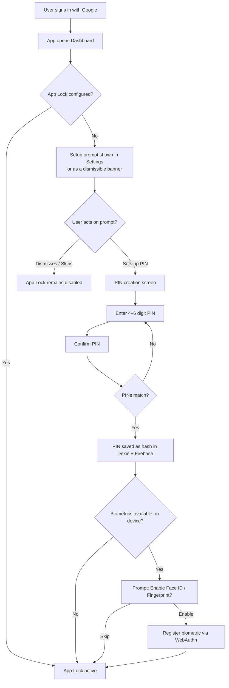
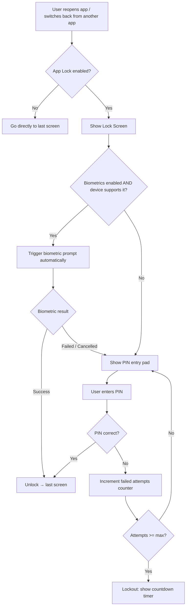

# Product Requirements Document (PRD)

**Feature:** App Lock — PIN Code & Biometric Authentication  
**Product:** MizanTrack  
**Version:** 1.0  
**Date:** 2026-07-04  
**Owner:** Salman Zahid Latif  
**Status:** Draft

---

## Table of Contents

- [1. Executive Summary](#1-executive-summary)
- [2. Problem Statement](#2-problem-statement)
- [3. Goals & Non-Goals](#3-goals--non-goals)
- [4. User Flows](#4-user-flows)
- [5. Functional Requirements](#5-functional-requirements)
- [6. User Interface (UI) Design](#6-user-interface-ui-design)
- [7. Non-Functional Requirements](#7-non-functional-requirements)
- [8. Success Metrics](#8-success-metrics)
- [9. Open Questions / Risks](#9-open-questions--risks)

---

## Document Change Log

| Version | Date       | Author             | Changes         |
|---------|------------|--------------------|-----------------|
| 1.0     | 2026-07-04 | Salman Zahid Latif | Initial draft   |

---

## 1. Executive Summary

MizanTrack currently relies solely on Google OAuth for authentication. Once a user is signed in, the app is immediately accessible on any device without further verification. This creates a privacy risk — anyone who picks up an unlocked device can view all financial data.

This feature adds a **local App Lock layer** on top of Google OAuth: a PIN code screen and optional biometric authentication (Face ID on iPhone, fingerprint on Android) that protects the app each time it is reopened after being backgrounded or closed. A settings sync mechanism ensures PIN-enabled state and user preferences (theme, biometric preference) are persisted to the user's own Firebase so they are restored when a user signs in on a new device.

---

## 2. Problem Statement

| Pain Point | Description |
|---|---|
| No local access barrier | After Google sign-in, any person with physical access to the device can open the PWA and see all financial data. |
| No session expiry | There is no timeout or re-authentication prompt — the session persists indefinitely. |
| Settings lost on new device | User preferences (theme, currency, biometric preference) are stored only in local IndexedDB. Signing in on a new device resets all preferences. |

---

## 3. Goals & Non-Goals

### Goals

- Add a PIN code lock screen shown every time the user returns to the app after it has been backgrounded or closed.
- Support biometric authentication (Face ID / Touch ID on iOS, fingerprint on Android) as an alternative to PIN entry.
- Require setup of PIN on first use if not already configured; allow skip (opted-out users receive no lock screen).
- Store the PIN hash and settings-sync preferences in the user's own Firebase Firestore so preferences are restored on new devices.
- Sync user preferences (theme, enabled currencies, biometric-enabled flag) to Firebase alongside financial data.

### Non-Goals

- Replacing Google OAuth — app lock is a *second layer*, not an alternative to Google sign-in.
- Enforcing PIN on first Google sign-in (lock screen appears only on subsequent app opens).
- Storing biometric credentials in Firebase — biometrics are device-local by design; only the "biometric enabled" flag is synced.
- Multi-user PIN support (single user per device only).
- Forgot PIN → re-authentication flow requiring manual data reset is out of scope for v1. [TBD: define recovery path]

---

## 4. User Flows

### 4.1 First-Time Setup (Google Sign-In → App Lock Setup)



**Key actors:** Authenticated user  
**Decision points:**
- App lock already configured → no setup required
- Biometrics available on device → offer biometric enrollment
- PINs must match before saving

**Edge cases:**
- User dismisses setup prompt → lock screen never shown until they configure it in Settings
- WebAuthn API unavailable in browser → biometric option hidden; PIN-only mode
- PIN confirmation mismatch → re-prompt, no partial save

---

### 4.2 Returning to App (Lock Screen)



**Key actors:** Authenticated user  
**Decision points:**
- App lock enabled → lock screen required
- Biometrics available and enrolled → attempt biometric first
- Max PIN attempts exceeded → temporary lockout

**Edge cases:**
- User force-closes app while lock screen is showing → lock screen shows again on next open
- Device biometrics removed externally → fall back to PIN silently
- No internet → PIN unlock works fully offline (hash comparison is local)
- [TBD: What is the "backgrounded" threshold? Immediate on tab blur vs. after N minutes]

---

### 4.3 Trigger Conditions for Lock Screen

| Scenario | Lock shown? |
|---|---|
| First Google sign-in (this session) | No |
| App opened from home screen after being closed | Yes |
| Browser tab regains focus after > [TBD: N minutes] | Yes |
| Browser tab regains focus immediately (accidental switch) | [TBD: configurable threshold or always] |
| Page refresh | [TBD] |
| Sign-out → sign-in | No (treated as new sign-in) |

---

### 4.4 Settings Sync to Firebase

```mermaid
flowchart TD
    A[User triggers sync OR changes a synced setting] --> B{Firebase enabled?}
    B -->|No| C[Settings stored locally only]
    B -->|Yes| D[Write settings doc to Firestore\n/users/{userId}/settings/prefs]
    D --> E[Sync complete]
    
    F[User signs in on new device] --> G[Pull from Firestore]
    G --> H[Restore: theme, PIN hash, biometric flag,\nenabled currencies, fiscal month]
    H --> I[Apply settings locally in Dexie dbConfig]
```

**Synced fields:**

| Field | Type | Notes |
|---|---|---|
| `theme` | `"light" \| "dark" \| "system"` | User's theme preference |
| `pinHash` | `string` | SHA-256 hash of PIN — never plaintext |
| `biometricEnabled` | `boolean` | Flag only; actual biometric credential is device-local |
| `enabledCurrencies` | `string[]` | List of active ISO currency codes |
| `fiscalYearStartMonth` | `number` | 1–12 |
| `appLockEnabled` | `boolean` | Whether lock screen is active |

---

## 5. Functional Requirements

### FR-LOCK-001: Lock Screen Display

| ID | Requirement | Acceptance Criteria |
|---|---|---|
| FR-LOCK-001 | The lock screen MUST be shown whenever the user returns to the app after it was backgrounded or closed, if App Lock is enabled. | AC: Opening the PWA from the home screen when App Lock is enabled always shows the lock screen before any app content is visible. |
| FR-LOCK-002 | The lock screen MUST NOT be shown on the user's first Google sign-in within a session. | AC: Completing Google OAuth redirects directly to the dashboard with no lock screen. |
| FR-LOCK-003 | App content (dashboard, transactions, etc.) MUST NOT be visible behind the lock screen at any time. | AC: The lock screen overlay covers 100% of the viewport; no financial data is visible through it. |

### FR-LOCK-002: PIN Code

| ID | Requirement | Acceptance Criteria |
|---|---|---|
| FR-PIN-001 | Users MUST be able to set a PIN of [TBD: 4 or 6] digits in Settings. | AC: Settings page has a "Set PIN" section; entering matching PINs twice saves successfully. |
| FR-PIN-002 | PIN MUST be stored as a SHA-256 hash in Dexie `dbConfig` and synced to Firebase (not plaintext). | AC: Inspecting Dexie `dbConfig` shows a hashed value, never the raw digits. |
| FR-PIN-003 | Incorrect PIN entry MUST increment a failed-attempt counter. After [TBD: 5] consecutive failures, the PIN entry MUST be disabled for [TBD: 30 seconds] with a visible countdown. | AC: Entering wrong PIN 5× disables input and shows "Try again in 30s". |
| FR-PIN-004 | Users MUST be able to change or remove their PIN from Settings. Removing PIN disables App Lock. | AC: "Change PIN" requires current PIN first; "Remove PIN" disables the lock screen. |

### FR-LOCK-003: Biometric Authentication

| ID | Requirement | Acceptance Criteria |
|---|---|---|
| FR-BIO-001 | When biometrics are enabled, the biometric prompt MUST be triggered automatically when the lock screen appears. | AC: On a supported device, Face ID / fingerprint prompt appears immediately with no user tap required. |
| FR-BIO-002 | Biometric authentication MUST use the Web Authentication API (WebAuthn). | AC: The browser's native biometric prompt is used; no third-party SDK required. |
| FR-BIO-003 | If biometric authentication fails or is cancelled, the PIN entry pad MUST be shown as fallback. | AC: Tapping "Cancel" on Face ID prompt shows the PIN pad. |
| FR-BIO-004 | If the device does not support WebAuthn, the biometric option MUST be hidden entirely. | AC: On a desktop browser, the "Enable Face ID / Fingerprint" toggle does not appear. |
| FR-BIO-005 | The biometric enabled flag (`biometricEnabled: true`) MUST sync to Firebase; the actual WebAuthn credential MUST NOT. | AC: Firestore contains `biometricEnabled: true`; no credential bytes are in Firestore. |

### FR-LOCK-004: Settings Setup Prompt

| ID | Requirement | Acceptance Criteria |
|---|---|---|
| FR-SETUP-001 | If App Lock is not configured, the Settings page MUST display a clear prompt to set it up. | AC: A "Set up App Lock" card is visible in Settings when no PIN is configured. |
| FR-SETUP-002 | The setup prompt MUST be dismissible. Dismissing it does not configure App Lock. | AC: User can dismiss the card; it re-appears on next Settings visit until lock is configured. |

### FR-LOCK-005: Settings Sync

| ID | Requirement | Acceptance Criteria |
|---|---|---|
| FR-SYNC-001 | Theme, PIN hash, biometric flag, enabled currencies, fiscal year start month, and app lock enabled state MUST be synced to the user's Firestore under `/users/{userId}/settings/prefs`. | AC: After sync, opening the app on a fresh device and completing Google sign-in restores all listed settings. |
| FR-SYNC-002 | Settings sync MUST occur as part of the existing `syncAll()` flow. | AC: Triggering "Sync Now" in Settings pushes and pulls the prefs document alongside accounts/categories/transactions. |
| FR-SYNC-003 | Settings sync MUST work offline-first: local Dexie values are the source of truth; Firebase is the backup. | AC: Changing theme while offline persists locally; syncing when online pushes the change. |

---

## 6. User Interface (UI) Design

### Lock Screen

- **Full-screen overlay** — no app content visible behind it
- Displays app logo and user name/avatar at the top
- PIN entry pad (numeric grid, 0–9 + delete) centered on screen
- [TBD: 4-digit or 6-digit PIN display dots above the pad]
- "Use Face ID / Fingerprint" button below the pad (only on supported devices, only if enrolled)
- Failed attempt counter shown as subtle text (e.g., "2 failed attempts")
- Lockout state: pad disabled, countdown timer displayed prominently

### Settings — App Lock Section

- Toggle: **App Lock** on/off
- If on: **Set PIN** / **Change PIN** / **Remove PIN** actions
- If biometrics available: **Use Face ID / Fingerprint** toggle
- Sync status: timestamp of last settings sync

### Responsive / PWA Considerations

- The PIN pad must be large enough for thumb input on mobile (minimum 60×60px tap targets)
- The lock screen must suppress scroll-behind behavior (body scroll locked while visible)
- Biometric prompt behavior on iOS Safari PWA: Face ID triggers natively via WebAuthn

---

## 7. Non-Functional Requirements

### 7.1 Performance & Latency

- Lock screen must render in < 100ms from app focus event (purely local; no network call required)
- PIN hash comparison is a synchronous local operation; no perceptible latency
- Settings sync adds at most one additional Firestore document read/write per `syncAll()` call

### 7.2 Security & Privacy

- PIN is **never stored in plaintext** anywhere — only SHA-256 hash in Dexie and Firestore
- Biometric credential (WebAuthn `CredentialId`, private key) is **device-local only** — never leaves the device
- Lock screen content is a full viewport overlay; the app must not render financial data before authentication
- Failed attempt lockout prevents brute-force PIN attacks
- Settings document in Firestore (`/users/{userId}/settings/prefs`) is covered by the same `allow read, write: if true` rules as financial data (user owns their Firebase project)

### 7.3 Error Handling

| Error Scenario | User-Facing Message | Recovery Action |
|---|---|---|
| WebAuthn not supported | Biometric option hidden; no error shown | PIN entry shown as sole option |
| WebAuthn fails (hardware error) | "Biometric authentication failed. Use your PIN." | PIN pad displayed |
| Incorrect PIN | "Incorrect PIN. [N] attempts remaining." | Re-prompt |
| PIN attempt lockout | "Too many attempts. Try again in [countdown]." | Wait for countdown; PIN pad re-enables automatically |
| Firebase write fails during settings sync | Existing sync error handling in `sync-store.ts` applies | Settings saved locally; retry on next sync |

### 7.4 Scalability

- Settings sync document is a single Firestore document per user — negligible cost and load
- No scalability concerns specific to this feature beyond existing sync infrastructure

### 7.5 Cost

- Settings sync: 1 additional Firestore read + 1 write per `syncAll()` invocation
- Estimated additional monthly Firestore cost at 100 active users: < 0.01 USD (well within free tier)

---

## 8. Success Metrics

| Metric | Target |
|---|---|
| Lock screen render time | < 100ms from app focus |
| PIN setup completion rate (users who open Settings) | > 60% within first week of feature availability |
| Biometric enrollment rate (on supported devices) | > 40% of users who set a PIN |
| Zero financial data visible before authentication | 100% — confirmed by visual regression test |
| Settings restored correctly on new device | 100% — confirmed by integration test |

---

## 9. Open Questions / Risks

| # | Question | Impact | Priority |
|---|---|---|---|
| OQ-01 | What is the inactivity threshold before the lock screen appears on tab refocus? Immediately on any focus loss vs. after N minutes of inactivity? | High — defines UX intrusiveness | Must decide before dev |
| OQ-02 | Should the lock screen appear on page refresh (F5)? | Medium | Must decide before dev |
| OQ-03 | What is the PIN length — 4 digits or 6 digits? | Medium | Must decide before dev |
| OQ-04 | Forgot PIN recovery: v1 scope? Options: (a) force sign-out + clear local data, (b) email OTP, (c) no recovery (PIN is advisory only). | High — data loss risk for option (a) | Must decide before dev |
| OQ-05 | WebAuthn on iOS PWA: Face ID works in Safari via WebAuthn but credential registration UX varies by iOS version. Need real-device testing before committing to biometric support. | High — may not work reliably on older iOS | Risk — test in Phase 0 |
| OQ-06 | Should changing PIN on one device trigger a logout/re-lock on other devices (cross-device PIN invalidation)? | Medium | Nice-to-have for v1 |
| OQ-07 | Settings sync conflict: if `pinHash` on Firebase is newer than local, should it overwrite? A different device's PIN may be incompatible with the current device's biometric setup. | Medium | Must decide before dev |
