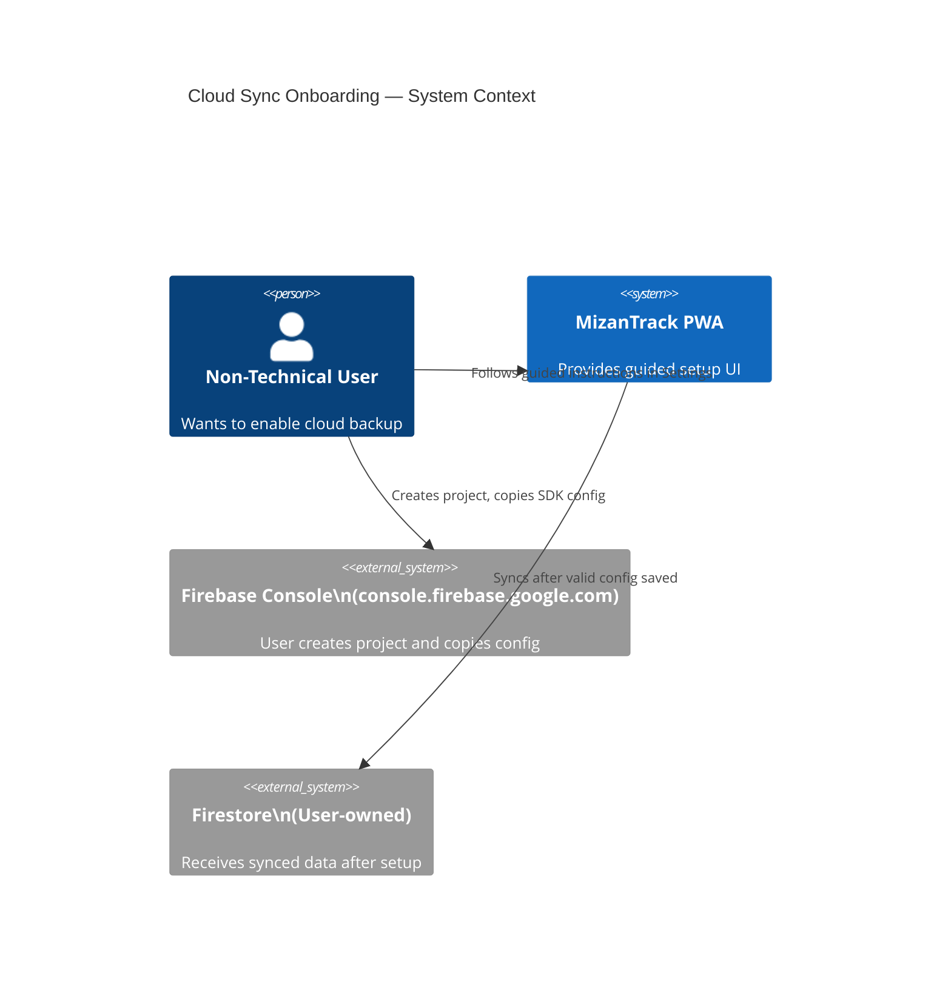
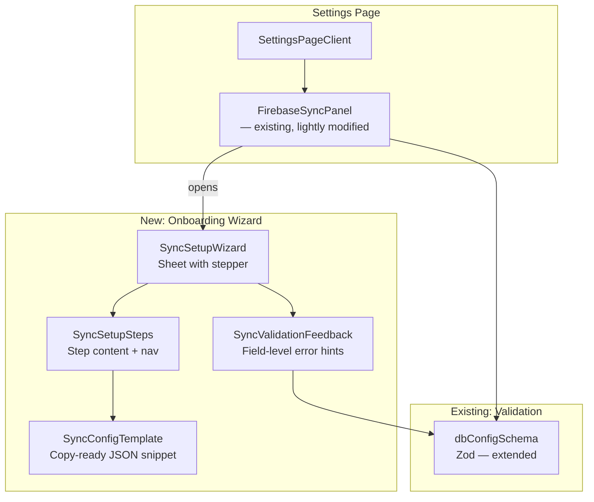

# Technical Design: Cloud Sync Onboarding Instructions

**Document Version:** 1.1  
**Last Updated:** 2026-05-31  
**Mode:** New Feature  
**PRD Reference:** docs/cloud-sync-onboarding/prd.md  
**Repository:** mizantrack

---

## Table of Contents

1. [Executive Summary](#1-executive-summary)
2. [Requirements Summary](#2-requirements-summary)
   - [Functional Requirements](#21-functional-requirements)
   - [Non-Functional Requirements](#22-non-functional-requirements)
   - [Constraints](#23-constraints)
3. [Current Architecture Analysis](#3-current-architecture-analysis)
   - [Existing Components](#31-existing-components)
   - [Integration Points](#32-integration-points)
4. [Proposed Architecture](#4-proposed-architecture)
   - [System Context](#41-system-context)
   - [Component Design](#42-component-design)
   - [Detailed Component Design](#43-detailed-component-design)
5. [Data Design](#5-data-design)
6. [Sequence Diagrams](#6-sequence-diagrams)
7. [Security Considerations](#7-security-considerations)
8. [Performance Considerations](#8-performance-considerations)
9. [Testing Strategy](#9-testing-strategy)
10. [Implementation Plan](#10-implementation-plan)
11. [Assumptions & Open Questions](#11-assumptions--open-questions)

---

## Document Change Log

| Version | Date | Author | Changes |
|---|---|---|---|
| 1.1 | 2026-05-31 | Salman Zahid Latif | Phase 2: Detailed component design — props, state, JSX structure |
| 1.0 | 2026-05-31 | Salman Zahid Latif | Phase 1: Foundation & Architecture |

---

## 1. Executive Summary

This feature enhances the Cloud Sync section of MizanTrack Settings with an in-app guided setup wizard that walks non-technical users through the Firebase Console steps required to obtain a valid web SDK config JSON.

The current `FirebaseSyncPanel` accepts a raw JSON textarea with minimal guidance — only a generic error message when `apiKey`, `authDomain`, or `projectId` are missing. Non-technical users have no in-app signal about where those values come from or how to produce a valid config object.

The proposed design adds a `SyncSetupWizard` component — a multi-step sheet/drawer — that integrates alongside the existing panel without replacing any validated logic already in place. Existing validation (`src/lib/validations/dbConfig.ts`) is reused and extended to produce per-field errors. No new persistence layer, API route, or external dependency is required.

---

## 2. Requirements Summary

### 2.1 Functional Requirements

| ID | Summary |
|---|---|
| FR-CSI-001 | "Get Setup Instructions" CTA visible on Cloud Sync card |
| FR-CSI-002 | Step-by-step wizard in plain language, no jargon |
| FR-CSI-003 | Instructions explicitly cover Firebase Console navigation |
| FR-CSI-004 | Copy-ready JSON template with all required keys |
| FR-CSI-005 | Field-specific validation feedback with correction hints |
| FR-CSI-006 | Deep-link from validation error back to relevant wizard step |
| FR-CSI-007 | Final verification step before enabling sync |
| FR-CSI-008 | Troubleshooting guidance for common failures |
| FR-CSI-009 | Privacy messaging visible within the setup flow |

### 2.2 Non-Functional Requirements

- All instruction content is static and client-rendered — no remote CMS or CDN dependency
- Wizard must be fully functional offline (content is bundled)
- Instruction view open latency p95: < 100ms (JSX render only, no network call)
- Config validation feedback latency p95: < 50ms (synchronous Zod parse)
- Feature must be accessible: keyboard-navigable, screen-reader labels on all wizard steps

### 2.3 Constraints

- No new backend, API route, or external service
- No changes to existing Dexie schema or sync logic
- Reuse existing shadcn/ui primitives (`Sheet`, `Dialog`, `Button`, `Badge`, `Tabs`)
- Existing `dbConfigSchema` Zod validation reused and extended for field-level errors
- Existing `FirebaseSyncPanel` must remain functionally unchanged for users who already have valid config

---

## 3. Current Architecture Analysis

### 3.1 Existing Components

| Component | File | Responsibility |
|---|---|---|
| `FirebaseSyncPanel` | `src/components/settings/FirebaseSyncPanel.tsx` | Renders config textarea, Enable toggle, Save/Sync/Reset actions, usage bar |
| `dbConfigSchema` | `src/lib/validations/dbConfig.ts` | Zod schema validating `apiKey`, `authDomain`, `projectId` (required) + optional fields |
| `useDbConfig` | `src/hooks/useDbConfig.ts` | Live Dexie query for `DbConfig` record by userId |
| `useSyncStore` | `src/store/sync-store.ts` | Zustand store: `syncing`, `lastSync`, `error`, `triggerSync()` |
| `SettingsPageClient` | `src/components/settings/SettingsPageClient.tsx` | Composes all settings panels; renders `<FirebaseSyncPanel />` at bottom |

### 3.2 Integration Points

- `FirebaseSyncPanel` already calls `validateJson()` inline — this is a **manual re-implementation** of `dbConfigSchema`. The design will consolidate to use the Zod schema exclusively.
- Validation is triggered on textarea change and on save; the wizard will **reuse the same validation path** for its inline paste step.
- No server-side component involved — entire Settings page is client-rendered.

---

## 4. Proposed Architecture

### 4.1 System Context



The wizard itself has **no integration with Firebase Console** — it produces a static hyperlink to `console.firebase.google.com` and guides the user to copy values manually. No OAuth, no API calls, no automation.

### 4.2 Component Design



New components are co-located in `src/components/settings/` alongside the existing sync panel. No new routes or pages.

### 4.3 Detailed Component Design

#### `SyncSetupWizard`

- **File:** `src/components/settings/SyncSetupWizard.tsx`
- **Responsibility:** Controlled Sheet wrapper that manages active step index and exposes a step-jump API for deep-linking from validation errors
- **Props:**

| Prop | Type | Purpose |
|---|---|---|
| `open` | `boolean` | Controlled open state |
| `onOpenChange` | `(open: boolean) => void` | Controlled close |
| `initialStep` | `number \| undefined` | Optional: open at a specific step (used by deep-link from error) |
| `onConfigPasted` | `(json: string) => void` | Callback when user pastes and validates config inside wizard |

- **State:** `activeStep: number` (0–4), `pastedJson: string`
- **Renders:** `<Sheet>` → `<SyncSetupSteps>` with step navigation buttons

#### `SyncSetupSteps`

- **File:** `src/components/settings/SyncSetupSteps.tsx`
- **Responsibility:** Renders individual step content as a static array of step descriptors; each step is pure JSX — no async logic
- **Step definitions (constant):**

| Step | Title | Content summary |
|---|---|---|
| 0 | Go to Firebase Console | Link to `console.firebase.google.com`; "Create a new project or open an existing one" |
| 1 | Create a Web App | "Inside your project → Project settings → Add app → Web" |
| 2 | Copy the SDK config | "Firebase SDK snippet → Config (not CDN) → copy the object" |
| 3 | Paste your config | Inline `<Textarea>` with Zod validation feedback; copy-ready template button |
| 4 | Enable Sync | Privacy note + confirmation before handing back to `FirebaseSyncPanel` |

#### `SyncConfigTemplate`

- **File:** `src/components/settings/SyncConfigTemplate.tsx`
- **Responsibility:** Renders annotated template JSON with a "Copy template" button using `navigator.clipboard.writeText`
- **Template output:**

```
{
  "apiKey": "← paste from Firebase SDK config",
  "authDomain": "your-project.firebaseapp.com",
  "projectId": "your-project-id",
  "storageBucket": "your-project.appspot.com",
  "messagingSenderId": "123456789",
  "appId": "1:123456789:web:abc123"
}
```

- Comments stripped before paste validation; used for user reference only

#### `SyncValidationFeedback`

- **File:** `src/components/settings/SyncValidationFeedback.tsx`
- **Responsibility:** Consumes a Zod `SafeParseReturnType` result and renders a per-field error list with a "How to fix" deep-link that jumps the wizard to the relevant step
- **Step mapping:**

| Field | Wizard step |
|---|---|
| `apiKey` | Step 2 (Copy the SDK config) |
| `authDomain` | Step 2 |
| `projectId` | Step 2 |
| Malformed JSON | Step 3 (Paste your config) |

#### `FirebaseSyncPanel` — modifications

- Add a "How to set this up →" button that opens `<SyncSetupWizard open={true} />` (FR-CSI-001)
- Replace the inline `validateJson()` function body with a call to `parseFirebaseConfigJson()` — a thin wrapper over `dbConfigSchema` that returns typed per-field errors (FR-CSI-005)
- When validation errors are present, render `<SyncValidationFeedback>` in place of the single-line error string, with a deep-link opener (FR-CSI-006)
- No change to save/sync/reset logic

#### `parseFirebaseConfigJson` utility

- **File:** `src/lib/firebaseConfigParser.ts`
- **Signature:** `parseFirebaseConfigJson(raw: string): { valid: true; value: FirebaseConfigFields } | { valid: false; errors: FieldError[] }`
- **Responsibility:** Parses raw string → JSON → Zod validation → normalized error array
- **Type `FieldError`:** `{ field: string; message: string; wizardStep: number }`

---

## 5. Data Design

No new Dexie tables, schema versions, or Zustand stores are required. The `DbConfig` entity already has `firebaseConfig: string` and `enabled: boolean`.

The only data change is the **extraction of a reusable parse result type** in `firebaseConfigParser.ts`:

```
FirebaseConfigFields {
  apiKey: string
  authDomain: string
  projectId: string
  storageBucket?: string
  messagingSenderId?: string
  appId?: string
}

FieldError {
  field: string          // e.g. "apiKey"
  message: string        // plain-language description
  wizardStep: number     // 0-based step to jump to
}
```

These are TypeScript-only types — no persistence, no migration.

---

## 6. Sequence Diagrams

### Flow A: First-Time Setup via Wizard

```mermaid
sequenceDiagram
  participant User
  participant FSP as FirebaseSyncPanel
  participant SSW as SyncSetupWizard
  participant FCParser as parseFirebaseConfigJson
  participant DB as Dexie (dbConfig)

  User->>FSP: Taps "How to set this up →"
  FSP->>SSW: open=true, initialStep=0
  SSW-->>User: Sheet opens at Step 0 (Go to Firebase Console)

  User->>SSW: Navigates through Steps 1 → 2 → 3
  Note over User,SSW: User opens Firebase Console externally, copies config

  User->>SSW: Pastes JSON into Step 3 textarea
  SSW->>FCParser: parseFirebaseConfigJson(raw)
  FCParser-->>SSW: { valid: true, value: {...} }
  SSW-->>User: Step 3 shows green check; "Next" enabled

  User->>SSW: Proceeds to Step 4 (Enable Sync)
  SSW-->>User: Privacy message + "Apply config" button
  User->>SSW: Confirms Apply
  SSW->>FSP: onConfigPasted(validJson)
  FSP->>DB: db.dbConfig.update(userId, { firebaseConfig: validJson, enabled: true })
  FSP-->>User: Sheet closes; sync panel shows "Save Config" pre-filled
```

### Flow B: Validation Error Recovery

```mermaid
sequenceDiagram
  participant User
  participant FSP as FirebaseSyncPanel
  participant FCParser as parseFirebaseConfigJson
  participant SSW as SyncSetupWizard

  User->>FSP: Pastes partial JSON in config textarea
  FSP->>FCParser: parseFirebaseConfigJson(raw)
  FCParser-->>FSP: { valid: false, errors: [{ field: "projectId", wizardStep: 2 }] }
  FSP-->>User: Shows SyncValidationFeedback with per-field list

  User->>FSP: Taps "Fix this → Step 2"
  FSP->>SSW: open=true, initialStep=2
  SSW-->>User: Sheet opens directly at Step 2 (Copy the SDK config)

  User->>SSW: Finds and copies projectId from Firebase Console
  User->>FSP: Re-pastes corrected JSON
  FCParser-->>FSP: { valid: true }
  FSP-->>User: Validation feedback clears; Save Config enabled
```

---

## 7. Security Considerations

- No new authentication or authorization surface — feature is gated behind the existing authenticated Settings page
- Firebase Console link opens in a new tab (`target="_blank" rel="noopener noreferrer"`) — no referrer leakage
- The config JSON is stored only in the user's own IndexedDB (`DbConfig.firebaseConfig`) — no transmission to any MizanTrack server
- Clipboard write (`navigator.clipboard.writeText`) is user-initiated — no silent data capture
- Validation is client-side Zod — no config value is sent anywhere before user explicitly saves
- Template JSON contains placeholder strings, not real credentials — cannot be accidentally valid

---

## 8. Performance Considerations

- All wizard content is statically bundled JSX — zero network cost at open time
- `SyncSetupWizard` is conditionally rendered (mounted only when `open=true`) — no render cost when Settings loads
- Zod validation runs synchronously in < 1ms for a config object of this size
- Sheet open animation is CSS-driven via shadcn `Sheet` — no layout reflow on main thread
- No performance target changes to existing sync or Dexie paths

---

## 9. Testing Strategy

| Layer | Test | File |
|---|---|---|
| Unit | `parseFirebaseConfigJson` — valid config, missing field, malformed JSON, empty string | `src/test/firebaseConfigParser.test.ts` |
| Unit | `SyncValidationFeedback` — renders correct per-field errors and step numbers | `src/test/SyncValidationFeedback.test.tsx` |
| Unit | `SyncSetupWizard` — opens at step 0, opens at initialStep=2, step navigation, close | `src/test/SyncSetupWizard.test.tsx` |
| Integration | `FirebaseSyncPanel` with wizard — "How to set this up" opens wizard; `onConfigPasted` populates textarea | `src/test/FirebaseSyncPanel.test.tsx` |

Coverage target: ≥ 80% line coverage on new files. Existing settings test suite must remain at current pass rate (12/12).

---

## 10. Implementation Plan

### Phase 1: Parser utility (Day 1)
- Create `src/lib/firebaseConfigParser.ts` with `parseFirebaseConfigJson`
- Write unit tests; all pass before proceeding

### Phase 2: Wizard shell + steps (Day 1–2)
- Create `SyncSetupWizard.tsx` with Sheet, step state, navigation
- Create `SyncSetupSteps.tsx` with static step content for all 5 steps
- Create `SyncConfigTemplate.tsx` with copy button

### Phase 3: Validation feedback + FirebaseSyncPanel integration (Day 2)
- Create `SyncValidationFeedback.tsx`
- Modify `FirebaseSyncPanel`: replace inline `validateJson` with `parseFirebaseConfigJson`; add wizard trigger; render `SyncValidationFeedback`

### Phase 4: Validation + polish (Day 3)
- Run full test suite; fix regressions
- `npm run validate` must pass clean

| Risk | Impact | Probability | Mitigation |
|---|---|---|---|
| Firebase Console UI changes invalidate step content | Medium | Medium | Use generic landmark descriptions ("Project settings gear icon") rather than UI text labels |
| shadcn Sheet z-index conflict with existing dialogs | Low | Low | Test on Settings page with all panels open |

---

## Phase 2: Component Design

### P2.1 `parseFirebaseConfigJson` (Parser Utility)

**File:** `src/lib/firebaseConfigParser.ts`

```typescript
import { firebaseConfigSchema } from "@/lib/validations/dbConfig";

export interface FieldError {
  field: string;        // e.g. "apiKey"
  message: string;      // plain-language, non-Zod
  wizardStep: number;   // 0-based step index in SyncSetupWizard
}

export type ParseFirebaseConfigResult =
  | { valid: true; value: FirebaseConfigFields }
  | { valid: false; errors: FieldError[] };

export interface FirebaseConfigFields {
  apiKey: string;
  authDomain: string;
  projectId: string;
  storageBucket?: string;
  messagingSenderId?: string;
  appId?: string;
}

const FIELD_STEP_MAP: Record<string, number> = {
  apiKey: 2,
  authDomain: 2,
  projectId: 2,
  storageBucket: 2,
  messagingSenderId: 2,
  appId: 2,
};

const FIELD_HINTS: Record<string, string> = {
  apiKey: 'Copy "apiKey" from your Firebase SDK config snippet.',
  authDomain: 'Copy "authDomain" from your Firebase SDK config snippet.',
  projectId: 'Copy "projectId" from your Firebase SDK config snippet.',
};

export function parseFirebaseConfigJson(raw: string): ParseFirebaseConfigResult {
  if (!raw.trim()) {
    return { valid: false, errors: [{ field: "json", message: "Paste your Firebase config JSON here.", wizardStep: 3 }] };
  }

  let parsed: unknown;
  try {
    parsed = JSON.parse(raw);
  } catch {
    return { valid: false, errors: [{ field: "json", message: "Not valid JSON. Make sure you copied the full config object including the outer { }.", wizardStep: 3 }] };
  }

  const result = firebaseConfigSchema.safeParse(parsed);
  if (result.success) {
    return { valid: true, value: result.data as FirebaseConfigFields };
  }

  const errors: FieldError[] = result.error.errors.map((issue) => {
    const field = issue.path[0]?.toString() ?? "json";
    return {
      field,
      message: FIELD_HINTS[field] ?? issue.message,
      wizardStep: FIELD_STEP_MAP[field] ?? 2,
    };
  });
  return { valid: false, errors };
}
```

**Notes:**
- `firebaseConfigSchema` is imported directly from the existing Zod validation — **no duplication of validation logic**
- `FIELD_HINTS` overrides Zod's terse messages with plain-language guidance
- Empty string returns a special `json` field error pointing to Step 3 (Paste step)
- Malformed JSON returns a `json` field error pointing to Step 3
- Missing required fields point to Step 2 (Copy the SDK config)

---

### P2.2 `SyncValidationFeedback`

**File:** `src/components/settings/SyncValidationFeedback.tsx`

**Props:**

| Prop | Type | Purpose |
|---|---|---|
| `errors` | `FieldError[]` | Array of parse errors from `parseFirebaseConfigJson` |
| `onOpenWizardAtStep` | `(step: number) => void` | Callback to open `SyncSetupWizard` at the given step |

**JSX structure:**

```
<div role="alert" aria-live="polite">
  <ul>
    {errors.map(err =>
      <li key={err.field}>
        <AlertCircle />
        <span>{err.message}</span>
        <Button variant="link" size="sm" onClick={() => onOpenWizardAtStep(err.wizardStep)}>
          Go to Step {err.wizardStep + 1} →
        </Button>
      </li>
    )}
  </ul>
</div>
```

**Accessibility:**
- `role="alert"` triggers immediate screen-reader announcement when errors appear
- `aria-live="polite"` for subsequent updates (user is typing)
- Each `<li>` is self-contained — no table or grid structure needed

---

### P2.3 `SyncConfigTemplate`

**File:** `src/components/settings/SyncConfigTemplate.tsx`

**Props:** none (purely presentational)

**JSX structure:**

```
<div>
  <div className="flex items-center justify-between mb-1">
    <span className="text-xs font-medium text-muted-foreground">Template (all keys)</span>
    <Button variant="ghost" size="sm" onClick={handleCopy}>
      {copied ? <Check className="h-3.5 w-3.5" /> : <Copy className="h-3.5 w-3.5" />}
      {copied ? "Copied" : "Copy template"}
    </Button>
  </div>
  <pre className="rounded-md bg-muted p-3 text-xs font-mono overflow-x-auto">
    {TEMPLATE_JSON}
  </pre>
</div>
```

**Template constant (stored in the component file):**

```
{
  "apiKey": "← from Firebase SDK config",
  "authDomain": "your-project.firebaseapp.com",
  "projectId": "your-project-id",
  "storageBucket": "your-project.appspot.com",
  "messagingSenderId": "123456789012",
  "appId": "1:123456789012:web:abc123def456"
}
```

**Copy behavior:**
- `copied` state resets to `false` after 2 seconds via `setTimeout`
- Uses `navigator.clipboard.writeText` — the raw template string without annotation comments is copied
- Graceful fallback if Clipboard API unavailable: no-op (PWA context always has clipboard access once installed)

---

### P2.4 `SyncSetupSteps`

**File:** `src/components/settings/SyncSetupSteps.tsx`

**Props:**

| Prop | Type | Purpose |
|---|---|---|
| `activeStep` | `number` | 0-based index of the current step |
| `pastedJson` | `string` | Controlled value for Step 3 textarea |
| `onPastedJsonChange` | `(value: string) => void` | Step 3 textarea onChange |
| `parseResult` | `ParseFirebaseConfigResult \| null` | Validation result for Step 3 inline feedback |
| `onOpenWizardAtStep` | `(step: number) => void` | Passed down to `SyncValidationFeedback` |

**Step definitions (static array):**

```typescript
const STEPS: StepDef[] = [
  {
    title: "Open Firebase Console",
    icon: "🌐",
    content: <Step0Content />,
  },
  {
    title: "Create a Web App",
    icon: "📱",
    content: <Step1Content />,
  },
  {
    title: "Copy the SDK Config",
    icon: "📋",
    content: <Step2Content />,
  },
  {
    title: "Paste Your Config",
    icon: "📝",
    content: null, // rendered dynamically — needs pastedJson + parseResult
  },
  {
    title: "Privacy & Confirm",
    icon: "🔒",
    content: <Step4Content />,
  },
];
```

Steps 0–2 and 4 are pure static JSX sub-components (`Step0Content`, etc.) — they take no props. Step 3 is rendered inline in `SyncSetupSteps` because it needs dynamic props.

**Step content detail:**

| Step | Key instructions |
|---|---|
| 0 | "Go to [console.firebase.google.com](https://console.firebase.google.com) and sign in with your Google account. Click **Add project** and give it any name (e.g. `mizantrack-backup`)." |
| 1 | "Inside your project, click the ⚙️ gear icon → **Project settings**. Scroll to **Your apps** and click the **</>** (Web) icon to register a new app. Give it a nickname — this won't affect your data." |
| 2 | "After registering the app, Firebase shows you an SDK snippet. Select **Config** (not CDN). Copy the entire `firebaseConfig` object — from `{` to `}`. See the template below for the shape of the object." |
| 3 | Textarea + `SyncConfigTemplate` + `SyncValidationFeedback` inline |
| 4 | Privacy statement + final checklist before confirming |

**Rendered layout (all steps share the same shell):**

```
<div className="flex flex-col gap-4 py-2">
  {/* Step header */}
  <div className="flex items-center gap-2">
    <span className="text-xl" aria-hidden>{step.icon}</span>
    <h3 className="font-semibold text-base">{step.title}</h3>
  </div>

  {/* Step body */}
  <div className="text-sm text-muted-foreground leading-relaxed space-y-3">
    {stepBody}
  </div>
</div>
```

---

### P2.5 `SyncSetupWizard`

**File:** `src/components/settings/SyncSetupWizard.tsx`

**Props:**

| Prop | Type | Purpose |
|---|---|---|
| `open` | `boolean` | Controlled Sheet open |
| `onOpenChange` | `(open: boolean) => void` | Controlled Sheet close |
| `initialStep` | `number \| undefined` | Open at a specific step (deep-link) |
| `onConfigPasted` | `(json: string) => void` | Called when Step 4 confirms — passes validated JSON back to parent |

**State:**

| State var | Type | Initial | Purpose |
|---|---|---|---|
| `activeStep` | `number` | `0` | Currently visible step (0–4) |
| `pastedJson` | `string` | `""` | Controlled textarea value for Step 3 |
| `parseResult` | `ParseFirebaseConfigResult \| null` | `null` | Live validation result for Step 3 |

**`initialStep` handling:**
```typescript
useEffect(() => {
  if (open) setActiveStep(initialStep ?? 0);
}, [open, initialStep]);
```
This resets to `initialStep` whenever the sheet opens, covering both first-open and re-open from deep-link.

**Navigation rules:**

| Condition | "Next" enabled |
|---|---|
| Steps 0–2 | Always |
| Step 3 | Only when `parseResult?.valid === true` |
| Step 4 | Always (Confirm button replaces Next) |

**Confirm action (Step 4):**
```typescript
function handleConfirm() {
  if (parseResult?.valid) {
    onConfigPasted(pastedJson);
    onOpenChange(false);
  }
}
```

**JSX skeleton:**

```tsx
<Sheet open={open} onOpenChange={onOpenChange}>
  <SheetContent side="right" className="w-full sm:max-w-md flex flex-col">
    <SheetHeader>
      <SheetTitle>Cloud Sync Setup</SheetTitle>
      <SheetDescription>
        Step {activeStep + 1} of {STEPS.length}
      </SheetDescription>
    </SheetHeader>

    {/* Step progress indicator */}
    <div className="flex gap-1.5 px-6" role="tablist" aria-label="Setup steps">
      {STEPS.map((s, i) => (
        <div
          key={i}
          role="tab"
          aria-selected={i === activeStep}
          aria-label={`Step ${i + 1}: ${s.title}`}
          className={cn(
            "h-1.5 flex-1 rounded-full transition-colors",
            i < activeStep && "bg-primary",
            i === activeStep && "bg-primary",
            i > activeStep && "bg-muted"
          )}
        />
      ))}
    </div>

    {/* Step content — scrollable */}
    <ScrollArea className="flex-1 px-6">
      <SyncSetupSteps
        activeStep={activeStep}
        pastedJson={pastedJson}
        onPastedJsonChange={(v) => {
          setPastedJson(v);
          setParseResult(parseFirebaseConfigJson(v));
        }}
        parseResult={parseResult}
        onOpenWizardAtStep={setActiveStep}
      />
    </ScrollArea>

    {/* Navigation footer */}
    <SheetFooter className="px-6 pb-6 flex justify-between">
      <Button
        variant="outline"
        disabled={activeStep === 0}
        onClick={() => setActiveStep((s) => s - 1)}>
        Back
      </Button>
      {activeStep < STEPS.length - 1 ? (
        <Button
          disabled={activeStep === 3 && parseResult?.valid !== true}
          onClick={() => setActiveStep((s) => s + 1)}>
          Next
        </Button>
      ) : (
        <Button onClick={handleConfirm}>
          Apply Config
        </Button>
      )}
    </SheetFooter>
  </SheetContent>
</Sheet>
```

---

### P2.6 `FirebaseSyncPanel` — Diff from Current

Only three targeted changes to the existing component:

**Change 1 — Add wizard state + import:**
```typescript
// ADD to imports
import { parseFirebaseConfigJson } from "@/lib/firebaseConfigParser";
import { SyncSetupWizard } from "@/components/settings/SyncSetupWizard";
import { SyncValidationFeedback } from "@/components/settings/SyncValidationFeedback";
import type { ParseFirebaseConfigResult } from "@/lib/firebaseConfigParser";

// ADD to component state
const [wizardOpen, setWizardOpen] = useState(false);
const [wizardInitialStep, setWizardInitialStep] = useState<number | undefined>(undefined);
const [parseResult, setParseResult] = useState<ParseFirebaseConfigResult | null>(null);
```

**Change 2 — Replace `validateJson` with `parseFirebaseConfigJson`:**
```typescript
// REMOVE: entire validateJson function
// REMOVE: setJsonError usage

// REPLACE textarea onChange
onChange={(e) => {
  setConfigJson(e.target.value);
  setParseResult(parseFirebaseConfigJson(e.target.value));
}}

// REPLACE error display (below Textarea)
{parseResult && !parseResult.valid && (
  <SyncValidationFeedback
    errors={parseResult.errors}
    onOpenWizardAtStep={(step) => {
      setWizardInitialStep(step);
      setWizardOpen(true);
    }}
  />
)}

// UPDATE Save button disabled condition
disabled={saving || (parseResult !== null && !parseResult.valid)}
```

**Change 3 — Add CTA button + wizard mount:**
```typescript
// ADD "How to set this up" button in the card header row
<Button
  variant="outline"
  size="sm"
  onClick={() => {
    setWizardInitialStep(0);
    setWizardOpen(true);
  }}>
  Get Setup Instructions
</Button>

// ADD at end of component return, before closing </div>
<SyncSetupWizard
  open={wizardOpen}
  onOpenChange={setWizardOpen}
  initialStep={wizardInitialStep}
  onConfigPasted={(json) => {
    setConfigJson(json);
    setParseResult(parseFirebaseConfigJson(json));
    setEnabled(true);
  }}
/>
```

Note: `onConfigPasted` sets `enabled: true` in local state but does **not** call `handleSave()` — the user must still tap "Save Config" to persist. This keeps the existing save path unmodified.

---

## 11. Assumptions & Open Questions

- **Assume:** Firebase Console navigation described in steps is based on the current Firebase Console design (as of May 2026). Step text should use landmarks, not pixel-exact UI labels.
- **Assume:** Instruction content is English-only for v1. Localization is out of scope per PRD.
- **Assume:** Screenshots / video are out of scope for v1 (PRD §9 TBD). Steps are text-only with emoji cues for visual anchoring.
- **Open:** Should `onConfigPasted` in the wizard also set `enabled: true` automatically, or leave the toggle for the user? Recommendation: leave toggle to user — avoids an unexpected sync on first save.
- **Open:** Should the wizard deep-link also close the panel's error state, or leave it visible? Recommendation: keep panel error visible until user re-pastes a valid config.
