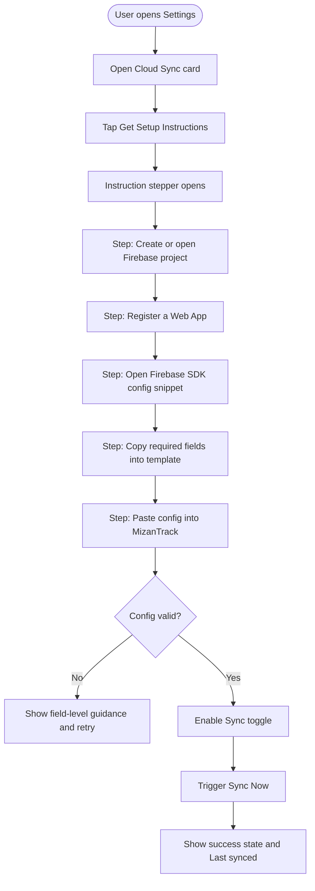
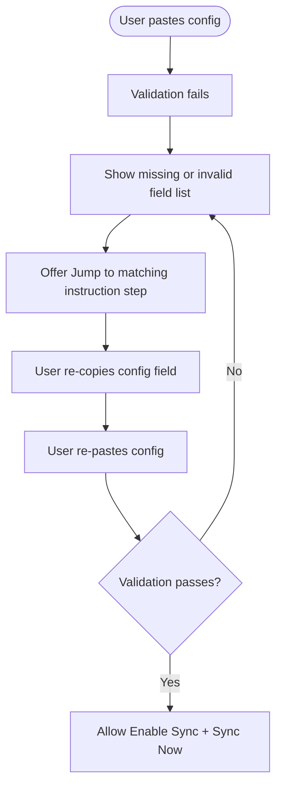

# Product Requirements Document (PRD)

**Version:** 1.0  
**Date:** 2026-05-31  
**Feature/Product Name:** Cloud Sync Onboarding Instructions for Non-Technical Users  
**Owner:** Salman Zahid Latif  
**Status:** Draft

## Table of Contents

- [1. Executive Summary](#1-executive-summary)
- [2. Problem Statement](#2-problem-statement)
- [3. Goals & Non-Goals](#3-goals--non-goals)
- [4. User Flows](#4-user-flows)
- [5. Functional Requirements](#5-functional-requirements)
- [6. User Interface (UI) Design](#6-user-interface-ui-design)
- [7. Non-Functional Requirements](#7-non-functional-requirements)
- [8. Success Metrics](#8-success-metrics)
- [9. Open Questions / Risks](#9-open-questions--risks)

## Document Change Log

| Version | Date | Author | Changes |
|---|---|---|---|
| 1.0 | 2026-05-31 | Salman Zahid Latif | Initial feature PRD for guided Cloud Sync setup instructions |

## 1. Executive Summary

This feature adds a guided, plain-language setup experience that helps non-technical users obtain and paste Firebase configuration details required for online sync.

The expected impact is reduced setup failure, fewer support loops, and higher sync adoption by turning a developer-focused Firebase setup flow into user-friendly in-app instructions.

## 2. Problem Statement

Current Cloud Sync setup assumes users can independently navigate Firebase Console concepts such as project creation, web app registration, and SDK configuration.

For non-technical users, this creates friction and failure points:
- Users do not know where to start in Firebase Console.
- Users cannot identify which values belong in the config JSON.
- Users paste malformed JSON or incomplete fields.
- Users abandon setup before enabling sync.

## 3. Goals & Non-Goals

### Goals

- Provide step-by-step in-app instructions for obtaining valid Firebase web config.
- Reduce malformed config submissions and setup abandonment.
- Keep instructions understandable for users with no developer background.
- Add verification cues so users know when they completed each step correctly.
- Preserve privacy-first positioning by clearly explaining data ownership.

### Non-Goals

- Building a managed backend setup wizard that creates Firebase projects automatically.
- Replacing Firebase Console with an in-app project provisioning flow.
- Teaching advanced Firebase concepts (rules authoring, indexes, quota tuning).
- Supporting non-Firebase sync providers in this feature scope.

## 4. User Flows

### Flow A: Guided First-Time Cloud Sync Setup

Key actors:
- Non-technical end user
- Firebase Console (external system)
- MizanTrack Settings UI

Decision points:
- Valid vs invalid config parse/validation
- User exits flow before completion vs continues

Edge cases:
- User copies partial config and misses required keys
- User pastes config with trailing comments or malformed JSON
- User has multiple Firebase projects and picks the wrong one
- User has valid config but disabled required Firebase product setup [TBD: exact prerequisites to confirm]

### Flow B: Recovery Flow After Validation Error

## 5. Functional Requirements

| ID | Requirement | Testable Acceptance Criteria |
|---|---|---|
| FR-CSI-001 | Cloud Sync card must provide a clear entry point to setup help. | Given a signed-in user on Settings, when Cloud Sync renders, then a visible action labeled for setup instructions is present and interactive. |
| FR-CSI-002 | The app must provide a step-by-step instruction experience in plain language. | Given the user opens setup help, when navigating steps, then each step includes action-oriented text, expected outcome, and next action without technical jargon [TBD: readability benchmark]. |
| FR-CSI-003 | Instructions must explicitly cover how to create/open a Firebase project and where to locate web config values. | Given a user follows the guide, when they reach config assembly, then all required fields are listed and mapped to Firebase Console locations. |
| FR-CSI-004 | The app must provide a copy-ready config template for users. | Given the instructions view, when user requests template, then a valid JSON template with required keys appears for copy/use. |
| FR-CSI-005 | Config validation feedback must be field-specific and actionable. | Given invalid config input, when validation runs, then the UI shows which required fields are missing/invalid and provides a direct correction hint per field. |
| FR-CSI-006 | Users must be able to jump from validation errors back to the relevant instruction step. | Given validation errors are shown, when user selects a help action, then the instruction view opens at the corresponding step. |
| FR-CSI-007 | The flow must include a final verification step before enabling sync. | Given a valid config, when user completes verification, then Enable Sync and Sync Now are available and success state can be observed. |
| FR-CSI-008 | The feature must include non-technical troubleshooting guidance for common setup failures. | Given known failure scenarios, when an error occurs, then the UI surfaces a plain-language explanation and a recommended next action. |
| FR-CSI-009 | Privacy messaging must be visible within the setup flow. | Given the user is in setup instructions, then the UI explains that data syncs to the user-owned Firebase project and is not stored on a shared MizanTrack backend. |

## 6. User Interface (UI) Design

Entry points and navigation paths:
- Primary entry from Settings Cloud Sync card.
- Secondary entry from validation-error help links in the config form.

Key screens:
- Cloud Sync card with Get Setup Instructions action.
- Instruction stepper/modal with progress indicator.
- Copy-ready template panel and required field checklist.
- Validation feedback panel with field-level guidance.
- Completion panel with Enable Sync and Sync Now confirmation.

Visual states:
- Loading: instruction content skeleton while content loads.
- Error: invalid config with clear correction guidance.
- Empty: no config yet, show start CTA.
- Success: valid config accepted, sync readiness confirmed.

Accessibility and responsiveness expectations:
- Mobile-first layout with readable text hierarchy and large touch targets.
- Keyboard navigation across steps and controls.
- Clear focus indicators and screen-reader compatible step labels.
- Plain-language content designed for low technical literacy [TBD: localization scope].

## 7. Non-Functional Requirements

### 7.1 Performance & Latency

- Instruction view open latency p95: [TBD: target pending baseline].
- Validation feedback render latency p95: [TBD: target pending baseline].
- Content cache hit rate for static instruction assets: [TBD: target pending caching design].
- Setup action throughput: [TBD: expected concurrent user load].

### 7.2 Security & Privacy

- Access control: only authenticated users can open and submit Cloud Sync configuration.
- Sensitive handling: config values stored only in user-local data and user-owned sync target.
- PII handling: no additional PII collection introduced by this feature.
- Data retention policy: instruction analytics [TBD: whether collected], config retention follows existing app policy.

### 7.3 Error Handling

| Error Scenario | User-Facing Message | Recovery Action |
|---|---|---|
| Malformed JSON | We could not read this configuration. Please paste valid JSON. | Show example template and highlight JSON format hints. |
| Missing required field | A required field is missing from your config. | Highlight missing key and deep-link to matching instruction step. |
| Invalid field value format | One of the config values looks incorrect. | Show field-specific format guidance and ask user to recopy from Firebase Console. |
| Sync enable attempted with invalid config | Sync cannot be enabled until setup is complete. | Keep Enable Sync blocked and prompt verification step. |
| Initial sync fails after valid config | Setup is saved, but sync could not start. | Show retry action and troubleshooting checklist. |
| Wrong Firebase project selected | This config may belong to a different project. | Prompt user to confirm project name and recopy from intended project. |

### 7.4 Scalability

- Instruction content delivery should remain stable under expected Settings page traffic [TBD: load forecast].
- Validation logic should remain client-side and lightweight.
- Any remote help-content hosting strategy must support cache-friendly scaling [TBD: hosting decision].

### 7.5 Cost

If external services are used for this feature (for example hosted help assets or localization tooling), define and track:

| Cost Item | Unit Pricing | Expected Monthly Usage | Peak Monthly Usage | Projected Cost |
|---|---|---|---|---|
| Firebase service usage related to setup verification | [TBD: provider pricing] | [TBD] | [TBD] | [TBD] |
| Help-content hosting/CDN | [TBD: provider pricing] | [TBD] | [TBD] | [TBD] |
| Optional localization/content tooling | [TBD: provider pricing] | [TBD] | [TBD] | [TBD] |

Cost-saving mechanisms:
- Reuse static instruction assets with caching.
- Limit validation retries to meaningful user actions.
- Keep setup guidance client-rendered where feasible.

## 8. Success Metrics

- Cloud Sync setup completion rate from instruction flow entry: [TBD: target].
- Valid config submission rate on first attempt: [TBD: target].
- Median time to complete setup from first entry: [TBD: target].
- Reduction in Cloud Sync setup-related support requests: [TBD: target].
- Sync enablement rate among users who open setup instructions: [TBD: target].

## 9. Open Questions / Risks

- [TBD: decision needed] Should setup instructions be embedded content, remotely managed content, or both?
- [TBD: decision needed] Which Firebase prerequisite steps must be explicitly covered (for example Firestore initialization, authentication providers, security rules)?
- [TBD: decision needed] Should the flow support screenshots, short videos, or text-only guidance in v1?
- Risk: Firebase Console UI changes may age static instructions quickly.
- Risk: Over-simplification may omit critical prerequisites and increase hidden failure modes.
- Risk: If no telemetry is captured, measuring instructional effectiveness may be limited.
