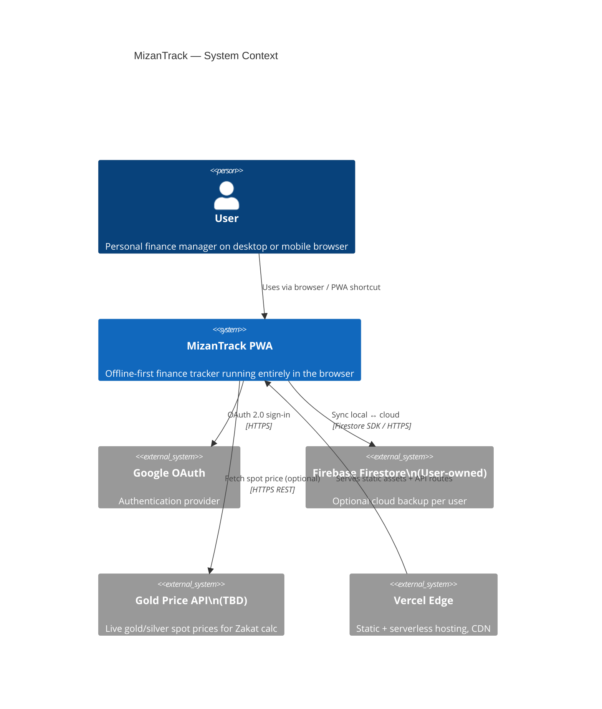
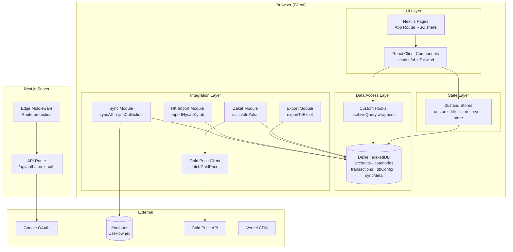
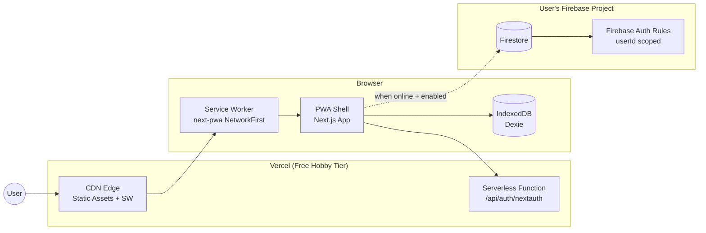
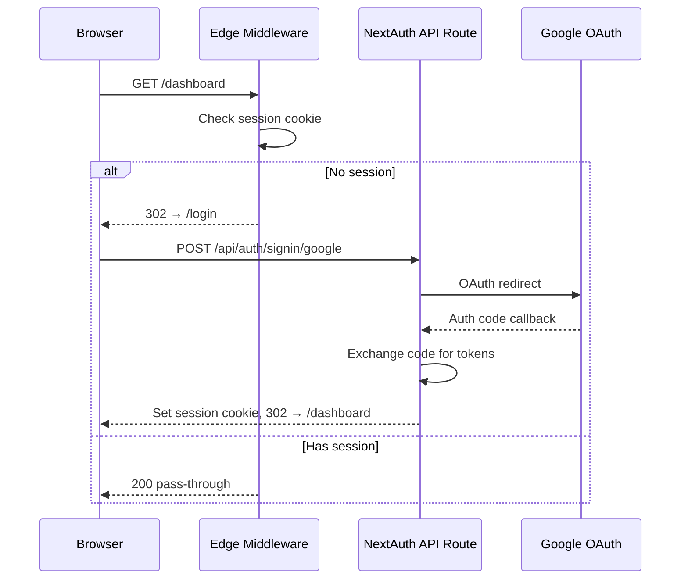
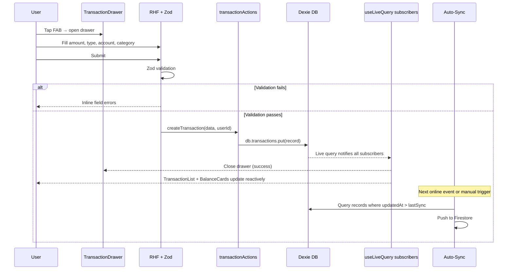
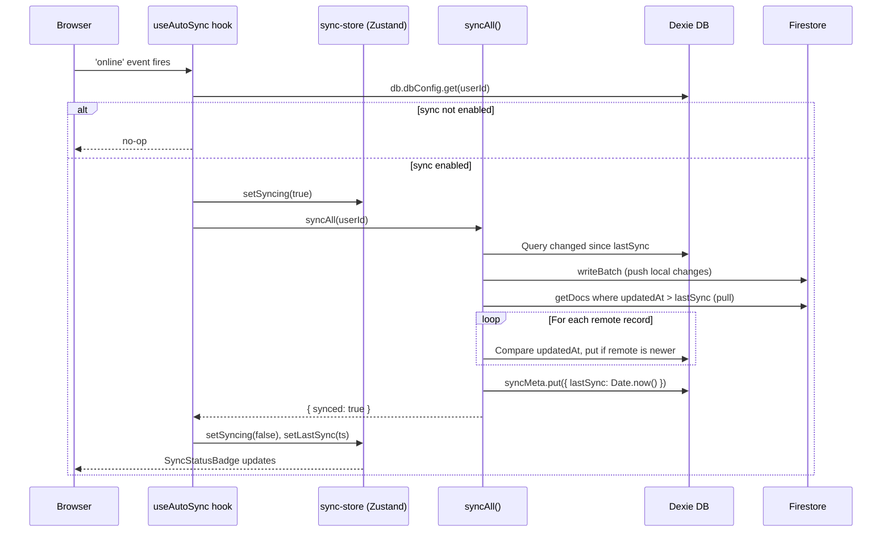
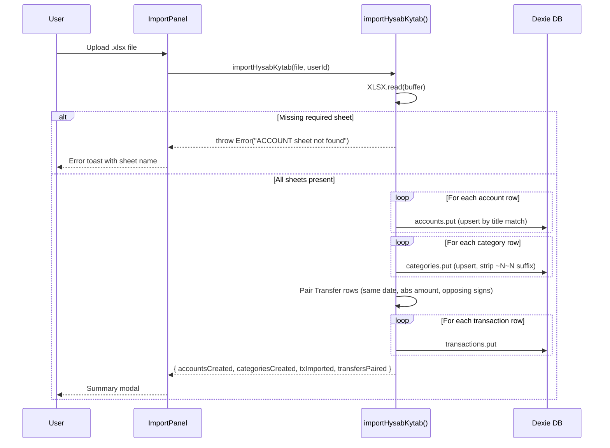
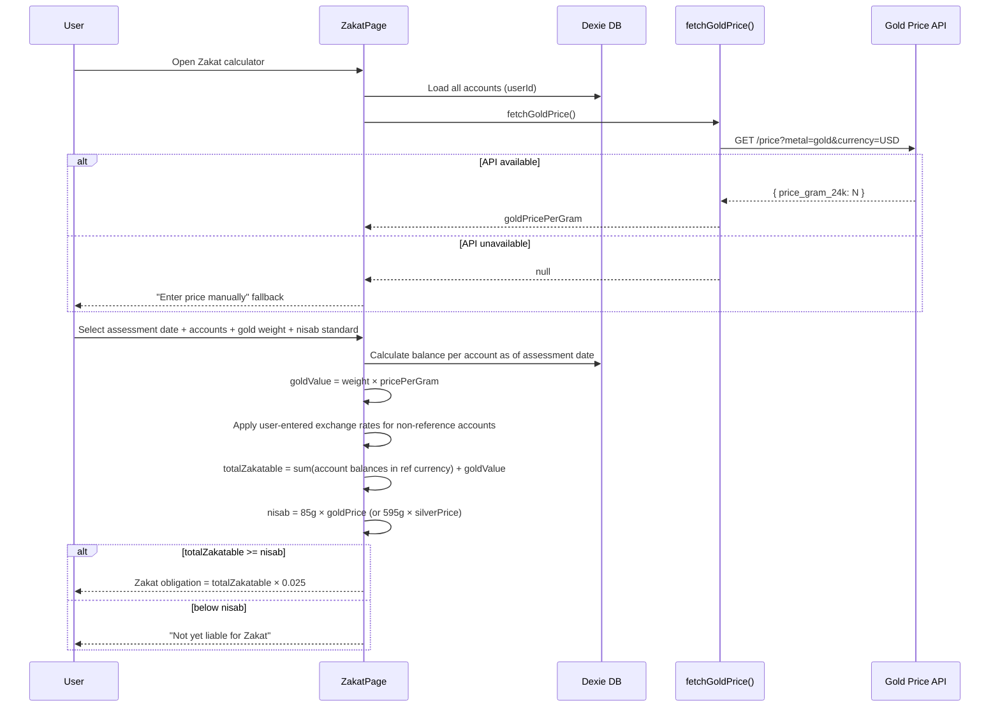

# Technical Design: MizanTrack

**Document Version:** 1.0  
**Last Updated:** 2026-05-26  
**Mode:** New Project  
**PRD Reference:** docs/prd.md  
**Target Stack:** Next.js 16 · TypeScript · Dexie.js · Firebase Firestore · NextAuth v5 · Zustand · shadcn/ui · Tailwind CSS v4

---

## Table of Contents

1. [Executive Summary](#1-executive-summary)
2. [Requirements Summary](#2-requirements-summary)
   - [Functional Requirements](#21-functional-requirements)
   - [Non-Functional Requirements](#22-non-functional-requirements)
   - [Constraints](#23-constraints)
3. [Architecture Overview](#3-architecture-overview)
   - [System Context](#31-system-context)
   - [High-Level Architecture](#32-high-level-architecture)
   - [Deployment Architecture](#33-deployment-architecture)
4. [Technology Stack](#4-technology-stack)
5. [Detailed Component Design](#5-detailed-component-design)
   - [Auth Layer](#51-auth-layer)
   - [Local Data Layer (Dexie)](#52-local-data-layer-dexie)
   - [Sync Layer (Firebase)](#53-sync-layer-firebase)
   - [State Layer (Zustand)](#54-state-layer-zustand)
   - [UI Component Library](#55-ui-component-library)
   - [Feature Modules](#56-feature-modules)
6. [Data Models & Schemas](#6-data-models--schemas)
   - [Core Entities](#61-core-entities)
   - [IndexedDB Schema (Dexie)](#62-indexeddb-schema-dexie)
   - [Firestore Schema](#63-firestore-schema)
   - [State Shape (Zustand)](#64-state-shape-zustand)
7. [Sequence Diagrams](#7-sequence-diagrams)
   - [Authentication Flow](#71-authentication-flow)
   - [Transaction Create Flow](#72-transaction-create-flow)
   - [Auto-Sync Flow](#73-auto-sync-flow)
   - [HK Import Flow](#74-hk-import-flow)
   - [Zakat Calculation Flow](#75-zakat-calculation-flow)
8. [Security Considerations](#8-security-considerations)
9. [Performance Considerations](#9-performance-considerations)
10. [Testing Strategy](#10-testing-strategy)
11. [Implementation Plan](#11-implementation-plan)
12. [Open Questions & Decisions](#12-open-questions--decisions)
13. [Appendices](#13-appendices)

---

## Document Change Log

| Version | Date       | Author              | Changes                                   |
|---------|------------|---------------------|-------------------------------------------|
| 1.0     | 2026-05-26 | Salman Zahid Latif  | Phase 1 & 2: Architecture + component design |

---

## 1. Executive Summary

MizanTrack is a **privacy-first, client-only** personal finance PWA. All financial data lives in the browser's IndexedDB (Dexie.js). An optional sync layer pushes/pulls to a **user-owned** Firebase Firestore project — MizanTrack's own servers never touch user data.

The architecture is a **layered client-side monolith** hosted on Vercel. There is no custom backend beyond two Next.js API routes (NextAuth handlers). Every feature — transactions, reports, Zakat calculation, HK import — executes entirely in the browser. This makes the app inherently scalable (zero server load per user) and deployable for free indefinitely.

The key architectural challenge is the **offline-first sync model**: Dexie is the source of truth; Firestore is the backup. Conflict resolution uses last-write-wins on `updatedAt`. All data mutations write to Dexie first, then sync opportunistically.

---

## 2. Requirements Summary

### 2.1 Functional Requirements

Derived from PRD v1.0. Full IDs in `docs/prd.md`.

- **Auth (FR-AUTH):** Google OAuth via NextAuth v5; all routes protected; session persists across restarts
- **Accounts (FR-ACC):** Multi-currency accounts (ISO-4217); per-account computed balance; soft delete/archive
- **Categories (FR-CAT):** Income/Expense; one-level parent/child hierarchy; default seed set on first login
- **Transactions (FR-TXN):** Expense / Income / Transfer; full metadata (tags, place, travel currency); filtered list with search; soft delete; virtualized for 10k+ records
- **HK Import (FR-IMP):** Parse ACCOUNT + CATEGORY + ACTIVITIES sheets; upsert on re-import; transfer pairing; import summary modal
- **Export (FR-EXP):** HK-compatible `.xlsx` download for any date range
- **Sync (FR-SYN):** User-owned Firestore; auto-trigger on online event; manual sync now; usage indicator
- **Dashboard (FR-DASH):** Account balance cards; month summary; recent transactions; 6-month trend chart
- **Reports (FR-RPT):** All `FilterPeriod` presets + custom; category breakdown; monthly trend; per-account filter; XLSX export
- **Zakat (FR-ZAK):** Per-account balance at assessment date; gold/silver input; live price fetch with manual fallback; nisab comparison; 2.5% calculation; multi-currency rate inputs; XLSX export
- **Settings (FR-SET):** Default currency; fiscal year start month; Firebase config; import/export triggers; theme

### 2.2 Non-Functional Requirements

| Category | Target |
|---|---|
| First load (cached, mobile 3G) | < 2 seconds |
| Transaction list render (1k records) | < 300ms |
| Transaction list render (10k records) | < 1 second (virtualized) |
| Dexie query p95 | < 50ms |
| Offline capability | 100% of core features |
| Max supported transactions | 100,000 per user |
| Sync batch size | 499 docs per Firestore writeBatch call |

### 2.3 Constraints

- No custom backend — all logic runs client-side
- Firebase is user-supplied; MizanTrack never holds Firebase credentials
- Must work without any configuration (Firebase optional)
- PWA install on iOS Safari and Android Chrome
- Zero analytics or third-party tracking scripts
- TypeScript strict mode; ESLint zero-warnings

---

## 3. Architecture Overview

### 3.1 System Context



**Actors:**
- **User** — single authenticated person; their data never shared
- **Google OAuth** — identity only; no financial data sent to Google
- **Firebase Firestore (user-owned)** — optional; each user brings their own project
- **Gold Price API** — read-only; no user data sent; called at most ~30×/month
- **Vercel** — hosts the Next.js app; sees no financial data (only auth tokens in cookies)

### 3.2 High-Level Architecture

The app follows a **4-layer client-side architecture**. Next.js provides the host shell and auth API routes; everything else runs in the browser.



**Layer Responsibilities:**

| Layer | Responsibility |
|---|---|
| UI Layer | Render, handle user events, call hooks/actions |
| State Layer | Shared UI state (filters, sync status, modals); no financial data |
| Data Access Layer | All reads/writes via Dexie; live reactive queries via `useLiveQuery` |
| Integration Layer | Import, export, sync, gold price — pure functions with no UI coupling |
| Next.js Server | Auth API route only; edge middleware for route protection |

### 3.3 Deployment Architecture



**Hosting model:** Vercel free tier — static files, one serverless function (NextAuth). No containers, no managed DB on MizanTrack's side.

---

## 4. Technology Stack

| Concern | Choice | Rationale |
|---|---|---|
| Framework | Next.js 16 (App Router) | Already in use; RSC for auth shell; client components for all data UI |
| Language | TypeScript 5 (strict) | Already in use; type safety across layers |
| UI Components | shadcn/ui (Radix primitives) + Tailwind CSS v4 | Already scaffolded; unstyled primitives + utility CSS |
| Charts | Recharts 3 | Already installed; composable React charts |
| Local DB | Dexie.js 4 + dexie-react-hooks | IndexedDB wrapper; `useLiveQuery` provides reactive data without extra state |
| Cloud Sync | Firebase Firestore (JS SDK v12) | User-owned; zero cost to MizanTrack |
| Auth | NextAuth.js v5 + Google Provider | Already wired; handles session cookie, CSRF, and OAuth callback |
| State | Zustand 5 | Lightweight; for UI-only state (filters, modals, sync indicators) |
| Forms | React Hook Form 7 + Zod 4 | Already installed; schema-driven validation |
| Import/Export | SheetJS (xlsx 0.18) | Parses and generates HK-compatible `.xlsx` |
| Dates | date-fns 4 | Tree-shakable; used in `dateRange.ts` already |
| PWA | next-pwa 5 | Already configured; NetworkFirst cache strategy |
| Hosting | Vercel | Zero-config Next.js deploy |

**Key architectural decision — Dexie live queries as primary data source:**

Rather than mirroring Dexie data into Zustand, components subscribe to Dexie directly via `useLiveQuery`. Zustand is reserved for **UI state only** (active filters, modal visibility, sync status). This avoids a dual-write problem and keeps financial data in a single source of truth.

---

## 5. Detailed Component Design

### 5.1 Auth Layer

**Files:** `src/lib/auth.ts`, `src/proxy.ts`, `src/app/api/auth/[...nextauth]/route.ts`, `src/app/(auth)/login/page.tsx`

- NextAuth v5 configured with Google provider only
- Edge middleware (`proxy.ts`) protects all routes except `/login` and Next.js internals
- Session exposes `user.id` (Google `sub`) used as `userId` throughout
- **Fix required (OQ-04):** `auth.ts` must use `AUTH_GOOGLE_ID` / `AUTH_GOOGLE_SECRET` env var names to match NextAuth v5 convention

```mermaid
graph LR
  Request --> Middleware
  Middleware -->|no session| LoginPage
  Middleware -->|has session| AppLayout
  AppLayout -->|server component| SessionCheck[auth() call]
  SessionCheck -->|no session| Redirect
  SessionCheck -->|session.user.id| Children
```

### 5.2 Local Data Layer (Dexie)

**Files:** `src/lib/db/local.ts`, `src/hooks/use*.ts` (to be created)

`MizanTrackDB` is a singleton exported as `db`. All data access goes through custom hooks that wrap `useLiveQuery`.

**Hook naming convention:** `use{Entity}` returns live data; `{entity}Actions` returns mutation functions.

| Hook | Returns | Dexie operation |
|---|---|---|
| `useAccounts(userId)` | `Account[]` live | `where('userId').equals(userId).filter(!deletedAt)` |
| `useAccount(id)` | `Account \| undefined` live | `db.accounts.get(id)` |
| `useCategories(userId, type?)` | `Category[]` live | filtered by userId + optional type |
| `useTransactions(userId, filters)` | `Transaction[]` live | compound filter (account, category, type, date range) |
| `useAccountBalance(accountId)` | `number` live | opening + sum of txns |
| `useDbConfig(userId)` | `DbConfig \| undefined` live | `db.dbConfig.get(userId)` |
| `useSyncMeta()` | `SyncMeta \| undefined` live | `db.syncMeta.get('lastSync')` |

**Mutation pattern — all mutations follow this structure:**

```
async function createTransaction(data, userId): Promise<void>
  1. Build record with id=uuid(), userId, updatedAt=Date.now()
  2. db.transactions.put(record)
  3. Dexie live queries auto-update all subscribers
  4. Sync module picks it up on next sync cycle
```

No optimistic updates needed — Dexie writes are synchronous from the UI's perspective (< 5ms typical).

### 5.3 Sync Layer (Firebase)

**Files:** `src/lib/db/firebase.ts`, `src/lib/db/sync.ts`

Already implemented. Key behaviors:
- `getFirestoreForUser(userId)` — lazy-initializes per-user Firebase app from stored config; cached in module-level Map
- `syncAll(userId)` — bidirectional sync for accounts, categories, transactions; last-write-wins on `updatedAt`
- Batches writes in chunks of 499 (Firestore limit is 500 per batch)
- Returns `{ synced: boolean, reason? }` for UI feedback

**Auto-sync trigger (to be added in `src/hooks/useAutoSync.ts`):**

```
useEffect on mount:
  window.addEventListener('online', handleOnline)
  handleOnline: if dbConfig.enabled → syncAll(userId) → update sync store

  Interval: every 5 minutes if online + enabled
  cleanup: removeEventListener
```

### 5.4 State Layer (Zustand)

**Directory:** `src/store/` (currently empty — to be created)

**Design decision:** Zustand holds **zero financial data**. All financial data lives in Dexie and is accessed via live query hooks. Zustand manages:

**`ui-store.ts`** — modal and drawer visibility

| State | Type | Purpose |
|---|---|---|
| `transactionDrawerOpen` | `boolean` | Add/Edit transaction drawer |
| `transactionEditId` | `string \| null` | null = new, string = edit mode |
| `importDialogOpen` | `boolean` | HK import dialog |
| `exportDialogOpen` | `boolean` | Export range picker |

**`filter-store.ts`** — report and transaction list filters

| State | Type | Purpose |
|---|---|---|
| `period` | `FilterPeriod` | Active period preset |
| `customRange` | `DateRange \| null` | When period = 'custom' |
| `selectedAccountId` | `string \| null` | Account filter |
| `selectedCategoryId` | `string \| null` | Category filter |
| `transactionType` | `TransactionType \| null` | Type filter |
| `searchQuery` | `string` | Description/place search |

**`sync-store.ts`** — sync status surface

| State | Type | Purpose |
|---|---|---|
| `syncing` | `boolean` | Spinner state |
| `lastSync` | `number \| null` | Timestamp from syncMeta |
| `error` | `string \| null` | Last sync error message |
| `triggerSync` | `() => Promise<void>` | Action: calls syncAll + updates state |

### 5.5 UI Component Library

**Directory:** `src/components/ui/` — shadcn/ui primitives already present. No changes needed.

**Shared feature components (to be built):**

| Component | Location | Purpose |
|---|---|---|
| `CurrencyAmount` | `components/shared/` | Format amount with currency symbol; color by type |
| `DateRangePicker` | `components/shared/` | Period selector pills + custom date picker |
| `AccountSelect` | `components/shared/` | Dropdown of user's accounts |
| `CategorySelect` | `components/shared/` | Grouped dropdown by type |
| `SyncStatusBadge` | `components/layout/` | Inline last-sync time + spinner |
| `EmptyState` | `components/shared/` | Illustrated empty state with CTA |
| `SkeletonCard` | `components/shared/` | Loading skeleton matching card shape |

### 5.6 Feature Modules

Each page has a co-located components folder:

```
src/
  components/
    accounts/
      AccountCard.tsx
      AccountForm.tsx         ← React Hook Form + Zod
      AccountList.tsx
    categories/
      CategoryTree.tsx
      CategoryForm.tsx
    transactions/
      TransactionList.tsx     ← virtualized (react-virtual or CSS contain)
      TransactionRow.tsx
      TransactionDrawer.tsx   ← add/edit; bottom sheet mobile, dialog desktop
      TransactionFilters.tsx
    dashboard/
      BalanceCards.tsx
      MonthSummary.tsx
      RecentTransactions.tsx
      TrendChart.tsx
    reports/
      ReportFilters.tsx
      CategoryBreakdownChart.tsx
      MonthlyTrendChart.tsx
      ReportSummary.tsx
    zakat/
      ZakatForm.tsx
      ZakatAccountSelector.tsx
      GoldInputPanel.tsx
      ZakatResult.tsx
    settings/
      FirebaseConfigForm.tsx
      ImportPanel.tsx
      ExportPanel.tsx
      PreferencesForm.tsx
    shared/
      CurrencyAmount.tsx
      DateRangePicker.tsx
      AccountSelect.tsx
      CategorySelect.tsx
      EmptyState.tsx
      SkeletonCard.tsx
    layout/
      AppShell.tsx            ← already built
      ThemeToggle.tsx         ← already built
      SyncStatusBadge.tsx
      BottomNav.tsx           ← mobile nav (to be extracted from AppShell)
```

---

## 6. Data Models & Schemas

### 6.1 Core Entities

All entities already defined in `src/types/index.ts`. Design decisions:

- `updatedAt: number` — Unix ms timestamp; used for sync conflict resolution
- `deletedAt?: number` — soft delete; never hard-delete to preserve sync tombstones
- `userId: string` — Google OAuth `sub`; scopes all queries

**Account balance computation:**

```
balance = account.openingBalance
        + SUM(income transactions where accountId = account.id)
        - SUM(expense transactions where accountId = account.id)
        - SUM(transfer transactions where accountId = account.id)
        + SUM(transfer transactions where toAccountId = account.id)
```

Computed in `useAccountBalance` hook via `useLiveQuery`. Never stored.

### 6.2 IndexedDB Schema (Dexie)

Current schema in `src/lib/db/local.ts` — **no changes required for v1.0**.

```
accounts:      id, userId, isArchived, updatedAt, deletedAt
categories:    id, userId, type, updatedAt, deletedAt
transactions:  id, userId, type, date, accountId, categoryId, toAccountId, updatedAt, deletedAt
dbConfig:      id (userId)
syncMeta:      id
```

**Compound index consideration:** For the transaction list with heavy filtering (userId + date range + accountId), Dexie's `.where().and()` chain performs adequately up to ~100k records. A compound index `[userId+date]` would improve date-range queries. Add in `version(2)` migration when benchmarks show degradation.

### 6.3 Firestore Schema

Data path: `/users/{userId}/{collection}/{docId}`

- Collections: `accounts`, `categories`, `transactions`
- Documents: identical shape to Dexie records (same TypeScript types)
- Security rules enforce `request.auth.uid == userId` (documented in README)
- `dbConfig` and `syncMeta` are **local-only** — never synced to Firestore

### 6.4 State Shape (Zustand)

```typescript
// ui-store
interface UIStore {
  transactionDrawerOpen: boolean;
  transactionEditId: string | null;
  importDialogOpen: boolean;
  exportDialogOpen: boolean;
  openAddTransaction: () => void;
  openEditTransaction: (id: string) => void;
  closeTransactionDrawer: () => void;
  openImport: () => void;
  closeImport: () => void;
  openExport: () => void;
  closeExport: () => void;
}

// filter-store
interface FilterStore {
  period: FilterPeriod;
  customRange: DateRange | null;
  selectedAccountId: string | null;
  selectedCategoryId: string | null;
  transactionType: TransactionType | null;
  searchQuery: string;
  setPeriod: (p: FilterPeriod) => void;
  setCustomRange: (r: DateRange) => void;
  setAccountId: (id: string | null) => void;
  setCategoryId: (id: string | null) => void;
  setTransactionType: (t: TransactionType | null) => void;
  setSearchQuery: (q: string) => void;
  reset: () => void;
}

// sync-store
interface SyncStore {
  syncing: boolean;
  lastSync: number | null;
  error: string | null;
  triggerSync: (userId: string) => Promise<void>;
  setLastSync: (ts: number) => void;
  setError: (e: string | null) => void;
}
```

---

## 7. Sequence Diagrams

### 7.1 Authentication Flow



### 7.2 Transaction Create Flow



### 7.3 Auto-Sync Flow



### 7.4 HK Import Flow



### 7.5 Zakat Calculation Flow



---

## 8. Security Considerations

| Area | Decision | Implementation |
|---|---|---|
| Auth | Google OAuth only; no passwords to store or hash | NextAuth v5; session in HttpOnly cookie |
| Data isolation | All Dexie queries scoped by `userId` in every `.where('userId').equals(userId)` call | Enforced in every hook and action |
| Firestore rules | `request.auth.uid == userId` — user can only access their own path | Rules template in README; user deploys to their own project |
| Firebase config storage | Stored in Dexie `dbConfig` (IndexedDB), not localStorage or cookies | Survives browser restart; not accessible via `document.cookie` or `localStorage` XSS |
| NEXTAUTH_SECRET | 32-byte random secret; required env var | Must be set in Vercel project settings and `.env.local` |
| CSP | No analytics or third-party scripts | No Content Security Policy headers needed beyond Next.js defaults |
| Gold price API key | If a server-side proxy is needed, a Next.js API route can act as a thin proxy to hide the key from client bundles | See OQ-01 for API provider decision |
| Input validation | All form inputs validated by Zod before Dexie write | Schemas defined per-entity in `src/lib/validations/` (to be created) |

**OWASP Top 10 coverage:**
- A01 Broken Access Control → Dexie userId scoping + Firestore rules
- A02 Cryptographic Failures → No custom crypto; Firebase SDK handles Firestore TLS
- A03 Injection → No SQL; Dexie uses typed IndexedDB; Zod validates all inputs
- A07 Auth Failures → NextAuth handles CSRF, PKCE, and session management
- A09 Logging Failures → No financial data logged to console or external services

---

## 9. Performance Considerations

### Transaction List Virtualization

With 10k–100k imported HK transactions, a naive DOM render is unusable. Options:

| Approach | Pros | Cons |
|---|---|---|
| CSS `content-visibility: auto` | Zero deps; browser-native | Not fully supported on older iOS Safari |
| `@tanstack/react-virtual` | Battle-tested; great iOS support | ~10KB dep |
| Pagination (25/page) | Simplest | Bad UX for power users |

**Decision:** Use `@tanstack/react-virtual` for the transaction list. Add to dependencies.

### Dexie Query Optimization

- Date-range queries: `db.transactions.where('date').between(from, to)` uses the `date` index — O(log n + result set)
- Combined filters (account + date): Dexie does not support compound `where` across two indexes; use `where('accountId').equals(id).and(t => t.date >= from && t.date <= to)` — scans account's records, filters in JS
- At 100k transactions, this is ~10k records per account max; sub-50ms with Dexie's optimized cursor

### Chart Performance

Recharts renders SVG. For monthly aggregations feeding charts, pre-aggregate in the hook before passing to chart:
- `useMonthlySummary(userId, months)` — aggregates by month client-side from Dexie live query
- Memoize with `useMemo` on the transactions array reference

---

## 10. Testing Strategy

| Layer | Tool | Scope |
|---|---|---|
| Unit | Vitest | Pure functions: `getDateRange`, `calculateZakat`, `parseHKDate`, `exportToExcel`, Zod schemas |
| Component | React Testing Library + Vitest | Individual components with mocked Dexie hooks |
| Integration | Vitest + fake-indexeddb | Dexie operations on in-memory IndexedDB |
| E2E | Playwright | Critical flows: login → add transaction → verify balance; HK import; sync |

**Test file convention:** `*.test.ts` co-located with source (e.g., `src/lib/dateRange.test.ts`)

**Coverage target:** 80% on `src/lib/` (pure logic); component tests for all form components

**No tests exist yet** — testing infrastructure setup is Phase 1 of implementation.

---

## 11. Implementation Plan

### Phase 1 — Foundation (Week 1)

| Task | File(s) | Notes |
|---|---|---|
| Fix auth env vars | `src/lib/auth.ts` | OQ-04: `AUTH_GOOGLE_ID` / `AUTH_GOOGLE_SECRET` |
| Add PWA icons | `public/icon-192.png`, `public/icon-512.png` | OQ-03: required for install |
| Create Zustand stores | `src/store/ui-store.ts`, `filter-store.ts`, `sync-store.ts` | Per §5.4 shapes |
| Create base hooks | `src/hooks/useAccounts.ts`, `useCategories.ts`, `useTransactions.ts`, `useDbConfig.ts`, `useAutoSync.ts` | Dexie live query wrappers |
| Create Zod schemas | `src/lib/validations/account.ts`, `category.ts`, `transaction.ts` | Used by all forms |
| Seed default categories | `src/lib/db/seed.ts` | Called on first login in AppShell |
| Install react-virtual | `package.json` | For transaction list |
| Setup Vitest | `vitest.config.ts` | Test infrastructure |

### Phase 2 — Accounts & Categories (Week 2)

| Task | Component(s) |
|---|---|
| Account list + cards | `AccountList`, `AccountCard` |
| Add/Edit account form | `AccountForm` + drawer |
| Category tree view | `CategoryTree` |
| Add/Edit category | `CategoryForm` |
| Account balance computation | `useAccountBalance` hook |

### Phase 3 — Transactions (Week 3)

| Task | Component(s) |
|---|---|
| Transaction list (virtualized) | `TransactionList`, `TransactionRow` |
| Add/Edit transaction drawer | `TransactionDrawer` |
| Transaction filters | `TransactionFilters` |
| Transfer UI | Inside `TransactionDrawer` (conditional `toAccountId` field) |
| Search | Integrated in filter bar |

### Phase 4 — Dashboard & Reports (Week 4)

| Task | Component(s) |
|---|---|
| Balance cards | `BalanceCards` |
| Month summary strip | `MonthSummary` |
| Recent transactions | `RecentTransactions` |
| 6-month trend chart | `TrendChart` (Recharts BarChart) |
| Reports: period selector | `ReportFilters`, `DateRangePicker` |
| Category breakdown donut | `CategoryBreakdownChart` |
| Monthly trend bar | `MonthlyTrendChart` |
| Report XLSX export | `ExportPanel` (reuse export module) |

### Phase 5 — Settings & Sync UI (Week 5)

| Task | Component(s) |
|---|---|
| Preferences form | `PreferencesForm` |
| Firebase config form | `FirebaseConfigForm` |
| Sync now button + status | `SyncStatusBadge`, `sync-store` |
| Import panel + progress | `ImportPanel` |
| Export panel | `ExportPanel` |
| Auto-sync hook | `useAutoSync` |
| Firestore usage bar | In `FirebaseConfigForm` |

### Phase 6 — Zakat Calculator (Week 6)

| Task | Component(s) |
|---|---|
| Gold price client | `src/lib/goldPrice.ts` |
| Zakat form | `ZakatForm`, `ZakatAccountSelector` |
| Gold input panel | `GoldInputPanel` |
| Zakat result + XLSX export | `ZakatResult` |
| Navigation: add Zakat to AppShell | `AppShell.tsx` |

### Phase 7 — Polish & Launch (Week 7)

- E2E tests (Playwright)
- Lighthouse PWA audit
- iOS Safari install test
- Android Chrome install test
- README final review

**Technical Risks:**

| Risk | Impact | Probability | Mitigation |
|---|---|---|---|
| Gold price API free tier limits | Medium | Medium | Cache last price in Dexie; refresh max once per hour |
| Dexie query perf degrades at 100k txns | High | Low | Add compound index `[userId+date]` in Dexie v2 migration if benchmarks flag it |
| next-pwa incompatibility with Turbopack | Medium | Medium | PWA only enabled in production build; Turbopack used in dev only (current config correct) |
| iOS Safari IndexedDB storage limits | Medium | Low | 50MB+ available on modern iOS; 100k txns × 600B = 60MB borderline; monitor |
| HK `.xlsx` format variation across HK versions | Medium | Medium | Test with multiple HK export files; add format detection |

---

## 12. Open Questions & Decisions

| # | Question | Decision Needed By | Status |
|---|---|---|---|
| OQ-01 | Gold price API: goldapi.io vs metals-api vs manual-only? | Phase 6 start | ❓ Open |
| OQ-02 | Silver price needed for nisab calc? | Phase 6 start | ❓ Open |
| OQ-03 | PWA icons — create programmatically or design custom? | Phase 1 | ❓ Open |
| OQ-04 | Auth env var fix: confirmed `AUTH_GOOGLE_ID` convention | Phase 1 | ✅ Fix in Phase 1 |
| OQ-05 | Default category seed list — use built-in list or HK-only? | Phase 1 | ❓ Open |
| OQ-06 | HK import currency — prompt user per account during import? | Phase 3 | ❓ Open |
| OQ-07 | Zakat exchange rates — per-calculation input or persistent in Settings? | Phase 6 | ❓ Open |
| OQ-08 | Transaction list: react-virtual confirmed | Phase 3 | ✅ Decided §9 |
| OQ-09 | Category drag-to-reorder: v1 or later? | Phase 2 | ❓ Open |
| OQ-10 | Zakat export: PDF or XLSX only? | Phase 6 | ❓ Open |

---

## 13. Appendices

### Appendix A — File Structure Target (end-state)

```
src/
  app/
    (app)/
      dashboard/page.tsx
      transactions/page.tsx
      accounts/page.tsx
      categories/page.tsx
      reports/page.tsx
      zakat/page.tsx          ← new
      settings/page.tsx
  components/
    accounts/
      AccountCard.tsx
      AccountForm.tsx
      AccountList.tsx
    categories/
      CategoryTree.tsx
      CategoryForm.tsx
    transactions/
      TransactionList.tsx
      TransactionRow.tsx
      TransactionDrawer.tsx
      TransactionFilters.tsx
    dashboard/
      BalanceCards.tsx
      MonthSummary.tsx
      RecentTransactions.tsx
      TrendChart.tsx
    reports/
      ReportFilters.tsx
      CategoryBreakdownChart.tsx
      MonthlyTrendChart.tsx
      ReportSummary.tsx
    zakat/
      ZakatForm.tsx
      ZakatAccountSelector.tsx
      GoldInputPanel.tsx
      ZakatResult.tsx
    settings/
      FirebaseConfigForm.tsx
      ImportPanel.tsx
      ExportPanel.tsx
      PreferencesForm.tsx
    shared/
      CurrencyAmount.tsx
      DateRangePicker.tsx
      AccountSelect.tsx
      CategorySelect.tsx
      EmptyState.tsx
      SkeletonCard.tsx
    layout/
      AppShell.tsx
      ThemeToggle.tsx
      SyncStatusBadge.tsx
      BottomNav.tsx
  hooks/
    useAccounts.ts
    useCategories.ts
    useTransactions.ts
    useAccountBalance.ts
    useDbConfig.ts
    useSyncMeta.ts
    useAutoSync.ts
    useMonthlySummary.ts
  lib/
    auth.ts
    dateRange.ts
    export.ts
    utils.ts
    goldPrice.ts              ← new
    actions/
      auth.ts
      account.ts              ← new
      category.ts             ← new
      transaction.ts          ← new
    db/
      firebase.ts
      local.ts
      seed.ts                 ← new
      sync.ts
    export/
      excel.ts                ← move export.ts here
    import/
      hysabKytab.ts
      types.ts
    validations/              ← new
      account.ts
      category.ts
      transaction.ts
      dbConfig.ts
  store/
    ui-store.ts               ← new
    filter-store.ts           ← new
    sync-store.ts             ← new
  types/
    index.ts
    next-auth.d.ts
    next-pwa.d.ts
```

### Appendix B — Zakat Calculation Logic

```
zakatable_total_in_ref_currency =
  Σ (account.balance × exchange_rate_to_ref)   [for included accounts]
  + gold_weight_grams × gold_price_per_gram_in_ref

nisab_gold   = 85  × gold_price_per_gram_in_ref
nisab_silver = 595 × silver_price_per_gram_in_ref

if zakatable_total >= selected_nisab:
  zakat_due = zakatable_total × 0.025
else:
  zakat_due = 0
```

### Appendix C — Dexie Version Migration Strategy

Current: `version(1)` — no migrations needed for v1.0.

When adding compound index for performance:
```typescript
this.version(2).stores({
  transactions: 'id, userId, type, date, accountId, categoryId, toAccountId, updatedAt, deletedAt, [userId+date]'
}).upgrade(() => {
  // No data migration needed — index rebuild only
});
```
