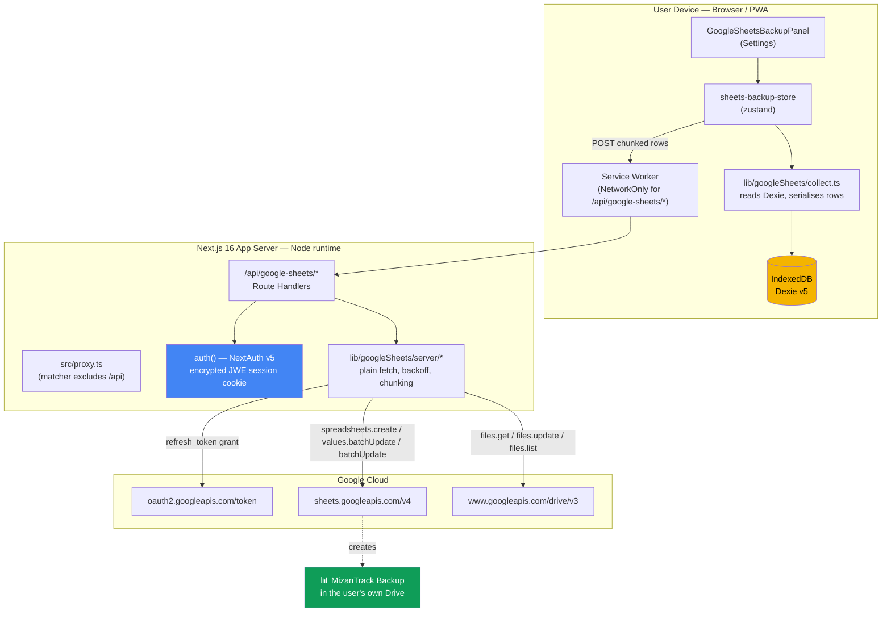
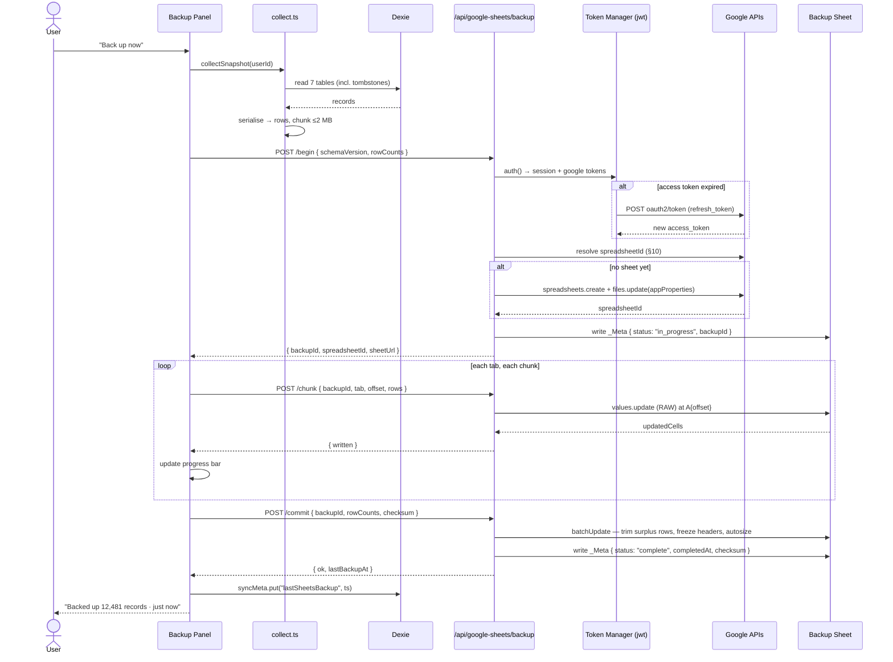
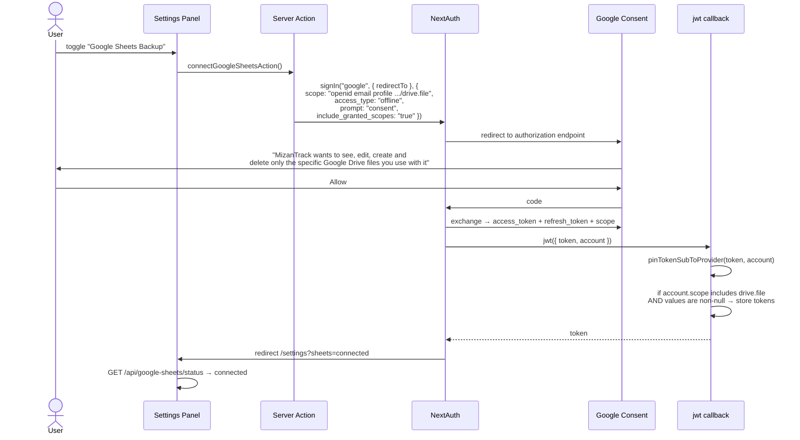
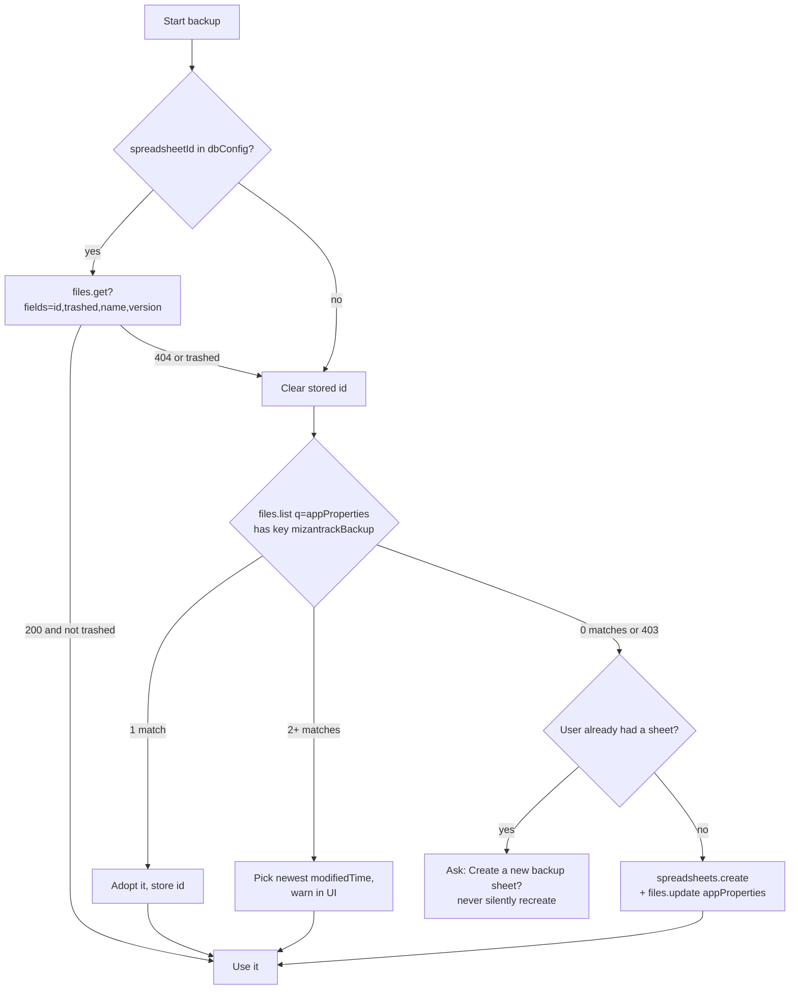

# Technical Design: Google Sheets Backup

**Document Version:** 1.0
**Last Updated:** 2026-09-29
**Mode:** New Feature
**Status:** Draft — blocked on the decisions in `docs/google-sheets-backup-questions.md`
**Feasibility Reference:** `docs/google-sheets-backup-feasibility.md`
**Plan Reference:** `docs/google-sheets-backup-plan.md`
**Repository:** mizantrack

---

## Table of Contents

1. [Executive Summary](#1-executive-summary)
2. [Requirements](#2-requirements)
3. [Current Architecture Analysis](#3-current-architecture-analysis)
4. [Proposed Architecture](#4-proposed-architecture)
5. [Sheet Schema](#5-sheet-schema)
6. [Google API Surface](#6-google-api-surface)
7. [Authentication & Token Lifecycle](#7-authentication--token-lifecycle)
8. [Backup Algorithm](#8-backup-algorithm)
9. [Route Handler Design](#9-route-handler-design)
10. [Discovery & Idempotency](#10-discovery--idempotency)
11. [Sync Semantics — One-Way vs Two-Way](#11-sync-semantics--one-way-vs-two-way)
12. [Failure Modes & Error Handling](#12-failure-modes--error-handling)
13. [Security & Privacy](#13-security--privacy)
14. [UI/UX Design](#14-uiux-design)
15. [Dependencies](#15-dependencies)
16. [Data Model Changes](#16-data-model-changes)
17. [Testing Strategy](#17-testing-strategy)
18. [Open Questions](#18-open-questions)

---

## 1. Executive Summary

MizanTrack will gain a third backup target alongside the existing bring-your-own-Firebase sync and the existing `.xlsx` download: a **live Google Spreadsheet in the signed-in user's own Google Drive**, created, written and updated by the app.

The design in one paragraph: the user opts in from Settings; the app requests **one additional non-sensitive OAuth scope** (`drive.file`) through next-auth v5's incremental-authorisation parameters; the refresh token is stored in the Auth.js encrypted session cookie and never reaches the browser; a Next.js 16 Route Handler running on the Node runtime holds the token and talks to the Sheets and Drive REST APIs with plain `fetch`; the client reads rows from Dexie and streams them to that handler in ≤2 MB chunks; the handler performs a **snapshot rewrite** of one tab per Dexie table, bracketed by a `_Meta` status sentinel so partial writes are always detectable.

Deliberately **out of scope for v1**: reading the sheet back into the app. One-way backup only. Restore is designed here but phased separately, because two-way sync against a surface the user can freely edit is the only genuinely dangerous part of this feature.

**Net new npm dependencies: zero.**

---

## 2. Requirements

### 2.1 Functional

| ID | Requirement |
|---|---|
| FR-GS-001 | Create a spreadsheet in the signed-in user's Drive on first connect |
| FR-GS-002 | Write all backup-relevant Dexie tables into that spreadsheet |
| FR-GS-003 | Subsequent backups update the **same** spreadsheet, never create duplicates |
| FR-GS-004 | Authorisation reuses the existing Google sign-in via incremental consent |
| FR-GS-005 | Coexist with Firebase sync and `.xlsx` export; neither disables the other |
| FR-GS-006 | Back up `goldItems`, `zakatCalculations` and `zakatPayments` — tables Firebase sync does not currently cover |
| FR-GS-007 | Surface last-backup time, row counts and a direct link to the sheet |
| FR-GS-008 | Manual "Back up now"; automatic triggers behind a user toggle |
| FR-GS-009 | Disconnect cleanly, with an explicit choice about whether to delete the sheet |
| FR-GS-010 | Soft-deleted records (`deletedAt`) are represented, not silently dropped |

### 2.2 Non-Functional

| ID | Requirement |
|---|---|
| NFR-GS-001 | Access and refresh tokens never reach the browser |
| NFR-GS-002 | Least-privilege scope — `drive.file` only |
| NFR-GS-003 | A full backup of 50,000 transactions completes in under 60 s on a normal connection |
| NFR-GS-004 | Stay within 60 write requests/minute/user; budget ≤ 30 per run |
| NFR-GS-005 | The app functions completely offline; this feature degrades gracefully and is never a startup dependency |
| NFR-GS-006 | No new secrets; no secret committed to the repository |
| NFR-GS-007 | The server persists no user financial data |
| NFR-GS-008 | A partial or interrupted backup is always detectable, never silently mistaken for a good one |

### 2.3 Constraints

- Next.js 16 — Middleware is **Proxy** (`src/proxy.ts`), and its matcher **excludes `/api`**, so route handlers must authenticate themselves.
- No server-side database exists. Session strategy is JWT; `@auth/firebase-adapter` is installed but unused.
- All user data lives in IndexedDB on the client. The server cannot read it and must be sent it.
- `next.config.js` applies a catch-all `NetworkFirst` service-worker rule to `/^https?.*/`.

---

## 3. Current Architecture Analysis

Summarised from the feasibility study §3; read that for the evidence.

| Area | State today | Consequence for this design |
|---|---|---|
| `src/lib/auth.ts` | NextAuth v5, Google provider, **no adapter** → JWT sessions. Scopes: `openid email profile`. `prompt: "select_account"`, **no `access_type`**. `jwt` callback keeps only `token.sub`. | Refresh token, Drive scope and token storage are all net-new. The `jwt` callback must be extended, not replaced. |
| `src/lib/auth/session.ts` | `pinTokenSubToProvider` pins `token.sub` to Google's numeric `sub`; `resolveSessionUserId` rejects UUID-shaped legacy IDs | `session.user.id` is a stable Google `sub` — safe to use as the Dexie `userId` and in the sheet's `_Meta` tab |
| `src/proxy.ts` | `auth()`-wrapped; matcher excludes `api` | **Every new route handler calls `auth()` itself.** Non-negotiable. |
| `src/lib/db/local.ts` | Dexie v4, 9 tables | Tab-per-table mapping; `dashboardStats` excluded as a derived cache |
| `src/types/index.ts` | `updatedAt: number` + `deletedAt?: number` on every syncable record | Enables last-write-wins and tombstones in the sheet |
| `src/lib/db/sync.ts` | BYO-Firebase, client-side, per-table `lastSync:<table>` watermarks, LWW on `updatedAt`, 499-record batches, watermark captured *before* the run | Mirror the watermark and LWW semantics exactly so the two backup targets never disagree about which record is newer |
| `src/lib/export.ts` | Hysab-Kytab-shaped `.xlsx`: `ACTIVITIES` / `ACCOUNT` / `CATEGORY`, no IDs, no timestamps, single currency, date-filtered | **Not reusable as a backup format.** A report, not a snapshot. Keep it untouched; the Sheet gets its own lossless layout. |
| `src/components/settings/FirebaseSyncPanel.tsx` | Card + switch + buttons + status line + progress + per-table counts + destructive dialogs | Structural template for `GoogleSheetsBackupPanel.tsx` |
| `next.config.js` | `@ducanh2912/next-pwa`, `runtimeCaching: [{ urlPattern: /^https?.*/, handler: "NetworkFirst" }]` | Must prepend a `NetworkOnly` rule for `/api/google-sheets/*` |

---

## 4. Proposed Architecture

### 4.1 System context



### 4.2 Backup sequence



### 4.3 New files

All paths are additive. **No existing file is rewritten**; the three marked *(edit)* receive additive changes only.

```
src/
  app/api/google-sheets/
    status/route.ts              GET   connection + last backup state
    begin/route.ts               POST  resolve/create sheet, open a backup run
    chunk/route.ts               POST  write one chunk of one tab
    commit/route.ts              POST  finalise, format, seal _Meta
    disconnect/route.ts          POST  revoke token, optionally trash the sheet
  lib/googleSheets/
    schema.ts                    tab + column definitions, SHEET_SCHEMA_VERSION
    serialize.ts                 Record → string[]  (pure, unit-testable)
    deserialize.ts               string[] → Record  (pure; Phase 5 restore)
    collect.ts                   client: read Dexie → chunked payloads
    chunk.ts                     client: ≤2 MB chunking helper
    errors.ts                    shared error taxonomy
    server/
      tokens.ts                  'server-only' — read/refresh Google tokens
      googleFetch.ts             'server-only' — fetch + backoff + quota taxonomy
      sheetsApi.ts               'server-only' — create/values/batchUpdate wrappers
      driveApi.ts                'server-only' — files.get/list/update/trash
      backup.ts                  'server-only' — orchestration
  components/settings/
    GoogleSheetsBackupPanel.tsx  the card
    GoogleSheetsBackupDialog.tsx confirm / disconnect / delete dialogs
  store/
    sheets-backup-store.ts       zustand, modelled on sync-store.ts
  lib/actions/
    googleSheets.ts              Server Action wrapping signIn() for consent
  lib/validations/
    googleSheetsRow.ts           zod schemas for untrusted sheet input (Phase 5)

(edit) src/lib/auth.ts                          extend jwt/session callbacks
(edit) src/lib/db/local.ts                      Dexie v5: dbConfig fields
(edit) src/types/index.ts                       DbConfig fields + new interfaces
(edit) src/components/settings/SettingsPageClient.tsx   mount the panel
(edit) next.config.js                           NetworkOnly rule
(edit) .env.local.example                       document the new scope (comment only)
```

---

## 5. Sheet Schema

### 5.1 Principles

1. **Lossless.** Every field of every backed-up record round-trips. That means `id`, `userId`, `updatedAt` and `deletedAt` are columns, not decoration.
2. **`valueInputOption: "RAW"` everywhere.** `USER_ENTERED` would let Sheets reinterpret values — a UUID beginning with digits, an ISO date, a long numeric string. RAW is the only safe choice for a backup, and it is the difference between a restore that works and one that silently corrupts.
3. **ISO 8601 for timestamps.** `updatedAt: 1735689600000` is stored as `2025-01-01T00:00:00.000Z`. Readable, sortable, unambiguous, and `Date.parse()` round-trips it exactly. Store the ISO string, not the epoch integer.
4. **Column order is part of the contract.** Readers locate columns by header name, never by index, so appending a column is a non-breaking change.
5. **One tab per Dexie table.** Direct mental mapping, and each tab can be written independently.
6. **Tombstones are preserved.** A backup that drops soft-deleted rows cannot correctly restore a device, because the deletion itself is data.

### 5.2 Tabs

| Tab | Source | Notes |
|---|---|---|
| `_Meta` | — | Schema version, backup status, row counts, checksum |
| `Transactions` | `db.transactions` | Largest tab |
| `Accounts` | `db.accounts` | |
| `Categories` | `db.categories` | |
| `GoldItems` | `db.goldItems` | **Not covered by Firebase sync today** |
| `ZakatCalculations` | `db.zakatCalculations` | **Not covered by Firebase sync today**; two JSON columns |
| `ZakatPayments` | `db.zakatPayments` | **Not covered by Firebase sync today** |
| `Config` | `db.dbConfig` | Key/value; **secrets excluded** — see §5.3 |
| `Summary` | derived | *Phase 4, optional.* Human-readable, formula-driven, never read back |

`dashboardStats` is **excluded** — a derived cache, recomputable by `scheduleAnalyticsRecompute`, and backing it up would only create a stale-data hazard.

### 5.3 Column layouts

Derived field-by-field from `src/types/index.ts`.

**`_Meta`** — key/value, two columns `Key` | `Value`:

| Key | Example | Purpose |
|---|---|---|
| `schemaVersion` | `1` | Bump on any breaking column change |
| `appVersion` | `0.1.0` | From `package.json` |
| `dexieVersion` | `5` | Detect app-older-than-sheet |
| `userId` | `1078…` | Google `sub`; guards against restoring another user's sheet |
| `backupId` | `a3f1…` | UUID per run; concurrency guard (§12.6) |
| `status` | `in_progress` \| `complete` \| `failed` | Partial-write sentinel |
| `startedAt` / `completedAt` | ISO 8601 | |
| `rowCounts` | `{"transactions":12481,…}` | JSON; verified at commit |
| `checksum` | `sha256:…` | Over the serialised payload; detects user edits (§11.3) |
| `generatedBy` | `MizanTrack` | |
| `warning` | *"Do not edit …"* | Plain-language guard rail |

**`Transactions`** — 17 columns:

`id` · `userId` · `type` · `date` · `amount` · `description` · `categoryId` · `accountId` · `toAccountId` · `tags` · `place` · `travelCurrencySymbol` · `travelCurrencyRate` · `travelCurrencyAmount` · `travelLocation` · `updatedAt` · `deletedAt`

- `date`, `updatedAt`, `deletedAt`: ISO 8601 strings; `deletedAt` empty when live
- `amount`: always positive, matching the type contract (**note the divergence from `export.ts`, which negates expenses** — the backup keeps the raw model value)
- `tags`: joined with `|`. Chosen over `,` because commas are common in user tags; a `|` in a tag is escaped as `\|`
- `travelCurrency*`: flattened; all four empty when absent

**`Accounts`** — 11 columns:
`id` · `userId` · `title` · `openingBalance` · `currency` · `color` · `icon` · `isArchived` · `accountType` · `updatedAt` · `deletedAt`

Booleans are `TRUE`/`FALSE` strings. `accountType` empty means the `asset` default.

**`Categories`** — 10 columns:
`id` · `userId` · `title` · `type` · `currency` · `icon` · `color` · `parentId` · `updatedAt` · `deletedAt`

Empty `currency` means "shared across all currencies" — meaningful, not missing.

**`GoldItems`** — 10 columns:
`id` · `userId` · `title` · `weight` · `purity` · `purchaseDate` · `purchasePrice` · `notes` · `updatedAt` · `deletedAt`

**`ZakatCalculations`** — 21 columns:
`id` · `userId` · `islamicYear` · `assessmentDate` · `nisabStandard` · `goldPricePerGram` · `silverPricePerGram` · `referenceCurrency` · `totalGoldWeightGrams` · `totalGoldValue` · `accountBalancesJson` · `totalZakatable` · `nisabThreshold` · `zakatObligation` · `isLiable` · `monthlyBalancesJson` · `createdAt` · `updatedAt` · `deletedAt`

`accountBalances[]` and `monthlyBalances[]` are nested arrays. Flattening them into child tabs would need a join key and a second write round-trip for a handful of rows per year. **Decision: JSON-encode each into one cell.** Sizing: ~30 accounts × ~160 bytes ≈ 5 KB, and 12 monthly entries ≈ 1 KB — comfortably inside the commonly-cited 50,000-character cell limit, though that limit is **unverified** (feasibility §11.6). `serialize.ts` must assert the encoded length and fail loudly rather than let Sheets truncate.

**`ZakatPayments`** — 11 columns:
`id` · `userId` · `calculationId` · `islamicYear` · `date` · `amount` · `currency` · `recipient` · `notes` · `createdAt` · `updatedAt` · `deletedAt`

**`Config`** — key/value from `DbConfig`, with a **strict allow-list**:

| Included | Excluded — and why |
|---|---|
| `currency`, `fiscalYearStartMonth`, `enabledCurrencies`, `appLockEnabled`, `biometricEnabled`, `lastGoldPricePerGram`, `lastGoldPriceFetchedAt` | `pinHash` — a hash of a 4-digit PIN is brute-forced in milliseconds; putting it in a plaintext cloud document is indefensible |
| | `firebaseConfig` — contains the user's Firebase `apiKey`; not a capability secret, but never belongs in a shareable document |
| | `goldApiKey` — a real third-party API key |
| | `biometricCredentialId` — device-local by design; `sync.ts` already excludes it from `SYNCED_PREFS_FIELDS` |

This allow-list is deliberately narrower than `SYNCED_PREFS_FIELDS` in `sync.ts`, which *does* sync `pinHash`. That is defensible for a user-owned Firestore behind auth rules; it is **not** defensible for a Drive document the user might share with an accountant. Restoring App Lock settings is not worth that exposure — after a restore the user re-sets their PIN. This asymmetry must be documented in the code so a future reader does not "fix" it.

### 5.4 Formatting

Applied once at creation and re-asserted on commit, via a single `spreadsheets.batchUpdate`:

| Request | Effect |
|---|---|
| `updateSheetProperties` → `gridProperties.frozenRowCount = 1` | Header row frozen |
| `repeatCell` on row 0 | Bold, white on `#0f9d58`, centred |
| `setBasicFilter` | Sort/filter controls on every tab |
| `autoResizeDimensions` | Columns sized to content |
| `addConditionalFormatRule` | Rows with a non-empty `deletedAt` greyed and struck through — deletions become visible at a glance |
| `updateDimensionProperties` | `_Meta` column B widened to 600 px |
| `updateSpreadsheetProperties` → `title` | `MizanTrack Backup — <email>` |

**Cost note:** `autoResizeDimensions` across seven tabs on every backup is wasteful. Run the full formatting batch **only at creation and on schema-version change**; on ordinary commits re-assert only the frozen row and the `_Meta` write.

---

## 6. Google API Surface

### 6.1 Endpoints used

| Operation | Endpoint | Scope | When |
|---|---|---|---|
| Create spreadsheet | `POST https://sheets.googleapis.com/v4/spreadsheets` | `drive.file` | First connect only |
| Tag for discovery | `PATCH https://www.googleapis.com/drive/v3/files/{id}?fields=id,appProperties` | `drive.file` | Immediately after create |
| Verify it still exists | `GET https://www.googleapis.com/drive/v3/files/{id}?fields=id,name,trashed,modifiedTime,version,webViewLink` | `drive.file` | Start of every run |
| Re-discover (fallback) | `GET https://www.googleapis.com/drive/v3/files?q=appProperties has { key='mizantrackBackup' and value='v1' } and trashed=false&spaces=drive&fields=files(id,name,modifiedTime)` | `drive.file` **(unverified — feasibility §11.1)** | Only when no stored ID |
| Write rows | `PUT https://sheets.googleapis.com/v4/spreadsheets/{id}/values/{range}?valueInputOption=RAW` | `drive.file` | Per chunk |
| Multi-range write | `POST …/values:batchUpdate` | `drive.file` | Small tabs coalesced into one request |
| Structure & formatting | `POST …/spreadsheets/{id}:batchUpdate` | `drive.file` | Create, commit trim, formatting |
| Read back (Phase 5) | `GET …/values/{range}` | `drive.file` | Restore / drift detection |
| Trash on disconnect | `PATCH https://www.googleapis.com/drive/v3/files/{id}` → `{ "trashed": true }` | `drive.file` | Only if the user asks |
| Revoke consent | `POST https://oauth2.googleapis.com/revoke?token=…` | — | Disconnect |

### 6.2 Why not `spreadsheets.get`

Google's own guidance, from <https://developers.google.com/workspace/sheets/api/guides/create>:

> "we recommend that you query for only the specific spreadsheet fields that you need… `spreadsheets.get` returns all the data… resulting in large JSON payloads… a similar call to `values.get` returns only the specific cell value resulting in a much lighter, faster response"

So: `values.get` with an explicit range for reads, `files.get` with an explicit `fields` mask for metadata. Never bare `spreadsheets.get`.

### 6.3 Full overwrite vs incremental delta

This was the closest call in the design.

**Incremental delta** — write only rows whose `updatedAt > lastBackupAt`:

- Sheets has **no upsert-by-key**. Writing a changed row requires knowing its row index, which requires reading the whole `id` column first — a 50,000-cell read, i.e. paying most of the cost of a full write to save part of a write.
- Changed rows are scattered, producing many small non-contiguous `values.update` calls. Each consumes one of 60 writes/minute.
- Deleted rows leave holes, or force a compaction that invalidates every cached index.
- The sheet can **drift** from local state and there is no cheap way to tell.

**Snapshot rewrite** — rebuild every tab from current local state:

- Trivially idempotent. Sheet state is always exactly local state.
- Cost is bounded and predictable: 50,000 transactions × 17 columns ≈ 850k cells ≈ 4% of the 20-million-cell ceiling.
- Chunking is required anyway to respect the 2 MB payload guidance.
- Reasoning about correctness is easy, which matters enormously for backups.

**Decision: snapshot rewrite, with a per-tab dirty check.**

Before writing a tab, compare `max(updatedAt)` across that table with the `lastBackupAt` recorded in `_Meta`. If nothing changed, **skip the tab entirely**. In the common case — a user who added three transactions since yesterday — `Accounts`, `Categories`, `GoldItems`, `ZakatCalculations`, `ZakatPayments` and `Config` are all skipped and only `Transactions` is rewritten. This captures most of delta's benefit with none of its complexity.

If a user ever exceeds ~100,000 transactions, revisit with a **year-partitioned tab** scheme (`Transactions_2025`, `Transactions_2026`) so only the current year is rewritten. Recorded as a Phase 6 idea, not built.

### 6.4 Request budget for a realistic worst case

50,000 transactions, ~180 bytes/row serialised ≈ 9 MB total.

| Step | Requests |
|---|---|
| `files.get` (verify) | 1 read |
| `_Meta` begin write | 1 write |
| `Transactions` — 9 MB ÷ 1.8 MB chunks | 5 writes |
| Other six tabs, coalesced via `values:batchUpdate` | 1 write |
| Commit `batchUpdate` (trim + freeze) | 1 write |
| `_Meta` seal | 1 write |
| **Total** | **~9 writes, 1 read** |

Against a quota of 60 writes/minute/user, that is **15% utilisation**. Even a pathological 10× dataset stays inside quota. NFR-GS-004 holds with wide margin.

---

## 7. Authentication & Token Lifecycle

### 7.1 Consent flow



### 7.2 Extended `jwt` callback

```ts
const DRIVE_FILE_SCOPE = "https://www.googleapis.com/auth/drive.file";

async jwt({ token, account }) {
  // Preserve existing behaviour — never drop this.
  token = pinTokenSubToProvider(token, account) as typeof token;

  // Only enrich when THIS sign-in actually granted Drive access AND
  // actually returned the values. A plain re-sign-in (LockScreen calls
  // signIn("google", { redirect: false })) must not wipe stored tokens.
  if (account?.scope?.includes(DRIVE_FILE_SCOPE)) {
    if (account.access_token) token.googleAccessToken = account.access_token;
    if (account.refresh_token) token.googleRefreshToken = account.refresh_token;
    if (account.expires_at) token.googleExpiresAt = account.expires_at * 1000;
    token.googleScope = account.scope;
  }

  if (token.googleRefreshToken && isExpiringSoon(token.googleExpiresAt)) {
    token = await refreshGoogleAccessToken(token);
  }

  return token;
}
```

The guard in the middle of that function is **the most important five lines in the feature**. Feasibility §7.3 explains the failure it prevents; the plan makes it an explicit acceptance criterion with a dedicated unit test.

### 7.3 Refresh

```ts
async function refreshGoogleAccessToken(token) {
  try {
    const res = await fetch("https://oauth2.googleapis.com/token", {
      method: "POST",
      headers: { "Content-Type": "application/x-www-form-urlencoded" },
      body: new URLSearchParams({
        client_id: process.env.AUTH_GOOGLE_ID!,
        client_secret: process.env.AUTH_GOOGLE_SECRET!,
        grant_type: "refresh_token",
        refresh_token: token.googleRefreshToken,
      }),
    });
    const data = await res.json();
    if (!res.ok) throw new GoogleAuthError(data.error);

    return {
      ...token,
      googleAccessToken: data.access_token,
      googleExpiresAt: Date.now() + data.expires_in * 1000,
      // Google usually omits refresh_token on refresh — keep the existing one.
      googleRefreshToken: data.refresh_token ?? token.googleRefreshToken,
      googleTokenError: undefined,
    };
  } catch (e) {
    // invalid_grant is terminal: revoked, expired, or the 7-day testing-mode
    // expiry. Never retry — mark for reconnect and clear the dead token.
    return {
      ...token,
      googleAccessToken: undefined,
      googleRefreshToken: undefined,
      googleTokenError: "RequiresReconnect",
    };
  }
}
```

Refresh is attempted with a **60-second skew** so an in-flight backup never races the expiry.

### 7.4 Session exposure

The session callback exposes **status only** — never a token:

```ts
session.googleSheets = {
  connected: Boolean(token.googleRefreshToken),
  needsReconnect: token.googleTokenError === "RequiresReconnect",
};
```

Enforced by a lint-visible convention: every module under `lib/googleSheets/server/` starts with `import "server-only"`, per the Next.js 16 data-security guide (`node_modules/next/dist/docs/01-app/02-guides/data-security.md`), which recommends exactly this DTO-minimisation pattern.

### 7.5 Cookie size

A Google refresh token is ~100–200 characters and an access token ~1–2 KB. Adding both to the JWE session cookie adds roughly **1.5–2.5 KB**, against a 4 KB per-cookie browser limit. Auth.js chunks oversized cookies automatically, but it is close enough to matter.

**Mitigation:** store the refresh token and the expiry in the JWT; **do not store the access token.** Derive a fresh access token on each server request that needs one. Refreshes then cost one extra round-trip per backup run — negligible against a multi-second operation, and it keeps the cookie under ~500 bytes of growth. A Phase 0 measurement confirms the actual size before committing to this.

---

## 8. Backup Algorithm

### 8.1 Pseudocode

```
CLIENT: runBackup(userId)
  if (!navigator.onLine) → "You're offline" ; abort
  status ← GET /api/google-sheets/status
  if (!status.connected) → prompt connect ; abort

  snapshot ← collectSnapshot(userId)        // reads all 7 tables, incl. tombstones
  startedAt ← Date.now()                    // captured BEFORE reads, mirroring sync.ts

  { backupId, spreadsheetId, dirtyTabs } ←
      POST /begin { schemaVersion, rowCounts, maxUpdatedAtPerTable }

  for tab in dirtyTabs:
      for chunk in chunkRows(snapshot[tab], MAX_CHUNK_BYTES):
          POST /chunk { backupId, tab, startRow, rows: chunk }   // with retry
          onProgress(...)

  POST /commit { backupId, rowCounts, checksum }
  syncMeta.put({ id: "lastSheetsBackup", timestamp: startedAt })
```

```
SERVER: /begin
  session ← await auth()                    // REQUIRED — proxy excludes /api
  if (!session?.user?.id) → 401
  token ← getGoogleAccessToken(session)     // refresh if needed
  if (!token) → 409 { code: "RequiresReconnect" }

  spreadsheetId ← resolveSpreadsheet(token, body.knownSpreadsheetId)   // §10
  meta ← readMeta(spreadsheetId)

  if (meta.status == "in_progress" && age(meta.startedAt) < 5 min)
      → 409 { code: "ConcurrentBackup" }

  dirtyTabs ← tabs where body.maxUpdatedAt[tab] > meta.lastBackupAt[tab]
              ∪ (meta.schemaVersion != SHEET_SCHEMA_VERSION ? ALL_TABS : ∅)

  writeMeta({ status: "in_progress", backupId: uuid(), startedAt: now })
  return { backupId, spreadsheetId, sheetUrl, dirtyTabs }
```

```
SERVER: /commit
  verify body.backupId == meta.backupId      // else 409 ConcurrentBackup
  batchUpdate:
      for each written tab: delete rows beyond rowCount+1   // trim stale tail
      re-assert frozenRowCount = 1
      if schemaVersion changed: full formatting pass
  writeMeta({ status: "complete", completedAt, rowCounts, checksum,
              schemaVersion: SHEET_SCHEMA_VERSION })
```

### 8.2 Chunking

`MAX_CHUNK_BYTES = 1_800_000` — ~10% under Google's recommended 2 MB, leaving room for JSON framing and the Vercel ~4.5 MB request-body ceiling.

```ts
export function chunkRows(rows: string[][], maxBytes: number): string[][][] {
  const out: string[][][] = [];
  let cur: string[][] = [];
  let size = 0;
  for (const row of rows) {
    const rowBytes = JSON.stringify(row).length + 2;
    if (size + rowBytes > maxBytes && cur.length > 0) {
      out.push(cur); cur = []; size = 0;
    }
    cur.push(row); size += rowBytes;
  }
  if (cur.length) out.push(cur);
  return out;
}
```

A chunk targets `values.update` at `'<Tab>'!A{startRow}` with `valueInputOption=RAW`. Chunks within a tab are strictly sequential; tabs may be parallelised at concurrency **2** (not more — quota and ordering).

### 8.3 Trimming stale rows

If the previous backup had 12,000 transactions and the current one has 11,800, rows 11,802–12,001 would otherwise survive as ghosts. The commit `batchUpdate` issues a `deleteDimension` for every row beyond `rowCount + 1` on each written tab. `deleteDimension` is preferred over blank-padding: it keeps the sheet small and makes the row count visually honest.

### 8.4 Progress reporting

`sheets-backup-store.ts` mirrors `sync-store.ts`: `{ backingUp, lastBackupAt, error, progress: { tab, rowsWritten, totalRows } }`, so `FirebaseSyncPanel`'s progress idiom transfers directly.

### 8.5 Atomicity

Google guarantees atomicity **per request** only:

> "All Sheets requests are applied atomically… if any request is not valid then the entire update is unsuccessful."

A multi-request run therefore needs its own sentinel. `_Meta.status` is written `in_progress` **first** and `complete` **last**. Any reader — the next backup, a restore, or a human — can tell a truncated backup from a good one. The UI surfaces `in_progress` older than 5 minutes as **"Last backup did not finish — back up again."**

---

## 9. Route Handler Design

### 9.1 Conventions (Next.js 16)

Per `node_modules/next/dist/docs/01-app/01-getting-started/15-route-handlers.md`:

- `route.ts` under `app/api/…`, exporting named HTTP-method functions.
- *"Route Handlers are not cached by default."* Only `GET` can opt in, and we do not.
- Segment config from `node_modules/next/dist/docs/01-app/03-api-reference/03-file-conventions/route.md`:

```ts
export const runtime = "nodejs";   // not Edge — Auth.js Node crypto path
export const dynamic = "force-dynamic";
```

`runtime = "nodejs"` is explicit even though it is the default: it documents intent and prevents a future Edge default from silently breaking token handling.

### 9.2 Authentication — the non-negotiable bit

`src/proxy.ts`'s matcher **excludes `api`**, and the Next.js 16 Proxy guide says Proxy *"should not be used as a full session management or authorization solution"* anyway. Every handler therefore begins:

```ts
export async function POST(request: Request) {
  const session = await auth();
  if (!session?.user?.id) {
    return Response.json({ error: "Unauthorized" }, { status: 401 });
  }
  // ...
}
```

A shared `withGoogleSheetsAuth()` wrapper enforces this in one place so it cannot be forgotten in a new endpoint.

### 9.3 Service-worker exclusion

`next.config.js` currently starts `runtimeCaching` with a catch-all:

```js
{ urlPattern: /^https?.*/, handler: "NetworkFirst", options: { networkTimeoutSeconds: 10, ... } }
```

Workbox evaluates rules in order, so a `NetworkOnly` rule must be **prepended**:

```js
runtimeCaching: [
  { urlPattern: /\/api\/google-sheets\/.*/, handler: "NetworkOnly" },
  { urlPattern: /^https:\/\/(sheets|www)\.googleapis\.com\/.*/, handler: "NetworkOnly" },
  { urlPattern: /^https?.*/, handler: "NetworkFirst", options: { /* unchanged */ } },
]
```

The second rule is belt-and-braces: it costs nothing and guarantees correctness if the token-broker architecture is ever adopted.

### 9.4 Payload limits

Route Handlers are not bound by `serverActions.bodySizeLimit` (1 MB, per `node_modules/next/dist/docs/01-app/03-api-reference/05-config/01-next-config-js/serverActions.md`) — which is itself a reason to use Route Handlers rather than Server Actions for the data path. Hosting limits still apply (Vercel ≈ 4.5 MB). The 1.8 MB chunk size sits safely under both, and the handler rejects anything larger with `413` rather than failing opaquely.

### 9.5 Endpoint contracts

| Endpoint | Method | Request | Response | Errors |
|---|---|---|---|---|
| `/status` | GET | — | `{ connected, needsReconnect, spreadsheetId?, sheetUrl?, lastBackupAt?, rowCounts? }` | 401 |
| `/begin` | POST | `{ schemaVersion, rowCounts, maxUpdatedAt, knownSpreadsheetId? }` | `{ backupId, spreadsheetId, sheetUrl, dirtyTabs }` | 401, 409 `RequiresReconnect` \| `ConcurrentBackup`, 429, 502 |
| `/chunk` | POST | `{ backupId, tab, startRow, rows }` | `{ written }` | 401, 409, 413, 429, 502 |
| `/commit` | POST | `{ backupId, rowCounts, checksum }` | `{ ok, lastBackupAt, sheetUrl }` | 401, 409, 502 |
| `/disconnect` | POST | `{ deleteSheet: boolean }` | `{ ok }` | 401 |

Every error body is `{ error: string, code: GoogleSheetsErrorCode, retryAfterMs?: number }` so the client can branch on `code` rather than parse prose.

---

## 10. Discovery & Idempotency

FR-GS-003 — never create a second sheet — is the requirement most likely to be violated in practice.

### 10.1 Resolution order



### 10.2 The `appProperties` tag

Set immediately after creation:

```json
{
  "appProperties": {
    "mizantrackBackup": "v1",
    "mizantrackUserId": "<google sub>",
    "mizantrackSchemaVersion": "1"
  }
}
```

`appProperties` are *"private custom file properties"* visible only to the app that set them (<https://developers.google.com/workspace/drive/api/guides/properties>), retrievable only with an OAuth access token, not an API key. Query syntax per <https://developers.google.com/workspace/drive/api/guides/ref-search-terms>:

```
appProperties has { key='mizantrackBackup' and value='v1' } and trashed = false
```

### 10.3 The unverified assumption — and why the design survives it

Feasibility §11.1: we could not confirm from an official page that `files.list` with an `appProperties` filter works under `drive.file` alone. The Sheets guide's "listing a user's spreadsheets requires a restricted Drive API scope" appears to refer to unscoped enumeration, and `drive.file` should already restrict the result set to app-created files — but "should" is not "documented".

**The design does not depend on it.** Discovery is layered:

| Layer | Mechanism | Works if Drive query fails? |
|---|---|---|
| 1 (primary) | `dbConfig.googleSheetId`, local | Yes |
| 2 | Same field propagated to other devices via the existing Firebase prefs sync (`SYNCED_PREFS_FIELDS` + `googleSheetId`) | Yes |
| 3 (fallback) | Drive `appProperties` query | — |
| 4 (manual) | "I already have a backup sheet — paste its URL" | Yes |
| 5 | Create a new one | Yes |

If the spike shows layer 3 fails, we lose only graceful recovery for a user who has Firebase sync **off** *and* arrives on a brand-new device. Layer 4 covers that, and it is a two-input dialog. **Worst case, this is a small UX regression, not a design failure.**

Layer 4 has a wrinkle worth noting: `drive.file` grants access to files the app created *or that the user explicitly opens with the app via the Google Picker*. A user-pasted URL for a file the app created is fine. A URL for some *other* spreadsheet the user made by hand will return 404 under `drive.file`, and the error message must say so in plain language rather than "Not found".

### 10.4 Edge cases

| Case | Detection | Handling |
|---|---|---|
| User deletes the sheet | `files.get` → 404 | Clear stored id; UI: *"Your backup sheet was deleted. Create a new one?"* Never auto-recreate. |
| User trashes the sheet | `trashed: true` | Same, plus offer *"Restore it from Drive trash"* |
| User renames it | Name is not a key | Nothing — we key on id and `appProperties` |
| User moves it to a folder | `files.get` still succeeds | Nothing |
| Two sheets exist (duplicate) | `files.list` → 2+ | Use the newest; UI warns and links to both |
| User shares the sheet | Invisible to us | Covered by the standing privacy warning (§13.4) |
| Sheet belongs to another Google account | `_Meta.userId ≠ session.user.id` | **Refuse to write.** Guards against cross-account contamination. |

---

## 11. Sync Semantics — One-Way vs Two-Way

### 11.1 Recommendation: one-way for v1

**App → Sheet only.** The sheet is a *backup artefact*, not a second editing surface.

| | One-way | Two-way |
|---|---|---|
| Data-loss risk | Low — worst case the sheet is stale | **High** — a mis-parsed sheet can overwrite good local data |
| Conflict resolution | None needed | Needs LWW, tombstone reconciliation, referential integrity |
| Input validation | None — we produce the data | Every cell is untrusted input |
| User mental model | "This is my backup" | "Which one is right?" |
| Effort | ~2 weeks | ~4–5 additional weeks |

Two-way is where backup features go to die. A user deletes a row to "clean up", sync interprets it as a deletion, and their transaction history is gone from every device. That failure is unrecoverable and the app would deserve the blame.

### 11.2 Two-way, designed but deferred

If it is ever built, it must be **Restore**, not *sync*: an explicit, deliberate, one-shot, user-initiated import — never automatic, never background.

```
restoreFromSheet(userId, options):
  1. snapshot local Dexie to an .xlsx download FIRST — non-negotiable, non-skippable
  2. read every tab via values.get
  3. verify _Meta.schemaVersion is supported and _Meta.userId == session.user.id
  4. zod-validate EVERY row → collect per-row errors, never throw on the first
  5. if error rate > 1% → abort, show the report, change nothing
  6. referential integrity: every transaction.accountId resolves; orphans quarantined
  7. merge per record:
        local missing                     → insert
        sheet.updatedAt > local.updatedAt → overwrite   (LWW, matching sync.ts)
        otherwise                         → keep local
     deletedAt is data: a tombstone with a newer updatedAt wins
  8. show a dry-run diff: "142 new, 8 updated, 3 deleted, 2 skipped" → require confirmation
  9. apply in a single Dexie transaction
 10. scheduleAnalyticsRecompute(userId)
 11. reset syncMeta watermarks to 0 so Firebase re-reconciles
```

Step 1 and step 8 are what make this safe. Neither may be optimised away.

### 11.3 Detecting that the user edited the sheet

Three independent signals, cheap to compute:

1. **Drive `version` / `modifiedTime`** — record them at commit; if they changed before the next run, something else wrote to the file.
2. **`_Meta.checksum`** — SHA-256 over the serialised payload. Recompute on read; a mismatch means the content changed.
3. **`lastModifyingUser`** on `files.get` — distinguishes our own write from the user's.

With edits detected, the next backup must warn rather than steamroll:

> "This sheet was edited outside MizanTrack on 12 Feb. Backing up now will overwrite those changes. [Back up anyway] [Download the sheet first]"

### 11.4 Validation of untrusted input

Every row read from a sheet is **untrusted**, exactly like a file upload. Phase 5 adds `src/lib/validations/googleSheetsRow.ts` with per-table zod schemas — strict types, coerced numbers, UUID checks, enum checks on `type`/`purity`/`nisabStandard`, ISO-date parsing with explicit failure, and `.strict()` so unknown columns are surfaced rather than ignored. These extend the existing `src/lib/validations/*.ts` patterns rather than duplicating them.

---

## 12. Failure Modes & Error Handling

### 12.1 Taxonomy

| Code | Cause | HTTP | Retry? | UI |
|---|---|---|---|---|
| `Offline` | `navigator.onLine === false` | — | Manual | *"You're offline. Backup needs a connection."* Button disabled. |
| `Unauthorized` | No session | 401 | No | Redirect to `/login` |
| `NotConnected` | No Drive scope granted | 409 | No | *"Connect Google Sheets"* |
| `RequiresReconnect` | `invalid_grant` — revoked / expired / testing-mode 7-day | 409 | No | *"Your Google connection expired. Reconnect."* |
| `SheetMissing` | `files.get` → 404 | 409 | No | *"Backup sheet not found. Create a new one?"* |
| `SheetForeign` | `_Meta.userId` mismatch | 409 | No | *"This sheet belongs to a different account."* |
| `ConcurrentBackup` | `_Meta.status = in_progress` elsewhere | 409 | After 60 s | *"Another device is backing up."* |
| `QuotaExceeded` | 429 `RESOURCE_EXHAUSTED` | 429 | **Yes**, backoff | *"Google is rate-limiting. Retrying…"* |
| `PayloadTooLarge` | Chunk over limit | 413 | No (bug) | *"Backup failed. Please report."* |
| `PartialWrite` | Run aborted mid-way | — | Yes | *"Last backup didn't finish."* |
| `GoogleServerError` | 5xx | 502 | **Yes**, backoff | *"Google is having trouble. Retrying…"* |
| `SheetTooLarge` | 20M cells / 100 MB | 507 | No | *"Your data exceeds Google Sheets' limit."* |

### 12.2 Backoff

Google's published algorithm (<https://developers.google.com/workspace/sheets/api/limits>), implemented verbatim:

```ts
async function withBackoff<T>(fn: () => Promise<T>, maxAttempts = 5): Promise<T> {
  let lastError: unknown;
  for (let n = 0; n < maxAttempts; n++) {
    try { return await fn(); }
    catch (e) {
      lastError = e;
      if (!isRetryable(e)) throw e;             // 401/403/404/400 never retry
      const wait = Math.min(2 ** n * 1000 + Math.random() * 1000, 32_000);
      await sleep(wait);
    }
  }
  throw lastError;
}
```

`max_backoff` is 32 s, within Google's recommended 32–64 s. Five attempts gives a worst case of roughly 1 + 2 + 4 + 8 + 16 ≈ 31 s of waiting. A per-run wall-clock budget of **120 s** caps the total so the UI never appears to hang.

### 12.3 Offline

The client short-circuits before any network call and the store records `error: "Offline"`. A `window.addEventListener("online", …)` listener clears it. If "automatic backup" is enabled, a backup queued while offline runs on the next foreground `online` event — **not** via Background Sync (feasibility §8.4).

### 12.4 Expired / revoked token

Handled in `refreshGoogleAccessToken` (§7.3). `invalid_grant` is terminal by Google's own documentation. The token fields are cleared, `googleTokenError = "RequiresReconnect"` is set, `/status` reports it, and the panel switches to a single **Reconnect** button. Automatic backups are suppressed until reconnection so the user is not spammed with failures.

### 12.5 Partial write

`_Meta.status` (§8.5) plus the `backupId`. Three recovery rules:

1. Next `/begin` sees `in_progress` **older than 5 minutes** → treats it as abandoned, takes over, forces **all** tabs dirty (a partial write means dirty-tracking cannot be trusted).
2. Next `/begin` sees `in_progress` **newer than 5 minutes** → `ConcurrentBackup`.
3. The UI shows a persistent amber banner until a `complete` backup lands.

### 12.6 Concurrent writes from two devices

Two devices, one sheet. Compare-and-set on `backupId`:

1. `/begin` reads `_Meta`; if a fresh `in_progress` exists → 409.
2. Otherwise write a new `backupId` and re-read to confirm it stuck.
3. Every `/chunk` and `/commit` carries the `backupId`; the server verifies it still matches `_Meta` before writing.
4. A device whose `backupId` has been superseded aborts with `ConcurrentBackup`.

This is advisory locking, not a true mutex — there is a small window between read and write. That is acceptable: the worst outcome is one aborted backup, and the sentinel guarantees the *next* run rewrites everything. A true mutex would need Drive revision preconditions, which is not worth the complexity here.

### 12.7 Very large datasets

Pre-flight in `collect.ts`: estimate `Σ(rows × columns)` and compare against 20,000,000 cells.

| Utilisation | Behaviour |
|---|---|
| < 50% | Normal |
| 50–80% | Amber notice in the panel |
| 80–100% | Warning + recommend year-partitioned tabs (Phase 6) |
| > 100% | **Refuse to start** — `SheetTooLarge`. Failing fast beats a half-written sheet. |

At 17 columns, the 20M ceiling is ~1.17 million transactions. No realistic personal user reaches it. The guard exists so the failure is a clear message rather than a confusing API error.

---

## 13. Security & Privacy

This is a user's complete financial history. The bar is high.

### 13.1 Least privilege

`https://www.googleapis.com/auth/drive.file` and nothing more. The consent screen will read approximately *"See, edit, create and delete only the specific Google Drive files you use with this app."* That statement is true, and it is the whole point of the scope choice.

### 13.2 Token storage

| Secret | Where | Rationale |
|---|---|---|
| `refresh_token` | Auth.js JWE session cookie, `httpOnly`, `secure`, `sameSite=lax` | Encrypted with `AUTH_SECRET`; unreadable by client JS; no new infrastructure |
| `access_token` | **Not stored.** Derived per request | Keeps the cookie small; shrinks the exposure window |
| `AUTH_GOOGLE_SECRET` | Environment variable, server-only | Already the case |

**Never** in `localStorage`, `sessionStorage`, IndexedDB, a non-`httpOnly` cookie, a URL, or any client-readable session field.

### 13.3 Logging

An explicit deny-list, to be enforced in review:

**Never logged:** request bodies, row contents, access tokens, refresh tokens, `client_secret`, spreadsheet cell values, the user's email.

**Logged:** timestamp, `userId` (Google `sub`), operation, tab name, row *count*, duration, HTTP status, Google error `code`/`status`, `backupId`.

A single `console.log(await request.json())` left in during debugging would write a user's entire financial history into the hosting provider's log aggregator, where it is retained, searchable, and outside the user's control. This is the most likely real-world privacy incident in the whole feature and it deserves an explicit review checklist item.

### 13.4 What the user must be told

Verbatim copy for the Settings panel:

> **Google Sheets Backup**
> MizanTrack will create one spreadsheet in your Google Drive and keep it up to date with your data.
> - MizanTrack can only access the file it creates — not anything else in your Drive.
> - The spreadsheet is stored in **your** Google account. You own it and can delete it any time.
> - It is **not encrypted**. Anyone you share it with can read your full financial history.
> - Your data passes through MizanTrack's server to reach Google. It is never stored there.
> - Revoke access any time at [myaccount.google.com/permissions](https://myaccount.google.com/permissions).

The third and fourth bullets are the uncomfortable ones. They stay.

### 13.5 The server-transit trade-off

Stated plainly because it is a genuine regression in MizanTrack's privacy posture: today, with BYO-Firebase, the user's financial data **never touches the developer's server**. Under this design (feasibility §8), it does — in memory, in transit, never persisted, never logged.

Controls:

- The handler is stateless: parse → forward → discard. No filesystem, no database, no cache.
- Body logging is prohibited (§13.3).
- TLS end to end.
- MizanTrack is self-hostable; a user who runs their own instance eliminates the concern entirely.
- The alternative (token broker, browser → Google direct) is documented and remains available — but it puts a Drive-write access token into browser memory where XSS can reach it, and it depends on CORS behaviour Google does not document.

**This is Question 3 for the user. It is their data and their call.**

### 13.6 Repository hygiene

No secrets committed. `.env.local.example` gains **comments only** — the new scope string and a note that the OAuth consent screen must be in "In production" status. The scope string itself is a public constant and belongs in `src/lib/googleSheets/schema.ts`, not in the environment.

### 13.7 Data minimisation

Per the Next.js 16 data-security guide's DTO principle: `Config` uses a strict allow-list (§5.3), `dashboardStats` is excluded, and `session.googleSheets` exposes booleans only.

---

## 14. UI/UX Design

### 14.1 Placement

In `SettingsPageClient.tsx`, immediately **after** `FirebaseSyncPanel` and before `ResetLocalDataPanel` — grouping the two cloud backup options together, with Firebase (continuous sync) first and Sheets (snapshot backup) second.

```
Settings
├── PreferencesForm
├── AppLockSettings
├── [ ImportPanel | ExportPanel ]
├── FirebaseSyncPanel           (existing)
├── GoogleSheetsBackupPanel     ← NEW
└── ResetLocalDataPanel
```

### 14.2 States

**Not connected**

```
┌─────────────────────────────────────────────────────┐
│ Google Sheets Backup              [ Connect ]       │
│                                                     │
│ Back up your data to a spreadsheet in your own      │
│ Google Drive, using the account you signed in with. │
│                                                     │
│ ⓘ MizanTrack can only access the file it creates.   │
└─────────────────────────────────────────────────────┘
```

**Connected, idle**

```
┌─────────────────────────────────────────────────────┐
│ Google Sheets Backup     ● Connected   [ ⋮ ]        │
│                                                     │
│ 📊 MizanTrack Backup — salman@gmail.com      ↗      │
│ ✓ Last backed up 2 hours ago                        │
│                                                     │
│ Transactions          12,481                        │
│ Accounts                  14                        │
│ Categories                38                        │
│ Gold Items                 9                        │
│ Zakat Calculations         3                        │
│ Zakat Payments            11                        │
│                                                     │
│ [ Back up now ]        Auto-backup daily  [ ○ ]     │
└─────────────────────────────────────────────────────┘
```

**Backing up** — `Progress` bar plus *"Writing Transactions… 8,000 / 12,481"*, mirroring the Firebase panel's progress idiom.

**Needs reconnect** — amber border, `AlertCircle`, *"Your Google connection expired"*, single **Reconnect** button.

**Offline** — muted, *"Offline — last backed up 2 days ago"*, **Back up now** disabled.

The `⋮` menu holds: *Open in Google Sheets*, *Rename backup sheet*, *Disconnect*.

### 14.3 Connect flow

1. **Connect** → dialog explaining the scope and the trade-offs (§13.4 copy).
2. **Continue** → Server Action → Google consent screen.
3. Return to `/settings?sheets=connected`.
4. The panel auto-runs the first backup, showing progress. Creating an empty sheet and making the user press a second button would be a poor first impression.
5. Success toast: *"Backed up 12,481 records to Google Sheets"* with a link.

### 14.4 Disconnect flow

A dialog with two explicit choices, both destructive-looking so neither is clicked by accident:

- **Disconnect only** — revoke the token; the spreadsheet remains in Drive.
- **Disconnect and delete the sheet** — revoke, then `files.update { trashed: true }` (trash, never permanent delete — the user keeps 30 days to change their mind).

Default focus is on Cancel.

### 14.5 Automatic triggers

Off by default. When enabled, a backup runs at most **once per 24 hours**, on app foreground, only when online, only when something actually changed (`max(updatedAt) > lastBackupAt`), and never while another backup is in flight. This deliberately mirrors the conservatism of `sync-store.ts`'s `suppressAutoSyncUntil` logic.

Not offered: on-every-change. A snapshot rewrite per transaction edit would burn quota, achieve nothing, and eventually cost money once Google's 2026 billing change lands.

### 14.6 Coexistence with Firebase sync

**Both can be on simultaneously, and that is the recommended configuration.** They solve different problems:

| | Firebase sync | Google Sheets backup |
|---|---|---|
| Purpose | Multi-device **sync** | Durable, human-readable **backup** |
| Direction | Two-way | One-way (v1) |
| Frequency | Continuous | Daily / on demand |
| Readable by a human | No | Yes |
| Setup | Paste a Firebase config | One click |
| Covers zakat tables | **No** | **Yes** |

The panel states this in one line: *"Works alongside Cloud Sync. Cloud Sync keeps your devices in step; Sheets backup gives you a readable copy you own."*

No mutual exclusion, no warnings. If Firebase sync is on, `dbConfig.googleSheetId` rides along in `SYNCED_PREFS_FIELDS` so a second device finds the same sheet automatically — the two features reinforce each other.

---

## 15. Dependencies

### 15.1 The options

| Option | Size | Runtime | Verdict |
|---|---|---|---|
| `googleapis` v182 | Very large — bundles every Google API | Node only | **Rejected.** Hundreds of API clients for two of them. Google's own guidance is to prefer scoped packages. |
| `@googleapis/sheets` + `@googleapis/drive` | Moderate | Node only | Viable, but still typed wrappers over ~8 REST calls |
| `google-auth-library` v11 | Moderate; pulls `jws`, `gaxios`, `gcp-metadata`, `ecdsa-sig-formatter` | Node-oriented, **not Edge-safe** | **Rejected.** next-auth already performs the OAuth code exchange; we need one `fetch` to the refresh endpoint. |
| **Plain `fetch`** | **0 bytes** | **Any** | **Recommended** |

### 15.2 Recommendation: plain `fetch`

**Add no npm dependency.**

1. **The surface is tiny** — eight REST calls, all documented, all trivially expressible as `fetch` with a `Authorization: Bearer` header. Google's own web-server guide notes *"You don't need to install any libraries to be able to directly call the OAuth 2.0 endpoints."*
2. **Server-side only, zero client-bundle impact.** Nothing here ships to the browser.
3. **Runtime-portable.** No Node built-ins, so the handlers could move to Edge if that ever becomes desirable. `googleapis` and `google-auth-library` would foreclose that.
4. **Supply-chain surface.** `googleapis` pulls a deep transitive tree into an app that handles financial data. Three hand-written wrapper modules are auditable in an afternoon.
5. **Consistency with the codebase.** `src/lib/db/sync.ts` talks to Firestore through the SDK because Firestore's protocol demands it; Sheets is plain JSON over HTTPS and demands nothing.

Cost: hand-written TypeScript response types (~150 lines across `sheetsApi.ts` / `driveApi.ts`) and no compile-time guarantee against Google changing a field. Both are acceptable for a stable, versioned v4 API, and the 2 MB-payload/backoff logic has to be hand-written regardless.

If this is ever revisited, `@googleapis/sheets` + `@googleapis/drive` is the fallback — not the monolithic `googleapis`.

---

## 16. Data Model Changes

### 16.1 Dexie v5

```ts
// src/lib/db/local.ts — additive; no index changes, no migration function needed
this.version(5).stores({
  // identical to v4 — dbConfig is keyed by id only, so new fields need no index
  accounts: "id, userId, isArchived, accountType, updatedAt, deletedAt",
  categories: "id, userId, type, currency, updatedAt, deletedAt",
  transactions: "id, userId, type, date, accountId, categoryId, toAccountId, updatedAt, deletedAt",
  dbConfig: "id",
  syncMeta: "id",
  dashboardStats: "id, updatedAt",
  goldItems: "id, userId, purity, updatedAt, deletedAt",
  zakatCalculations: "id, userId, islamicYear, assessmentDate, updatedAt, deletedAt",
  zakatPayments: "id, userId, islamicYear, date, calculationId, updatedAt, deletedAt",
});
```

A version bump is arguably unnecessary since no index changes — but bumping it makes the schema change explicit and costs nothing.

### 16.2 `DbConfig` additions

```ts
export interface DbConfig {
  // ... existing fields unchanged ...

  /** Google Sheets backup — Drive file ID of the backup spreadsheet. */
  googleSheetId?: string;
  /** Cached webViewLink so the UI can link out without an API call. */
  googleSheetUrl?: string;
  /** Unix ms of the last COMPLETED backup. */
  googleSheetsLastBackupAt?: number;
  /** User opted into automatic daily backup. Default false. */
  googleSheetsAutoBackup?: boolean;
  /** _Meta schema version last written, for migration detection. */
  googleSheetsSchemaVersion?: number;
}
```

### 16.3 `syncMeta` key

`lastSheetsBackup` — deliberately parallel to the existing `lastSync:<table>` convention.

### 16.4 Firebase prefs sync

Add `googleSheetId` and `googleSheetsAutoBackup` to `SYNCED_PREFS_FIELDS` in `src/lib/db/sync.ts`, so a second device finds the same sheet without depending on the Drive query. **Do not** sync `googleSheetsLastBackupAt` — it is per-device state and syncing it would make one device believe another's backup was its own.

### 16.5 New types

```ts
export interface GoogleSheetsBackupStatus {
  connected: boolean;
  needsReconnect: boolean;
  spreadsheetId?: string;
  sheetUrl?: string;
  lastBackupAt?: number;
  rowCounts?: Record<string, number>;
  lastBackupIncomplete?: boolean;
}

export type GoogleSheetsErrorCode =
  | "Offline" | "Unauthorized" | "NotConnected" | "RequiresReconnect"
  | "SheetMissing" | "SheetForeign" | "ConcurrentBackup" | "QuotaExceeded"
  | "PayloadTooLarge" | "PartialWrite" | "GoogleServerError" | "SheetTooLarge";
```

---

## 17. Testing Strategy

### 17.1 Unit (vitest, existing setup)

| Module | Cases |
|---|---|
| `serialize.ts` | Every table; `undefined` → `""`; ISO round-trip; `tags` join/escape including a tag containing `\|`; `travelCurrency` flatten; `deletedAt` present and absent; JSON columns under the size assertion |
| `deserialize.ts` | Exact inverse of the above; malformed input rejected, not coerced |
| `chunk.ts` | Empty input; single oversized row; boundary exactly at the limit; 50,000 rows |
| `tokens.ts` | Fresh token passthrough; expiring-soon triggers refresh; `invalid_grant` → `RequiresReconnect`; **`refresh_token` absent from the refresh response preserves the existing one** |
| **`auth.ts` jwt callback** | **`account` without `drive.file` scope must NOT clear stored tokens** — the R3 regression test. Also: `pinTokenSubToProvider` behaviour is unchanged. |
| `googleFetch.ts` | Backoff schedule; 401/403/404 are not retried; max-attempts exhaustion |
| Discovery | Each branch of the §10.1 flowchart |

### 17.2 Integration

Route handlers tested with a mocked Google API (MSW or `vi.stubGlobal("fetch")`): unauthenticated → 401, happy path, `ConcurrentBackup`, `SheetMissing`, quota retry, oversized chunk → 413, `_Meta` written `in_progress` first and `complete` last.

### 17.3 Round-trip property test

The highest-value test in the suite, and the one that catches silent corruption:

```
for each table:
  generate N random valid records (including tombstones, unicode, empty optionals,
    a tag containing a pipe, a description containing a newline and a comma)
  deserialize(serialize(record)) must deep-equal record
```

### 17.4 Manual / spike (Phase 0)

Against a real Google account with only `drive.file` granted — see feasibility §11 for the six checks. Plus: import the 2.2 MB `HYSAB KYTAB transaction data .xls` already in `docs/` and measure a real backup end to end.

### 17.5 E2E (Playwright, existing setup)

Settings → panel renders in the not-connected state; offline (`context.setOffline(true)`) disables the button with the right copy; connected state renders row counts. **Do not** E2E the real Google consent flow — mock `/api/google-sheets/status`.

---

## 18. Open Questions

Consolidated, with recommendations, in **`docs/google-sheets-backup-questions.md`**. The three that block implementation:

1. **Architecture** — server proxy (data transits the server) vs. token broker (access token in the browser). §8 of the feasibility doc recommends the server proxy; it is the user's data and the user's call.
2. **Scope** — hold the line at `drive.file`, or accept `spreadsheets` for capabilities we do not currently need. Recommendation: `drive.file`.
3. **Two-way** — confirm that v1 is one-way only. Recommendation: yes, one-way.

And one that blocks *scoping* rather than starting: **the Phase 0 spike result on `files.list` + `appProperties` under `drive.file`** (feasibility §11.1).
