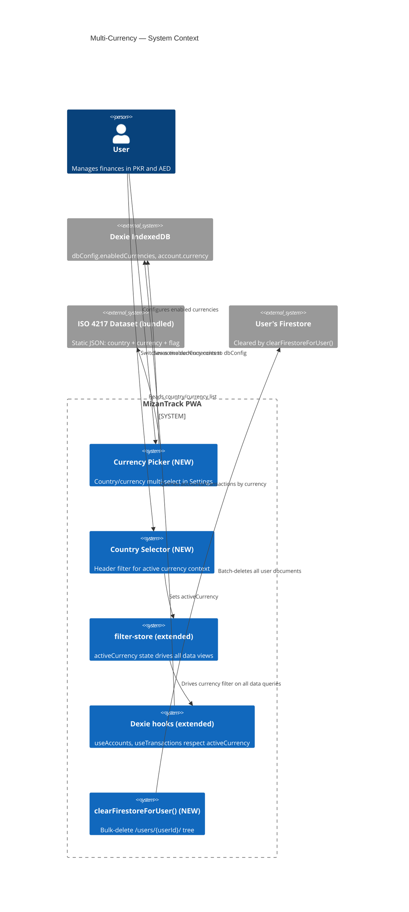
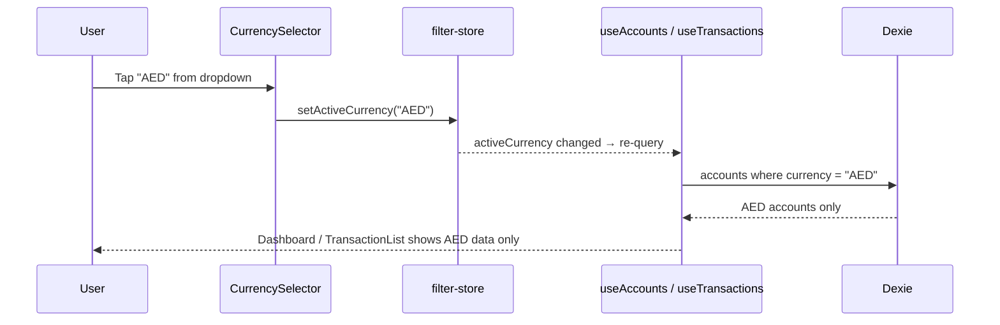
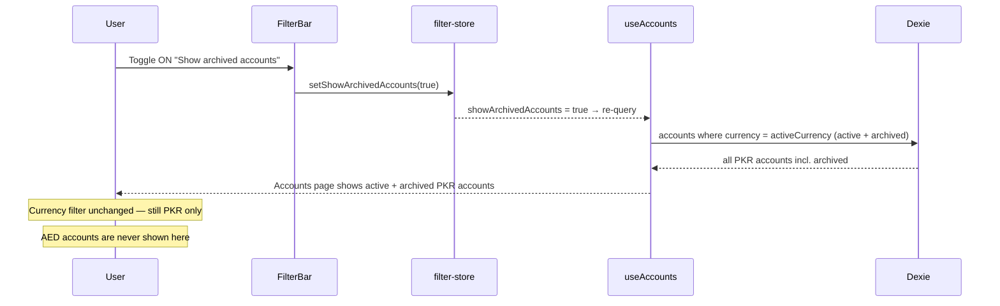
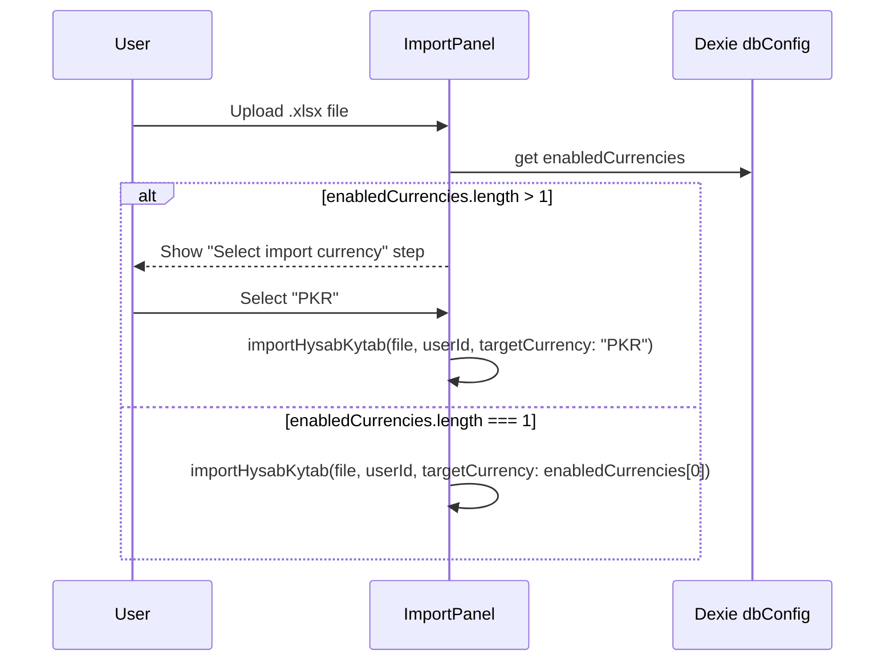
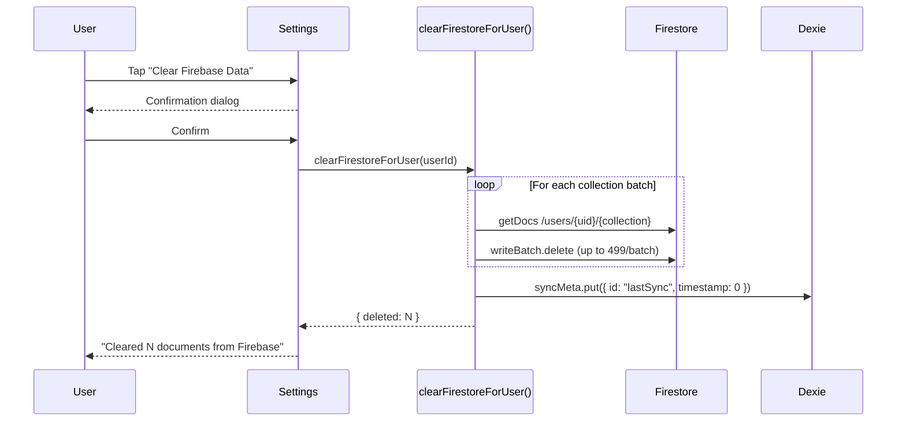

# Technical Design: Multi-Currency & Country Management

**Document Version:** 1.0  
**Last Updated:** 2026-07-04  
**Mode:** New Feature  
**PRD Reference:** docs/multi-currency/prd.md  
**Repository:** mizantrack

---

## Table of Contents

1. [Executive Summary](#1-executive-summary)
2. [Requirements Summary](#2-requirements-summary)
3. [Architecture — Phase 1](#3-architecture--phase-1)
   - [System Context](#31-system-context)
   - [High-Level Architecture](#32-high-level-architecture)
   - [Technology Decisions](#33-technology-decisions)
   - [Key Design Decisions](#34-key-design-decisions)
4. [Data Design](#4-data-design)
5. [Component Design](#5-component-design)
6. [Sequence Diagrams](#6-sequence-diagrams)
7. [Performance Considerations](#7-performance-considerations)
8. [Testing Strategy](#8-testing-strategy)
9. [Implementation Plan](#9-implementation-plan)
10. [Open Questions & Assumptions](#10-open-questions--assumptions)

---

## Document Change Log

| Version | Date       | Author             | Changes       |
|---------|------------|--------------------|---------------|
| 1.0     | 2026-07-04 | Salman Zahid Latif | Phase 1 draft |

---

## 1. Executive Summary

Multi-Currency & Country Management replaces the plain-text currency input in Settings with a **searchable, multi-select country/currency picker** backed by a bundled ISO 4217 dataset. A persistent **Country Selector** appears in the app header, allowing the user to switch the active currency context — instantly filtering all data views (dashboard, accounts, transactions, reports) to show only accounts denominated in that currency.

The existing data schema is **not changed** — `account.currency` already stores the ISO code per account. This feature adds a **filter layer** on top of it. The `filter-store` gains a new `activeCurrency` dimension; all Dexie live-query hooks respect it.

Two supporting features ship alongside: (1) the HK import wizard gains a currency selection step when multiple currencies are enabled, and (2) a "Clear All Firebase Data" button deletes the entire `/users/{userId}/` Firestore tree for the current user.

---

## 2. Requirements Summary

Derived from `docs/multi-currency/prd.md`.

**Functional (must-have):**
- Country/currency picker: searchable, flagged list (ISO 4217 + country name), multi-select
- Minimum 1 currency always selected; validation on save
- Enabled currencies stored in `dbConfig.enabledCurrencies`
- Country Selector in header: shown when ≥ 2 currencies enabled; includes "All" option
- All data hooks respect `activeCurrency` filter from `filter-store`
- HK import: currency selection step when ≥ 2 currencies enabled
- Clear Firebase Data: button in Settings; confirmation dialog; deletes `/users/{userId}/` tree; resets `syncMeta.lastSync = 0`

**Design decisions applied (from pre-design TBD resolution):**
- "All" view **removed** — currencies are always kept strictly separate; no mixing of financial data across currencies
- `activeCurrency` is always a specific ISO code; defaults to `enabledCurrencies[0]` on every app open
- Accounts from non-active currencies are hidden always — the currency filter is strict and never bypassed
- Archived/disabled accounts within the active currency are hidden by default; a **`showArchivedAccounts` toggle** (in the filter bar) reveals them within the current currency context
- Clear Firebase Data clears settings document too (full user tree)
- Active currency selection is NOT persisted across sessions (defaults to first enabled currency on every app open)

**Constraints:**
- No new server infrastructure; no currency conversion API
- ISO 4217 currency + country dataset is bundled statically (~8–12 KB)
- No breaking change to existing `account.currency` field or any Dexie schema

---

## 3. Architecture — Phase 1

### 3.1 System Context



### 3.2 High-Level Architecture

```mermaid
graph TD
  subgraph "Settings Page"
    CurrencyPicker[CurrencyPicker\nMulti-select + search\nflag + country + ISO code]
  end

  subgraph "App Header (existing AppShell)"
    CurrencySelector[CurrencySelector\nDropdown: All | PKR | AED\nonly shown when ≥2 currencies]
  end

  subgraph "filter-store (extended)"
    AC[activeCurrency: string | all\nsetActiveCurrency()]
  end

  subgraph "Data Hooks (extended)"
    UA[useAccounts\n+ currency filter]
    UT[useTransactions\n+ currency filter via account]
    UAB[useAccountBalance\nexisting — no change needed]
  end

  subgraph "Import Flow"
    IP[ImportPanel\nnew: currency step\nwhen ≥2 currencies]
  end

  subgraph "Sync / Firebase"
    CFU[clearFirestoreForUser()\nbatch delete /users/uid/]
    SyncAll[syncAll()\nno change]
  end

  subgraph "Static Data"
    ISO[src/lib/currencies.ts\nISO 4217 bundled array]
  end

  CurrencyPicker --> AC
  CurrencySelector --> AC
  AC --> UA
  AC --> UT
  UA --> Dexie[(Dexie)]
  UT --> Dexie
  IP --> Dexie
  CFU --> Firestore[(Firestore)]
  CurrencyPicker --> ISO
  CurrencySelector --> ISO
```

**Key architectural principle:** `activeCurrency` is a UI filter in Zustand — just like `period`, `accountId`, `searchQuery` already are. No data is duplicated or restructured per currency. All currency-scoping is done at query time.

### 3.3 Technology Decisions

| Concern | Choice | Rationale |
|---|---|---|
| Country/currency dataset | Static bundled `src/lib/currencies.ts` array | ~180 ISO 4217 entries; ~10KB; no API call; tree-shaken in production bundle |
| Flag rendering | Unicode flag emoji (e.g., 🇵🇰) | Zero asset overhead; system font; degrades to country code on Windows (acceptable) |
| Currency picker UI | Custom component using existing `Sheet` (mobile) / `Dialog` (desktop) + `Input` for search | Reuses existing shadcn/ui primitives; no new UI library |
| Active currency state | Extend `filter-store` with `activeCurrency: string \| "all"` | Consistent with existing filter pattern; all hook re-queries are automatic |
| Clear Firebase | New `clearFirestoreForUser(userId)` in `src/lib/db/sync.ts` | Reuses existing Firebase instance; batch-deletes all collections |

### 3.4 Key Design Decisions

| Decision | Choice | Rationale |
|---|---|---|
| Data schema change | None — existing `account.currency` is the discriminator | Avoids migration complexity; filter at query time |
| "All" view aggregation | **Removed** — no "All" option | Currencies kept strictly separate; no data mixing |
| Accounts not in enabled list | Always hidden — currency filter is strict; no cross-currency mixing ever |
| Archived/disabled accounts | Hidden by default within the active currency; **`showArchivedAccounts` toggle** in filter bar reveals them within the current currency |
| Active currency persistence | Not persisted — resets to `enabledCurrencies[0]` on every app open | Simpler; user always opens to their primary currency |
| `enabledCurrencies` sync | Synced as part of `settings/prefs` document (see App Lock design) | One sync path for all preferences |
| Clear Firebase scope | Entire `/users/{userId}/` tree including `settings/prefs` | Simplest; user gets a clean slate; can re-sync from local |
| Import currency prompt | Shown only when ≥ 2 currencies enabled | Single-currency users see no additional friction |

---

## 4. Data Design

### 4.1 `DbConfig` Extension

One new field added to the existing `DbConfig` interface (no Dexie migration needed — existing records default to `undefined`):

| Field | Type | Default | Description |
|---|---|---|---|
| `enabledCurrencies` | `string[]` | `["PKR"]` | ISO codes of user's active currencies. Minimum 1. |

**Migration for existing users:** On first load after update, if `enabledCurrencies` is absent, seed it from the existing `currency` field value:
```
if (!config.enabledCurrencies || config.enabledCurrencies.length === 0) {
  config.enabledCurrencies = [config.currency ?? "PKR"]
}
```

### 4.2 `filter-store` Extension

New fields and actions added to the existing Zustand store:

```typescript
interface FilterStore {
  // ... existing fields ...
  activeCurrency: string;                  // NEW — always a specific ISO code
  setActiveCurrency: (c: string) => void;  // NEW
  showArchivedAccounts: boolean;           // NEW — show archived/disabled accounts within the active currency
  setShowArchivedAccounts: (v: boolean) => void; // NEW
}
// activeCurrency default: set to enabledCurrencies[0] on first read from dbConfig
// showArchivedAccounts default: false
```

**Hook behaviour with `showArchivedAccounts`:**
- `false` (default): `useAccounts` returns only **active** (`isArchived: false`) accounts for the active currency
- `true`: `useAccounts` returns active **and archived** accounts for the active currency
- Currency filter is **always** applied regardless of this toggle — it never mixes currencies

### 4.3 ISO 4217 Dataset Structure

```typescript
// src/lib/currencies.ts
export interface CurrencyEntry {
  code: string;       // "PKR"
  name: string;       // "Pakistani Rupee"
  country: string;    // "Pakistan"
  flag: string;       // "🇵🇰"
}

export const CURRENCIES: CurrencyEntry[] = [ /* ~180 entries */ ];

export function searchCurrencies(query: string): CurrencyEntry[] { /* ... */ }
```

### 4.4 Firestore Impact

No new Firestore collections. `clearFirestoreForUser(userId)` deletes:
- `/users/{userId}/accounts/{*}`
- `/users/{userId}/categories/{*}`
- `/users/{userId}/transactions/{*}`
- `/users/{userId}/settings/prefs` (the App Lock settings doc)

Batched in groups of 499 (Firestore limit). Returns `{ deleted: number }`.

---

## 5. Component Design

### New Files

| File | Responsibility |
|---|---|
| `src/lib/currencies.ts` | Static ISO 4217 dataset + `searchCurrencies()` helper |
| `src/components/shared/CurrencyPicker.tsx` | Searchable multi-select country/currency list; used in Settings |
| `src/components/layout/CurrencySelector.tsx` | Header dropdown showing enabled currencies + "All"; drives `activeCurrency` |

### Modified Files

| File | Change |
|---|---|
| `src/store/filter-store.ts` | Add `activeCurrency` (string, default `enabledCurrencies[0]`), `showArchivedAccounts` (boolean, default `false`), and their setters |
| `src/hooks/useAccounts.ts` | Add `currency?: string` filter (always applied) and `showArchived?: boolean`; when `showArchived = false`, exclude accounts where `isArchived = true` |
| `src/hooks/useTransactions.ts` | Filter by currency via account join (get `accountIds` for active currency first) |
| `src/components/layout/AppShell.tsx` | Render `<CurrencySelector>` in header |
| `src/components/settings/PreferencesForm.tsx` | Replace plain `<Input>` currency field with `<CurrencyPicker>` |
| `src/components/settings/ImportPanel.tsx` | Add currency selection step before import when ≥ 2 currencies |
| `src/components/settings/FirebaseSyncPanel.tsx` | Add "Clear Firebase Data" button + confirmation dialog |
| `src/lib/db/sync.ts` | Add `clearFirestoreForUser(userId): Promise<{deleted: number}>` |
| `src/types/index.ts` | Add `enabledCurrencies?: string[]` to `DbConfig` |

---

## 6. Sequence Diagrams

### 6.1 Currency Switch (Global Header)



### 6.1b Show Archived Accounts Toggle



### 6.2 Import with Currency Prompt



### 6.3 Clear Firebase Data



---

## 7. Performance Considerations

- **Currency filter on `useAccounts`:** Adds a `.filter(a => a.currency === activeCurrency)` pass on the Dexie result. At 100 accounts this is < 1ms.
- **Currency filter on `useTransactions`:** Requires first resolving accountIds for the active currency, then filtering transactions. Two sequential Dexie reads, but both are indexed. Target: < 50ms on 10k transactions.
- **Currency picker search:** Client-side filter on the ~180-entry static array. < 1ms per keystroke.
- **Clear Firebase:** Progress spinner shown; `O(n/499)` batch calls where `n` = total document count. At 10k documents: ~21 batch calls. Show a progress counter.

---

## 8. Testing Strategy

| Layer | Tests |
|---|---|
| Unit | `currencies.ts`: `searchCurrencies("pak")` returns PKR entry; search is case-insensitive |
| Unit | `filter-store`: `setActiveCurrency("PKR")` updates state; `setShowArchivedAccounts(true)` includes archived accounts; reset restores `showArchivedAccounts = false` |
| Integration | `useAccounts` with `activeCurrency = "PKR"` and `showArchivedAccounts = false`: returns only active PKR accounts; with `showArchivedAccounts = true`: returns active + archived PKR accounts; AED accounts never returned in either case |
| Integration | `clearFirestoreForUser`: mock Firestore; assert all collections deleted and `syncMeta.timestamp = 0` |
| Integration | `ImportPanel`: when 2 currencies enabled and file selected, currency step shown; selected currency passed to `importHysabKytab` |
| Unit | `DbConfig` migration: if `enabledCurrencies` absent, seeded from `currency` field |

---

## 9. Implementation Plan

| Phase | Tasks |
|---|---|
| 1 — Data | `currencies.ts` dataset, extend `DbConfig` type + migration logic, extend `filter-store` with `activeCurrency` + `showArchivedAccounts` |
| 2 — Hooks | Update `useAccounts` and `useTransactions` to accept and apply `activeCurrency` filter |
| 3 — Currency Picker | `CurrencyPicker.tsx` component; replace currency input in `PreferencesForm` |
| 4 — Header Selector | `CurrencySelector.tsx` (no "All" option); mount in `AppShell` header |
| 5 — Import Prompt | Add currency step to `ImportPanel`; pass to `importHysabKytab` |
| 6 — Clear Firebase | `clearFirestoreForUser()` in `sync.ts`; button + dialog in `FirebaseSyncPanel` |
| 7 — Tests | Unit + integration tests per §8 |

**Technical Risks:**

| Risk | Impact | Mitigation |
|---|---|---|
| `useTransactions` currency filter requires two Dexie reads (accounts then transactions) | Medium | Cache account IDs for active currency in `useMemo`; re-resolve only when `activeCurrency` or accounts change |
| Existing users' `enabledCurrencies` undefined after update | Low | Migration seed at first read in `PreferencesForm` and at `importHysabKytab` |

---

## 10. Open Questions & Assumptions

| # | Item | Status |
|---|---|---|
| C | No "All" currency view — currencies are always strictly separate; `activeCurrency` is always a specific ISO code | **Confirmed** |
| D | `showArchivedAccounts` toggle in filter bar reveals archived/disabled accounts **within the current currency** — currency filter is never bypassed | **Confirmed** |
| E | Clear Firebase = full `/users/{userId}/` tree including settings | **Confirmed** |
| F | Active currency does not persist between sessions — resets to `enabledCurrencies[0]` on app open | **Decided** |
| G | `enabledCurrencies` seeded from existing `currency` field on first migration | **Decided** |
| H | Flag rendering = Unicode emoji (no flag library) | **Decided** — Windows flag limitation is acceptable |
