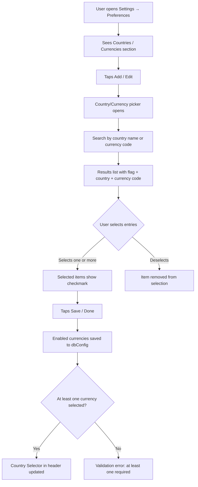
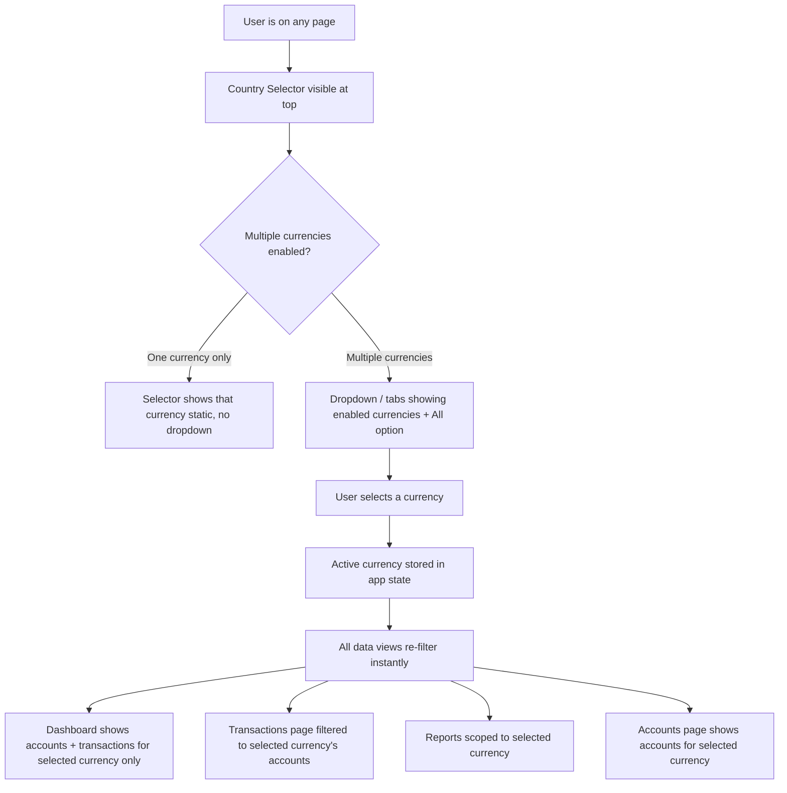
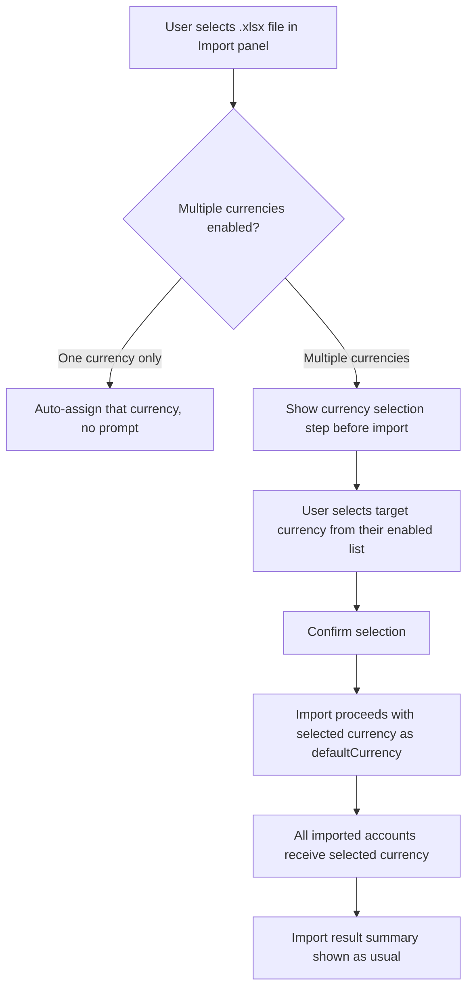

# Product Requirements Document (PRD)

**Feature:** Multi-Currency & Country Management  
**Product:** MizanTrack  
**Version:** 1.0  
**Date:** 2026-07-04  
**Owner:** Salman Zahid Latif  
**Status:** Draft

---

## Table of Contents

- [1. Executive Summary](#1-executive-summary)
- [2. Problem Statement](#2-problem-statement)
- [3. Goals & Non-Goals](#3-goals--non-goals)
- [4. User Flows](#4-user-flows)
- [5. Functional Requirements](#5-functional-requirements)
- [6. User Interface (UI) Design](#6-user-interface-ui-design)
- [7. Non-Functional Requirements](#7-non-functional-requirements)
- [8. Success Metrics](#8-success-metrics)
- [9. Open Questions / Risks](#9-open-questions--risks)

---

## Document Change Log

| Version | Date       | Author             | Changes         |
|---------|------------|--------------------|-----------------|
| 1.0     | 2026-07-04 | Salman Zahid Latif | Initial draft   |

---

## 1. Executive Summary

MizanTrack currently allows a single "default currency" configured in Settings. All accounts carry an individual `currency` field, but there is no unified country-level grouping, no prominent way to switch between financial contexts, and no currency-scoped view of the dashboard.

This feature replaces the simple currency text input with a **searchable, flag-adorned country/currency picker** supporting multi-selection. The selected set of active countries/currencies drives a persistent **Country Selector** at the top of every page — switching it instantly filters all data views (dashboard, transactions, accounts, reports) to show only data belonging to accounts in that currency. Data for each currency is kept cleanly separated in local storage and Firebase, enabling per-currency import, reporting, and eventual per-currency clearing.

An associated **Clear Firebase Data** action lets users wipe all of their Firestore data (for the signed-in user only) without affecting other users or local data.

---

## 2. Problem Statement

| Pain Point | Description |
|---|---|
| No currency-level context switching | The user manages PKR accounts (Pakistan) and AED accounts (UAE). The dashboard and reports show everything mixed together, making it hard to reason about each geography's finances separately. |
| Currency preference is a plain text field | There is no list of valid currencies/countries, no flag context, and no easy discoverability. Users must know the ISO code. |
| Import assigns all records to one currency | When importing a Hysab Kytab file, all accounts receive the same default currency. There is no prompt to specify the target currency context for the import. |
| No way to clear Firebase data | Once data is synced, there is no in-app mechanism to remove it from the user's Firestore — only the Firebase console. |

---

## 3. Goals & Non-Goals

### Goals

- Replace the currency text input in Settings with a searchable country/currency multi-select list (flags, country name, ISO currency code).
- Introduce a **Country/Currency Selector** at the top of the app (visible on all pages) that switches the active currency context.
- Filter all app data views (dashboard, transactions, accounts, reports) to show only accounts and their transactions for the selected currency.
- Persist the list of enabled currencies in `dbConfig` (Dexie + Firebase settings sync per the App Lock PRD).
- During HK import, prompt the user to select which currency context the imported data belongs to.
- Add a **Clear All Firebase Data** button in Settings that deletes all Firestore documents for the current signed-in user.
- Keep data structurally unchanged — currency-scoping is a **filter layer** on top of the existing `currency` field on `Account`; no schema migration required for existing data.

### Non-Goals

- Real-time currency conversion or exchange rate tracking (existing Zakat exchange rate input is out of scope here).
- Multiple simultaneous currency views side by side (one active currency at a time).
- Per-currency budgets or limits.
- Changing the currency of an already-imported account in bulk (user manages this manually via the account edit screen).

---

## 4. User Flows

### 4.1 Currency Setup in Settings



**Edge cases:**
- Deselecting all currencies → validation error, minimum one required
- Deselecting a currency that has accounts → warning shown but not blocked (accounts remain, they just won't appear in the filtered view)
- First open with no currencies configured → prompt to configure, or fall back to "All" view

---

### 4.2 Country Selector (Global Header)



**Edge cases:**
- "All" option shows all data regardless of currency (existing behavior preserved as a mode)
- Selecting a currency with no accounts → empty state shown on all pages
- Currency selector state is NOT persisted between sessions (defaults to "All" on app open) [TBD: or persist last selected?]

---

### 4.3 HK Import with Currency Prompt



**Edge cases:**
- User has not configured any currencies yet → prompt to configure before import
- User selects a currency and some accounts in the file already exist with a different currency → existing accounts are NOT overwritten (title-match upsert preserves currency)

---

### 4.4 Clear All Firebase Data

```mermaid
flowchart TD
    A[User opens Settings → Firebase / Sync section] --> B[Sees Clear Firebase Data button]
    B --> C[User taps button]
    C --> D[Confirmation dialog: This will delete ALL your data from Firebase permanently. Local data is not affected.]
    D --> E{User confirms?}
    E -->|Cancel| F[No action]
    E -->|Confirm| G[Delete all documents under /users/{userId}/ in Firestore]
    G --> H{Delete successful?}
    H -->|Yes| I[Show success toast: Firebase data cleared]
    I --> J[Reset syncMeta.lastSync to 0 so next sync re-uploads everything]
    H -->|No| K[Show error toast with reason]
```

**Edge cases:**
- Firebase not configured → button is disabled/hidden
- User clears Firebase then immediately syncs → full re-upload of all local data
- Partial delete failure (some documents not deleted) → show error; recommend retry

---

## 5. Functional Requirements

### FR-CURR-001: Country/Currency Picker

| ID | Requirement | Acceptance Criteria |
|---|---|---|
| FR-CURR-001 | Settings MUST contain a country/currency multi-select section replacing the current plain-text currency input. | AC: No free-text currency field exists; a picker replaces it. |
| FR-CURR-002 | The picker MUST display a searchable list of all ISO 4217 currencies with their associated country name and flag emoji. | AC: Searching "pak" surfaces 🇵🇰 Pakistan (PKR); searching "PKR" does the same. |
| FR-CURR-003 | The picker MUST support multi-selection with visual checkmarks on selected items. | AC: Selecting both PKR and AED shows both checked; deselecting one removes its checkmark. |
| FR-CURR-004 | At least one currency MUST be selected at all times. Deselecting the last currency MUST show a validation error. | AC: Attempting to save with zero currencies selected shows "Select at least one currency." |
| FR-CURR-005 | The enabled currency list MUST be saved to `dbConfig.enabledCurrencies` in Dexie and synced to Firebase per FR-SYNC-001 in the App Lock PRD. | AC: After sync, a new device restores the same enabled currencies. |

### FR-CURR-002: Country Selector (Global Header)

| ID | Requirement | Acceptance Criteria |
|---|---|---|
| FR-SEL-001 | A Country/Currency Selector MUST appear at the top of all authenticated pages when more than one currency is enabled. | AC: Header shows a selector between the logo and the sync badge when 2+ currencies are enabled. |
| FR-SEL-002 | The selector MUST include an "All" option that shows data for all currencies (default). | AC: Selecting "All" makes dashboard and transactions show accounts from all enabled currencies. |
| FR-SEL-003 | Changing the selected currency MUST instantly re-filter all data views without a page reload. | AC: Switching from PKR to AED updates account list, balance cards, and transaction list in < 300ms. |
| FR-SEL-004 | The active currency MUST be stored in the global filter store (Zustand) so all components react to it. | AC: `useFilterStore` exposes `activeCurrency: string | "all"` and a `setActiveCurrency` action. |
| FR-SEL-005 | All existing hooks (`useAccounts`, `useTransactions`, `useAccountBalance`) MUST respect the active currency filter. | AC: `useAccounts` returns only accounts where `account.currency === activeCurrency` when not "all". |

### FR-CURR-003: HK Import Currency Prompt

| ID | Requirement | Acceptance Criteria |
|---|---|---|
| FR-IMP-001 | When the user has more than one enabled currency and uploads an HK file, the import wizard MUST present a currency selection step before processing. | AC: Import panel shows a "Select target currency" step before the import begins when 2+ currencies are enabled. |
| FR-IMP-002 | The selected currency MUST be passed to `importHysabKytab()` as the `defaultCurrency` parameter. | AC: After import, all newly created accounts have `currency` equal to the user's selection. |
| FR-IMP-003 | When only one currency is enabled, the currency selection step MUST be skipped and that currency used automatically. | AC: Single-currency users see no currency prompt during import. |

### FR-CURR-004: Clear Firebase Data

| ID | Requirement | Acceptance Criteria |
|---|---|---|
| FR-CLR-001 | Settings MUST contain a "Clear Firebase Data" button in the Firebase / Sync section. | AC: Button is visible in the Firebase sync section when Firebase is configured. |
| FR-CLR-002 | The button MUST be disabled when Firebase sync is not configured. | AC: Button is greyed out with tooltip "Firebase not configured" when no config exists. |
| FR-CLR-003 | Tapping the button MUST show a confirmation dialog before taking any action. | AC: A dialog with explicit destructive warning and Cancel / Confirm buttons is shown. |
| FR-CLR-004 | Confirming MUST delete all Firestore documents under `/users/{userId}/` for the current user only. | AC: After clear, Firebase console shows no documents for that user path. Other users' data is unaffected. |
| FR-CLR-005 | After successful clear, `syncMeta.lastSync` MUST be reset to 0 so the next sync re-uploads all local data. | AC: Triggering sync after a clear pushes all local accounts/categories/transactions to Firebase. |
| FR-CLR-006 | A success toast MUST be shown after clear completes; an error toast MUST be shown if the operation fails. | AC: User receives clear feedback in both success and failure cases. |

---

## 6. User Interface (UI) Design

### Country/Currency Picker (Settings)

- Positioned in Preferences section, replacing the current currency text input
- Opens as a **bottom sheet** (mobile) or **dialog** (desktop) with a search input at the top
- Each list item: `[flag emoji] [Country Name] ([ISO code])` — e.g., `🇵🇰 Pakistan (PKR)`
- Selected items show a checkmark and are visually distinguished (bold or highlighted)
- Currently selected items float to the top of the list
- "Done" / "Save" button at the bottom; disabled if zero selected

### Country Selector (Global Header)

- Positioned in the header between the logo/title and the sync badge
- When only one currency: static badge showing currency code (no tap action)
- When multiple currencies: pill-style dropdown or segmented control
- "All" is always the first option
- Each option shows the flag emoji and currency code: e.g., `🇵🇰 PKR`

### HK Import — Currency Step

- Added as the first step of the import panel when 2+ currencies are enabled
- Shows the same country/currency list but in single-select mode
- Pre-selects the most recently used or the first enabled currency

### Clear Firebase Data (Settings)

- Placed in the Firebase / Sync section, visually separated (destructive red button, outlined variant)
- Confirmation dialog uses strong destructive language: "This will permanently delete all your data from Firebase. Your local data is not affected."
- Two buttons: "Cancel" (neutral) and "Delete from Firebase" (red/destructive)

### Responsive / PWA

- Country picker bottom sheet uses the existing `Sheet` / `Drawer` component
- Flag emojis are system font — no additional assets required
- Selector in header must not cause layout overflow on small screens (abbreviate to flag + code only)

---

## 7. Non-Functional Requirements

### 7.1 Performance & Latency

- Country/currency list (all ISO 4217 entries, ~180 items) rendered with virtualization if the picker uses a flat list; target < 50ms to open
- Active currency switch: all live queries must re-execute with new filter in < 300ms on a 10k-transaction dataset
- Clear Firebase Data: delete operation is batched (499 docs/batch per Firestore limit); UI shows a progress spinner for operations taking > 1s

### 7.2 Security & Privacy

- Clear Firebase Data deletes only documents under `/users/{userId}/` — the `userId` is taken from the authenticated session, not from user input
- No cross-user data access is possible; each user controls only their own Firebase project

### 7.3 Error Handling

| Error Scenario | User-Facing Message | Recovery Action |
|---|---|---|
| Picker saved with zero currencies | "Select at least one currency." | User must select at least one; save blocked |
| Import file uploaded with no currency selected | "Please select a target currency to continue." | Import blocked until currency is chosen |
| Clear Firebase Data — permission denied | "Could not delete data: permission denied. Check your Firestore rules." | Link to rules documentation |
| Clear Firebase Data — network error | "Could not reach Firebase. Check your connection and try again." | Retry button |
| Active currency has no accounts | Empty state: "No accounts for [currency]. Add one or switch currency." | CTA to add account or switch |

### 7.4 Scalability

- ISO 4217 currency list is static (~180 entries); bundled as a local constant, no API call
- Filter store change triggers reactive Dexie re-queries; performance bounded by existing transaction list benchmarks (< 1s at 100k records)

### 7.5 Cost

- Clear Firebase Data: Firestore deletes are charged at $0.06/100k document deletes. A full user clear of 10k documents costs $0.006. Negligible.
- Country picker: no external API; static data.

---

## 8. Success Metrics

| Metric | Target |
|---|---|
| Currency switch re-render time | < 300ms on a 10k-transaction dataset |
| Country picker open time | < 50ms |
| Zero data cross-contamination between currencies | 100% — accounts for currency A never appear in currency B view |
| Import assigns correct currency | 100% — verified by integration test |
| Clear Firebase completes without error | 100% on successful network + valid config |

---

## 9. Open Questions / Risks

| # | Question | Impact | Priority |
|---|---|---|---|
| OQ-01 | Should the active currency selection persist across sessions (stored in `dbConfig` or `filterStore`)? If persisted, a user always opens to their last-used currency context. | Medium | Decide before dev |
| OQ-02 | What happens to accounts whose currency is NOT in the user's enabled list? They would be invisible in all filtered views. Should there be a warning or automatic inclusion? | High | Must decide before dev |
| OQ-03 | Should "All" aggregate balances across currencies (requiring exchange rate conversion) or show raw numbers per account? | High — significant UX difference | Must decide before dev |
| OQ-04 | Migration path for existing users who have accounts with currency `"AED"` from old hardcoded default: are those automatically included when the user adds AED to their enabled list? (Answer: yes, because it's a filter — but needs documentation) | Medium | Clarify in onboarding |
| OQ-05 | Flag emoji support on Windows is poor (no flag rendering in most Windows fonts). Consider using a flag library (`flag-icons`) or accept emoji-only approach. | Low | Nice-to-have |
| OQ-06 | Should Clear Firebase Data also clear the settings document (`/users/{userId}/settings/prefs`)? Or only financial data? | Medium | Must decide before dev |
| OQ-07 | During Clear Firebase Data, if the user has > 499 documents, multiple batch deletes are needed. Should the UI show progress per batch? | Low | Nice-to-have |
