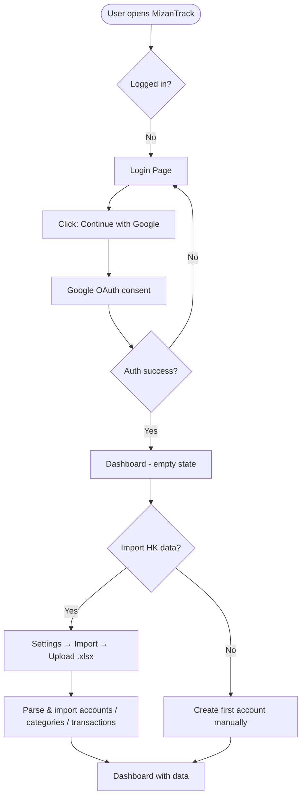
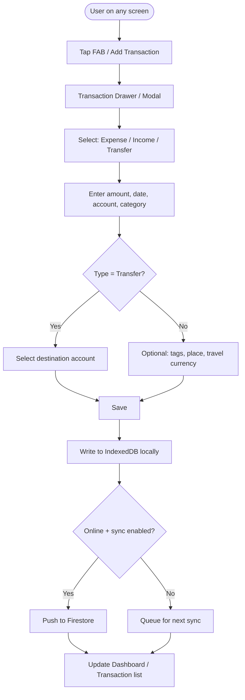
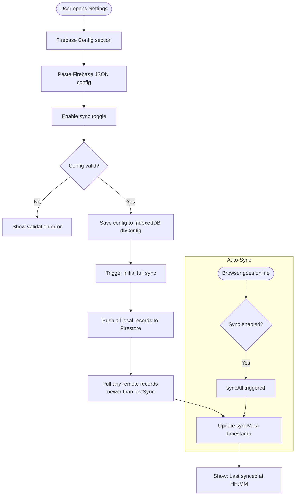
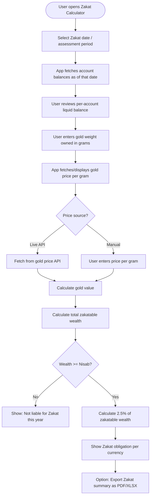
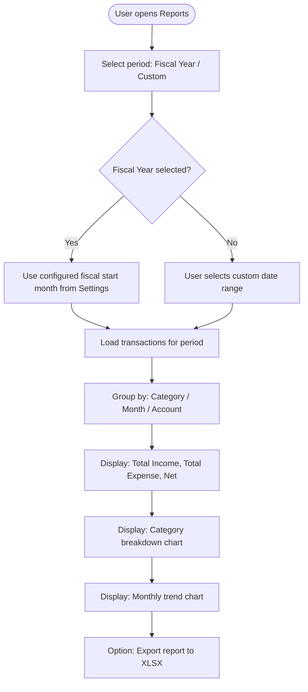

# Product Requirements Document (PRD)

**Product:** MizanTrack — Personal Finance Tracker  
**Version:** 1.1  
**Date:** 2026-05-31  
**Owner:** Salman Zahid Latif  
**Status:** Draft

---

## Table of Contents

- [Feature Documents](#feature-documents)
- [1. Executive Summary](#1-executive-summary)
- [2. Problem Statement](#2-problem-statement)
- [3. Goals & Non-Goals](#3-goals--non-goals)
- [4. User Flows](#4-user-flows)
- [5. Functional Requirements](#5-functional-requirements)
- [6. User Interface (UI) Design](#6-user-interface-ui-design)
- [7. Non-Functional Requirements](#7-non-functional-requirements)
- [8. Success Metrics](#8-success-metrics)
- [9. Open Questions / Risks](#9-open-questions--risks)

---

## Document Change Log

| Version | Date       | Author              | Changes                  |
|---------|------------|---------------------|--------------------------|
| 1.1     | 2026-05-31 | Salman Zahid Latif  | Added Cloud Sync onboarding feature PRD reference |
| 1.0     | 2026-05-26 | Salman Zahid Latif  | Initial draft            |

---

## Feature Documents

- [Cloud Sync Onboarding Instructions PRD](cloud-sync-onboarding/prd.md)

---

## 1. Executive Summary

MizanTrack is a privacy-first, offline-capable personal finance tracker designed for individuals managing finances across multiple currencies and geographies — specifically users transitioning from the Hysab Kytab mobile app who need more powerful reporting, Zakat calculation, and fiscal-year tax summaries.

The app runs entirely in the browser as a Progressive Web App (PWA) backed by a local IndexedDB database (Dexie.js). When the user is online and has configured their own Firebase project, data syncs automatically to their personal Firestore instance. No shared backend stores user financial data.

Key differentiators over Hysab Kytab: multi-currency account separation, automatic Zakat calculation (with live gold/silver price lookups), fiscal-year and custom tax-period reporting, and a seamless Hysab Kytab `.xlsx` data migration path.

---

## 2. Problem Statement

### Primary Pain Points

1. **Multi-currency, multi-geography finances are hard to track.** The user previously used Hysab Kytab in Pakistan (PKR) and now also has UAE accounts (AED). HK does not cleanly separate accounts by currency or allow cross-currency reporting.

2. **Zakat calculation is manual and error-prone.** Determining zakatable assets (cash, gold, receivables) across accounts at the nisab threshold requires exporting data and doing math manually. Gold/silver market rates change daily.

3. **Fiscal year and tax-period reporting does not exist in HK.** UAE and Pakistan have different fiscal year calendars. Generating an income/expense summary for a custom fiscal period requires manual spreadsheet work.

4. **HK data is locked in a proprietary app.** The only export is a `.xlsx` file with a specific sheet structure (ACCOUNT, CATEGORY, ACTIVITIES). There is no migration path to any modern tool.

5. **The app must work offline on a phone.** The user needs to log transactions without cellular data and have them sync when a connection is available — just like HK but with a browser-based PWA shortcut on the home screen.

---

## 3. Goals & Non-Goals

### Goals

- **G-01** Allow users to create and manage multiple accounts, each with its own currency (AED, PKR, USD, and any ISO-4217 code).
- **G-02** Record income, expense, and transfer transactions with full metadata (category, tags, place, travel currency).
- **G-03** Migrate all historical data from a Hysab Kytab `.xlsx` export file in one click.
- **G-04** Auto-sync data to the user's own Firebase Firestore project whenever an internet connection is detected.
- **G-05** Support the app as an installable PWA with full offline transaction entry and read access.
- **G-06** Provide a Zakat calculator that determines zakatable net worth per account/currency and computes the 2.5% obligation against the current nisab threshold.
- **G-07** Provide fiscal-year and tax-period reports (configurable start month) with income/expense breakdowns by category.
- **G-08** Allow per-account currency display with no forced conversion, and opt-in cross-currency summary using manual exchange rates.
- **G-09** Export transactions to HK-compatible `.xlsx` format for any date range.
- **G-10** Authenticate users via Google OAuth with no password management.

### Non-Goals

- **NG-01** MizanTrack is **not** a shared or multi-user budgeting platform. Each Google account is an isolated data silo.
- **NG-02** No bank feeds or automatic transaction import from financial institutions.
- **NG-03** No bill payment, reminders, or subscription tracking features.
- **NG-04** No investment portfolio tracking (stocks, mutual funds).
- **NG-05** No currency conversion at transaction time — amounts are stored as entered; exchange rates are used only in summary views.
- **NG-06** No server-side data processing. All computation happens client-side.
- **NG-07** Zakat calculation covers only Zakat al-Mal (wealth). Zakat al-Fitr is out of scope.

---

## 4. User Flows

### Flow 1: First-Time User Onboarding

**Actors:** New user  
**Decision points:** Auth failure → back to login; user chooses between import or manual setup  
**Edge cases:** Import file missing required sheets (ACCOUNT, CATEGORY, ACTIVITIES) → show sheet-specific error; duplicate account names on re-import → merge, not duplicate

---

### Flow 2: Daily Transaction Entry

**Actors:** Authenticated user  
**Decision points:** Transfer requires `toAccountId`; travel currency fields are optional; sync may be deferred  
**Edge cases:** User goes offline mid-save → local save succeeds, sync queued; amount entered as 0 → validation error

---

### Flow 3: Cloud Sync Setup & Auto-Sync

**Actors:** User (manual setup), browser online event (automatic)  
**Decision points:** Invalid Firebase JSON → error, no data written; sync disabled → no automatic push  
**Edge cases:** Firestore quota reached → show usage warning; conflicting records resolved by `updatedAt` last-write-wins

---

### Flow 4: Zakat Calculation

**Actors:** Authenticated user  
**Decision points:** Multiple currencies → show per-currency calculation and combined in a reference currency; nisab threshold varies by gold vs silver standard → user selects which to apply  
**Edge cases:** No transactions in selected period → balance = opening balance; gold price API unavailable → fall back to manual input; user has no gold → skip gold valuation step

---

### Flow 5: Fiscal Year / Tax Report

**Actors:** Authenticated user  
**Decision points:** Fiscal year boundaries calculated from `DbConfig.fiscalYearStartMonth`; multi-currency accounts → group by currency or show combined with manual rate  
**Edge cases:** Date range spans fiscal year boundary → transactions correctly partitioned; no data in range → show empty state

---

## 5. Functional Requirements

### 5.1 Authentication

| ID | Requirement | Acceptance Criteria |
|----|-------------|---------------------|
| FR-AUTH-001 | Users must authenticate using Google OAuth before accessing any app data | Unauthenticated requests to `/dashboard`, `/transactions`, `/accounts`, `/categories`, `/reports`, `/settings` redirect to `/login` |
| FR-AUTH-002 | Session must persist across browser restarts | User remains logged in after closing and reopening the browser without re-authenticating |
| FR-AUTH-003 | Sign-out clears session and redirects to `/login` | After sign-out, navigating to any protected route redirects to `/login` |
| FR-AUTH-004 | All user data is scoped to `userId` (Google sub claim) | User A cannot read or write User B's accounts, categories, or transactions in either Dexie or Firestore |

---

### 5.2 Account Management

| ID | Requirement | Acceptance Criteria |
|----|-------------|---------------------|
| FR-ACC-001 | User can create an account with: title, currency (ISO-4217), opening balance, optional color and icon | Account appears in accounts list immediately after creation |
| FR-ACC-002 | User can edit any account field | Edited fields saved to IndexedDB; `updatedAt` timestamp updated |
| FR-ACC-003 | User can archive an account | Archived accounts hidden from transaction entry dropdowns; toggle in settings to show archived |
| FR-ACC-004 | User can soft-delete an account | `deletedAt` set; account excluded from all UI and reports; sync propagates deletion to Firestore |
| FR-ACC-005 | Account balance is computed from opening balance + sum of non-deleted transactions | Balance displayed on account card matches manual calculation from transaction history |
| FR-ACC-006 | Each account displays its balance in its own currency | No forced conversion; AED account shows AED, PKR account shows PKR |

---

### 5.3 Category Management

| ID | Requirement | Acceptance Criteria |
|----|-------------|---------------------|
| FR-CAT-001 | User can create income or expense categories with title, optional icon, optional color | Category appears in transaction form dropdowns |
| FR-CAT-002 | Categories support one level of parent/child hierarchy (`parentId`) | Child categories grouped under parent in dropdowns and reports |
| FR-CAT-003 | User can edit and soft-delete categories | Soft-deleted categories hidden from new transaction entry; existing transactions retain `categoryId` reference |
| FR-CAT-004 | A default set of categories is seeded on first login | At least 10 default expense and 5 default income categories exist after first login |

---

### 5.4 Transaction Management

| ID | Requirement | Acceptance Criteria |
|----|-------------|---------------------|
| FR-TXN-001 | User can create Expense, Income, or Transfer transactions | Transaction saved to IndexedDB; balance of affected accounts updates |
| FR-TXN-002 | Transfer transaction requires both `accountId` (source) and `toAccountId` (destination) | Cannot save Transfer without selecting two distinct accounts |
| FR-TXN-003 | Transaction amount is always stored as positive; `type` field determines direction | Income increases account balance; Expense decreases it |
| FR-TXN-004 | Transactions support optional: description, category, tags (comma-separated), place | All optional fields saved if provided |
| FR-TXN-005 | Transactions support an optional travel currency block: symbol, rate, local amount, location | Travel currency fields visible and editable; stored as nested object on transaction |
| FR-TXN-006 | Transaction list supports filtering by: account, category, type, date range (using FilterPeriod presets + custom) | Filtered list shows only matching transactions; count updates |
| FR-TXN-007 | Transaction list supports search by description or place | Results update as user types |
| FR-TXN-008 | User can edit any field of an existing transaction | `updatedAt` updated; sync propagates change |
| FR-TXN-009 | User can soft-delete a transaction | `deletedAt` set; transaction excluded from balances and reports |
| FR-TXN-010 | Transactions are paginated or virtualized for lists exceeding 500 records | Page load and scroll performance acceptable with 10,000+ transactions |

---

### 5.5 Hysab Kytab Import

| ID | Requirement | Acceptance Criteria |
|----|-------------|---------------------|
| FR-IMP-001 | User can upload a Hysab Kytab `.xlsx` file | File picker accepts `.xlsx` files only |
| FR-IMP-002 | Importer reads ACCOUNT, CATEGORY, and ACTIVITIES sheets | Error shown if any required sheet is missing, naming the missing sheet |
| FR-IMP-003 | Existing accounts/categories matched by title — no duplicates created on re-import | Importing the same file twice results in identical record count (upsert, not append) |
| FR-IMP-004 | Transfer transactions paired by matching date + absolute amount + opposing signs | Paired transfer creates one `Transfer` transaction with `accountId` and `toAccountId` |
| FR-IMP-005 | Travel currency data imported from HK fields (symbol, rate, amount, location) | Travel currency visible on imported transactions |
| FR-IMP-006 | Import result shows count: accounts created, categories created, transactions imported, transfers paired | Summary modal shown after import completes |
| FR-IMP-007 | Import assigns `currency: "AED"` to imported accounts by default; user can change per account after import | [TBD: determine if HK export contains currency info per account] |

---

### 5.6 Excel Export

| ID | Requirement | Acceptance Criteria |
|----|-------------|---------------------|
| FR-EXP-001 | User can export transactions to `.xlsx` in Hysab Kytab-compatible format | Exported file has ACCOUNT, CATEGORY, ACTIVITIES sheets matching HK schema |
| FR-EXP-002 | Export respects selected date range | Only transactions within the range appear in ACTIVITIES sheet |
| FR-EXP-003 | Exported file downloads automatically in the browser | File named `mizantrack-export-YYYY-MM-DD.xlsx` |

---

### 5.7 Cloud Sync (Firebase)

| ID | Requirement | Acceptance Criteria |
|----|-------------|---------------------|
| FR-SYN-001 | User can paste their Firebase JSON config in Settings | Config validated (required keys present); saved as `DbConfig.firebaseConfig` |
| FR-SYN-002 | Sync can be enabled/disabled per-user without deleting the config | Toggle in Settings; `DbConfig.enabled` flag |
| FR-SYN-003 | Sync triggers automatically when the browser transitions from offline to online | `window` online event listener triggers `syncAll` when `DbConfig.enabled = true` |
| FR-SYN-004 | Sync pushes all local records with `updatedAt > lastSync` to Firestore | After sync, Firestore contains all locally modified records |
| FR-SYN-005 | Sync pulls all Firestore records with `updatedAt > lastSync`; last-write-wins by `updatedAt` | After pull, local DB reflects any changes made on another device |
| FR-SYN-006 | Sync status (last synced timestamp, syncing indicator, error message) visible in UI | Status shown in Settings and/or header |
| FR-SYN-007 | Manual "Sync Now" button triggers `syncAll` on demand | Button triggers sync; spinner shown during; success/error toast shown after |
| FR-SYN-008 | Firestore usage estimate (document count and MB) shown in Settings | Usage data fetched via `getCountFromServer` per collection |

---

### 5.8 Dashboard

| ID | Requirement | Acceptance Criteria |
|----|-------------|---------------------|
| FR-DASH-001 | Dashboard shows total balance per account as cards | Each account card shows account name, currency, and current balance |
| FR-DASH-002 | Dashboard shows net income vs expense for the current month | Two summary figures: month income total and month expense total |
| FR-DASH-003 | Dashboard shows recent transactions (last 10) | List shows date, description, amount, and account |
| FR-DASH-004 | Dashboard shows a monthly income vs expense trend chart (last 6 months) | Bar or line chart with one data point per month per type |

---

### 5.9 Reports

| ID | Requirement | Acceptance Criteria |
|----|-------------|---------------------|
| FR-RPT-001 | Reports page has a period selector with all `FilterPeriod` options: today, week, month, quarter, half-year, year, fiscal-year, custom | Selecting any option updates all report widgets |
| FR-RPT-002 | Category breakdown chart shows expense distribution as pie or bar chart | Each category slice labeled with name and percentage |
| FR-RPT-003 | Monthly trend chart shows income and expense per month over the selected period | Data points align to calendar months |
| FR-RPT-004 | Reports can be filtered by account | Selecting an account shows only transactions from that account |
| FR-RPT-005 | Fiscal year boundaries computed from `DbConfig.fiscalYearStartMonth` | If start month = 4 (April), fiscal year runs April–March |
| FR-RPT-006 | Report summary exportable to `.xlsx` | Export includes totals and category breakdown for the selected period |

---

### 5.10 Zakat Calculator

| ID | Requirement | Acceptance Criteria |
|----|-------------|---------------------|
| FR-ZAK-001 | Zakat page accessible from main navigation | Zakat calculator reachable from sidebar/bottom nav |
| FR-ZAK-002 | User selects Zakat assessment date; app calculates per-account balance as of that date | Balance computed from transactions up to and including selected date |
| FR-ZAK-003 | User selects which accounts to include in zakatable wealth | Accounts with toggle; excluded accounts do not contribute to total |
| FR-ZAK-004 | User enters gold weight in grams (or tola); app calculates gold market value | Gold weight input; value = weight × price per gram |
| FR-ZAK-005 | Gold price can be fetched from a live API or entered manually | Toggle between live/manual; live fetch attempted on page load; fallback to manual if API unavailable |
| FR-ZAK-006 | Nisab threshold selectable as gold standard (85g gold) or silver standard (595g silver) | Two radio options; threshold value displayed in user's reference currency |
| FR-ZAK-007 | App calculates total zakatable wealth, compares to nisab, and shows Zakat obligation (2.5%) | If wealth ≥ nisab: show 2.5% × zakatable wealth; if below: show "Not yet liable" |
| FR-ZAK-008 | Multi-currency accounts converted to a reference currency using user-entered exchange rates for Zakat total | User enters rate for each non-reference currency; combined total shown in reference currency |
| FR-ZAK-009 | Zakat summary exportable to PDF or XLSX | Export includes: assessment date, per-account balances, gold value, nisab threshold used, total, obligation |

---

### 5.11 Settings

| ID | Requirement | Acceptance Criteria |
|----|-------------|---------------------|
| FR-SET-001 | User can set their default display currency | Stored in `DbConfig.currency`; used as reference currency in cross-currency summaries |
| FR-SET-002 | User can configure fiscal year start month (1–12) | Stored in `DbConfig.fiscalYearStartMonth`; affects fiscal-year reports |
| FR-SET-003 | Firebase config section: paste JSON, validate, enable/disable sync | All sync-related FR-SYN-xxx requirements accessible from this section |
| FR-SET-004 | Import section: upload HK `.xlsx` file | Triggers FR-IMP-xxx flow |
| FR-SET-005 | Export section: select date range, download `.xlsx` | Triggers FR-EXP-xxx flow |
| FR-SET-006 | Theme toggle: light / dark / system | Persisted; applies immediately |

---

### 5.12 PWA & Offline

| ID | Requirement | Acceptance Criteria |
|----|-------------|---------------------|
| FR-PWA-001 | App installable as PWA on iOS and Android via "Add to Home Screen" | `manifest.json` with correct `display: standalone`; service worker registered |
| FR-PWA-002 | All core app features work offline after first load | Transactions, accounts, categories, and reports fully functional without network |
| FR-PWA-003 | App cached with NetworkFirst strategy; falls back to cache within 10 seconds | Pages load from cache when offline within 10 seconds |
| FR-PWA-004 | PWA icons 192×192 and 512×512 present in `/public/` | Icons serve correctly from `/icon-192.png` and `/icon-512.png` |

---

## 6. User Interface (UI) Design

### 6.1 Navigation Structure

The app uses a hybrid navigation model:
- **Desktop (≥768px):** Left sidebar with icon + label nav items
- **Mobile (<768px):** Bottom tab bar with icon + label for the 7 primary sections

**Nav sections:** Dashboard · Transactions · Accounts · Categories · Reports · Zakat · Settings

A floating action button (FAB) on mobile anchored above the bottom bar opens the Add Transaction drawer.

---

### 6.2 Key Screens

#### Login
- Centered card with MizanTrack logo (Arabic م mark), app name, tagline
- Single "Continue with Google" button with Google icon
- No form fields; no password entry

#### Dashboard
- Account balance cards (horizontal scroll on mobile)
- Month summary strip: Income / Expenses / Net
- Recent Transactions list (last 10)
- Monthly trend chart (6-month bar chart)
- **Empty state:** "Add your first account to get started" with CTA button

#### Transaction List (Transactions page)
- Filter bar: period selector, account filter, type filter, search input
- Grouped by date descending; date headers
- Each row: icon, description/place, category chip, amount (colored by type), account label
- Swipe-to-delete on mobile; context menu on desktop
- FAB to add new transaction
- **Empty state:** "No transactions found" with optional CTA

#### Add / Edit Transaction Drawer
- Bottom sheet on mobile; modal dialog on desktop
- Segmented control: Expense · Income · Transfer
- Fields: Amount (large input, numeric), Date (date picker), Account (select), Category (select, hidden for Transfer), Description (text), Tags (chips input), Place (text)
- Transfer: additional "To Account" select
- Travel Currency section: collapsible; fields: symbol, rate, local amount, location
- Save / Cancel buttons

#### Accounts Page
- Grid of account cards: name, currency, current balance, color indicator
- "Add Account" button
- Tap card → account detail with transaction history filtered to that account
- Archive / Edit / Delete via card context menu

#### Categories Page
- Two tabs: Income · Expense
- Tree list with parent/child grouping
- Add / Edit / Delete inline
- Drag-to-reorder [TBD: priority of this feature]

#### Reports Page
- Period selector (pill tabs or dropdown)
- Summary strip: Total Income / Total Expense / Net Savings
- Category breakdown: donut chart + table
- Monthly trend: bar chart
- Account filter
- Export button (top right)

#### Zakat Calculator Page
- Assessment date picker
- Account checklist with per-account balance shown
- Gold input: weight (grams/tola toggle) + price per gram (auto-fetched with manual override)
- Silver section (hidden unless silver nisab selected)
- Nisab standard selector: Gold (85g) · Silver (595g)
- Multi-currency rate inputs (for non-reference accounts)
- Results card: total zakatable, nisab threshold, obligation
- Export button

#### Settings Page
- Sections grouped by card:
  - **Profile:** name, email, avatar (read-only from Google)
  - **Preferences:** default currency, fiscal year start month, theme
  - **Cloud Sync:** Firebase config JSON textarea, enable toggle, sync now button, last sync time, usage bar
  - **Data:** Import HK file, Export transactions (with date range picker)
  - **Account:** Sign out

---

### 6.3 Visual States

Every data-displaying widget must handle four states:

| State   | Behavior |
|---------|----------|
| Loading | Skeleton placeholder matching the shape of the loaded content |
| Empty   | Illustrated empty state with contextual CTA |
| Error   | Inline error message with retry action |
| Success | Data rendered; no confirmation toast unless an action was just performed |

---

### 6.4 Accessibility & Responsiveness

- Minimum touch target size: 44×44px
- All interactive elements keyboard-navigable with visible focus rings
- ARIA labels on icon-only buttons
- Color is never the sole differentiator (e.g., income/expense also uses +/- prefix and icon)
- Responsive breakpoints: mobile (<640px), tablet (640–1024px), desktop (>1024px)

---

## 7. Non-Functional Requirements

### 7.1 Performance & Latency

- **Page load (first visit, cached):** <2 seconds on a mid-range Android device on 3G
- **Transaction list render (1,000 records):** <300ms after data fetch
- **Transaction list render (10,000 records):** <1 second using virtualization
- **Sync (1,000 changed records):** completes within 30 seconds on a stable connection
- **Dexie query p95:** <50ms for filtered transaction queries with up to 50,000 records

### 7.2 Security & Privacy

- All user data is isolated by `userId` in both Dexie (browser-local) and Firestore (`/users/{userId}/` path)
- Firestore security rules enforce `request.auth.uid == userId` — no cross-user read/write possible
- Firebase config (containing API keys) is stored in Dexie `dbConfig` table, not in `localStorage` or cookies, and never transmitted to any MizanTrack server
- Google OAuth tokens managed by NextAuth.js; no custom token handling
- `NEXTAUTH_SECRET` must be a random 32-byte secret; documented in setup instructions
- No analytics, tracking, or third-party scripts loaded without user consent
- PII (name, email, avatar URL) used only for display; not stored in Firestore

### 7.3 Error Handling

| Scenario | User-Facing Message | Recovery Action |
|---|---|---|
| Google OAuth failure | "Sign-in failed. Please try again." | Retry button on login page |
| HK import: missing sheet | "Import failed: '[SHEET_NAME]' sheet not found in the file." | User uploads correct file |
| HK import: parse error | "Import failed: could not read the file. Make sure it's a valid Hysab Kytab export." | User re-exports from HK |
| Firebase config invalid JSON | "Invalid Firebase config — please paste the full JSON from Firebase Console." | User corrects the config |
| Firebase init failed | "Could not connect to Firebase. Check your config and Firestore rules." | Link to setup instructions |
| Sync error (network) | "Sync failed. Will retry when back online." | Auto-retry on next online event |
| Sync error (Firestore rules) | "Sync failed: permission denied. Check your Firestore security rules." | Link to rules template in docs |
| Gold price API unavailable | "Live gold price unavailable. Please enter the price manually." | Manual input field shown |
| Transaction save failed (IndexedDB) | "Could not save transaction. Please try again." | Retry; if persistent, prompt to clear app data |
| Offline — feature requires network | "You're offline. This feature is available when connected." | Queue or inform; does not block offline-capable features |

### 7.4 Scalability

- The app is entirely client-side; no scaling concerns for compute
- Firestore free tier (Spark plan) supports 1 GiB storage and 50,000 reads/20,000 writes per day — more than sufficient for personal finance volumes
- Dexie IndexedDB storage: browsers typically allocate 1–50% of available disk; 50,000 transactions at ~600 bytes each ≈ 30MB — well within browser limits
- The app must remain functional for a single user with up to 100,000 transactions

### 7.5 Cost

| Service | Free Tier | Estimated Monthly Usage | Projected Monthly Cost |
|---|---|---|---|
| Firebase Firestore (user-supplied) | 1 GiB storage, 50K reads/day, 20K writes/day | <1,000 writes/month, <5,000 reads/month | $0 (free tier) |
| Gold Price API | [TBD: provider selection] | ~30 requests/month (one per Zakat calc) | [TBD: depends on provider] |
| Vercel (hosting) | 100GB bandwidth, serverless functions | Static + minimal API routes | $0 (hobby tier) |
| Google Cloud OAuth | Free | N/A | $0 |

> **Cost note:** Because each user brings their own Firebase project, MizanTrack itself incurs no Firestore costs. Gold price API costs depend on provider choice — see Open Questions.

---

## 8. Success Metrics

| Metric | Target | Measurement Method |
|---|---|---|
| HK import success rate | ≥95% of valid HK `.xlsx` files import without error | Manual testing with real HK exports |
| Offline transaction entry | 100% of create/read/update/delete operations work offline | Service worker + Dexie tests |
| PWA install prompt | App installable on iOS Safari and Android Chrome | Device testing |
| Sync reliability | Zero data loss across 3-device sync scenario | Integration test: write on device A, sync, read on device B |
| Zakat calculation accuracy | 2.5% of zakatable wealth matches manual calculation to 2 decimal places | Unit tests on calculation logic |
| Fiscal year report accuracy | Income/expense totals match manual sum of transactions in period | Unit tests on `getDateRange` + report aggregation |
| Page load (mobile, offline, cached) | <2 seconds | Lighthouse performance audit |
| TypeScript strict mode compliance | Zero type errors | `tsc --noEmit` in CI |
| Lint warnings | Zero warnings | `eslint --max-warnings 0` in CI |

---

## 9. Open Questions / Risks

| # | Question / Risk | Owner | Priority |
|---|---|---|---|
| OQ-01 | **Gold price API provider:** Which API to use? Options: metals-api.com (free tier: 100 req/month), goldapi.io (free tier: 300 req/month), or manual-only fallback. Free tiers may require API key per user or a shared key. | Salman | High |
| OQ-02 | **Silver price for nisab:** Does the Zakat calculator need silver price lookup as well as gold, or is gold nisab standard sufficient for the user's use case? | Salman | Medium |
| OQ-03 | **PWA icons:** `/public/icon-192.png` and `/public/icon-512.png` are referenced in `manifest.json` but not yet present in the repo. App install will fail without them. | Salman | High |
| OQ-04 | **Auth env var inconsistency:** `src/lib/auth.ts` uses `GOOGLE_CLIENT_ID`/`GOOGLE_CLIENT_SECRET` but NextAuth v5 convention (and README) uses `AUTH_GOOGLE_ID`/`AUTH_GOOGLE_SECRET`. This will cause auth to silently fail. Must be reconciled before first deployment. | Salman | Critical |
| OQ-05 | **Default categories:** Should default categories be seeded from a static list, or does the user want to import them from the HK file only? A default set improves first-run UX for non-HK users. | Salman | Medium |
| OQ-06 | **HK import currency:** HK does not store per-account currency in the export. Imported accounts are assigned AED by default. Is this correct for the user's PKR accounts? Should the user be prompted to set currency per account during import? | Salman | High |
| OQ-07 | **Cross-currency Zakat total:** When user has both AED and PKR accounts, Zakat total requires conversion. Should exchange rates be entered once per Zakat calculation, or should a persistent rate setting exist in Settings? | Salman | Medium |
| OQ-08 | **Zustand store scope:** The `src/store/` directory is empty. What global state needs to live in Zustand vs. local React state vs. Dexie live queries? Needs architecture decision before building components. | Salman | High |
| OQ-09 | **Category drag-to-reorder:** Is reordering categories a required feature for v1.0 or a later enhancement? | Salman | Low |
| OQ-10 | **Zakat PDF export:** PDF generation in the browser typically requires a library (jsPDF, html2canvas). Is PDF export required or is XLSX sufficient? | Salman | Low |
| OQ-11 | **Transaction pagination strategy:** With 10,000+ imported HK transactions, infinite scroll vs. pagination vs. windowing (react-virtual) needs a decision before building the transaction list component. | Salman | Medium |
| OQ-12 | **Multi-device sync conflict edge case:** Last-write-wins is simple but can lose data if two devices edit the same transaction offline simultaneously. Is this acceptable for a single-user app? | Salman | Low |
