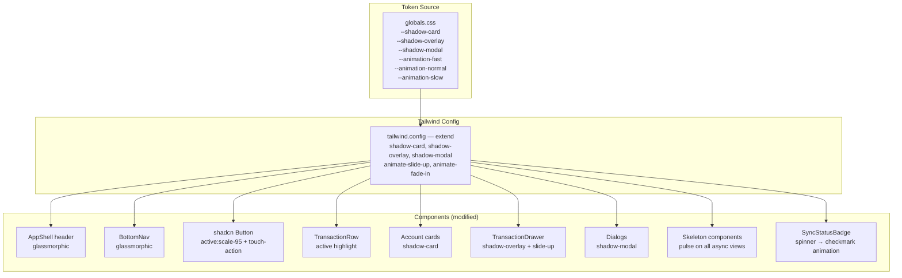
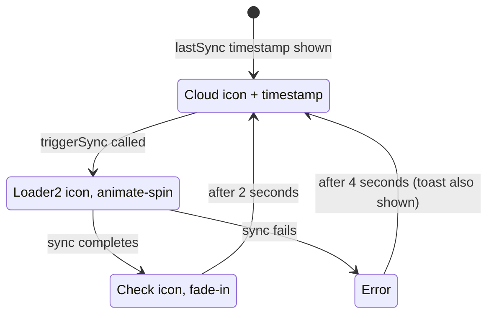

# Technical Design: UI/UX Polish — Mobile-First Visual Redesign

**Document Version:** 1.0  
**Last Updated:** 2026-07-04  
**Mode:** New Feature  
**PRD Reference:** docs/ui-ux-polish/prd.md  
**Repository:** mizantrack

---

## Table of Contents

1. [Executive Summary](#1-executive-summary)
2. [Requirements Summary](#2-requirements-summary)
3. [Architecture — Phase 1](#3-architecture--phase-1)
   - [Design System Overview](#31-design-system-overview)
   - [Component Change Map](#32-component-change-map)
   - [Technology Decisions](#33-technology-decisions)
   - [Key Design Decisions](#34-key-design-decisions)
4. [Design Token System](#4-design-token-system)
5. [Component Changes](#5-component-changes)
6. [Loading State System](#6-loading-state-system)
7. [Touch Feedback System](#7-touch-feedback-system)
8. [Animation System](#8-animation-system)
9. [Testing Strategy](#9-testing-strategy)
10. [Implementation Plan](#10-implementation-plan)
11. [Open Questions & Assumptions](#11-open-questions--assumptions)

---

## Document Change Log

| Version | Date       | Author             | Changes       |
|---------|------------|--------------------|---------------|
| 1.0     | 2026-07-04 | Salman Zahid Latif | Phase 1 draft |

---

## 1. Executive Summary

UI/UX Polish delivers a mobile-first visual and interaction refresh with no new features or pages. Changes are entirely **additive CSS and component-level modifications** — no data layer, routing, or state management changes.

The work divides into four systems:
1. **Design tokens** — shadow levels, animation durations, glassmorphic surfaces defined as CSS custom properties in `globals.css`
2. **Touch feedback** — `active:scale-95` and active-state highlights on all interactive elements; `touch-action: manipulation` to eliminate 300ms tap delay
3. **Loading states** — skeleton components for every async data view (balances, transaction list, charts)
4. **Micro-animations** — drawer open/close spring, fade transitions, sync status badge animation

All animation CSS respects `prefers-reduced-motion`. No new npm packages are needed.

---

## 2. Requirements Summary

Derived from `docs/ui-ux-polish/prd.md`.

**Functional (must-have):**
- Shadow system: 3 elevation levels (`shadow-card`, `shadow-overlay`, `shadow-modal`)
- Glassmorphic header and bottom nav: `backdrop-blur-sm bg-background/80`
- Touch feedback: `active:scale-95` on buttons; background highlight on list rows
- All tap targets ≥ 44×44px
- Loading skeletons: balances, transaction list rows, charts
- Sync badge: spinner on active sync; 2-second checkmark flash on completion
- Drawer open/close: spring slide animation
- `prefers-reduced-motion` compliance on all animations

**Not in scope:** new pages, features, brand redesign, animation library.

**Constraints:**
- CSS and Tailwind utilities only — no JS animation library
- No new npm packages
- Page transitions via View Transitions API are out of scope (OQ-04 — insufficient iOS Safari support)
- `backdrop-filter` performance on low-end Android must be benchmarked before shipping (OQ-05)

---

## 3. Architecture — Phase 1

### 3.1 Design System Overview

All visual tokens are defined in one place: `src/app/globals.css`. Components consume them via Tailwind utility classes. No new theming library is introduced.



### 3.2 Component Change Map

| Component | Type of change |
|---|---|
| `AppShell.tsx` header | Add `backdrop-blur-sm bg-background/80` glassmorphic treatment |
| `BottomNav.tsx` | Same glassmorphic treatment; add `pb-[env(safe-area-inset-bottom)]` |
| All `<Button>` | Add `active:scale-95 transition-transform touch-action-manipulation` |
| `TransactionRow.tsx` | Add `active:bg-muted/50` on the row wrapper |
| `AccountCard.tsx` / `BalanceCard` | Add `shadow-card` class |
| `TransactionDrawer.tsx` | Add `shadow-overlay`; animate slide-up via CSS keyframe |
| All `<Dialog>` | Add `shadow-modal` class via `DialogContent` |
| `SyncStatusBadge.tsx` | Add spinner (existing Lucide `Loader2 animate-spin`); add checkmark flash state |
| `SkeletonBalance.tsx` (new) | Pulse placeholder matching balance card dimensions |
| `SkeletonTransactionList.tsx` (new) | 5 placeholder rows matching `TransactionRow` dimensions |
| `SkeletonChart.tsx` (new) | Rectangular pulse placeholder for Recharts |

### 3.3 Technology Decisions

| Concern | Choice | Rationale |
|---|---|---|
| Animations | CSS keyframes + Tailwind `animate-*` utilities | No JS runtime cost; respects `prefers-reduced-motion` via `@media` query; zero new deps |
| Shadow system | CSS custom properties in `globals.css` + Tailwind `extend.boxShadow` | Single source of truth; dark mode aware |
| Touch delay elimination | `touch-action: manipulation` CSS property | Standard, widely supported; eliminates 300ms click delay on iOS/Android |
| iOS tap highlight removal | `-webkit-tap-highlight-color: transparent` on interactive elements | Replaces default blue flash with custom active state |
| Safe area insets | `env(safe-area-inset-bottom)` on bottom nav | Prevents content overlap with iPhone home indicator |
| Skeleton pattern | Tailwind `animate-pulse bg-muted rounded` | Zero new components needed for the base pattern; bespoke wrappers match real content |

### 3.4 Key Design Decisions

| Decision | Choice | Rationale |
|---|---|---|
| Page transitions | Not implemented | View Transitions API has insufficient iOS Safari support; would require a JS wrapper with questionable reliability |
| `backdrop-filter` gate | No JS feature detection for v1 — pure CSS fallback | `@supports (backdrop-filter: blur(1px))` fallback in CSS is sufficient; no JS needed |
| Animation durations | Fast: 80ms, Normal: 200ms, Slow: 300ms | Standard timing for micro-interactions that feels native |
| Drawer animation | CSS `transform: translateY` from 100% to 0, `transition: transform 250ms spring-like cubic-bezier` | Vaul (already installed) already handles this — leverage existing library |
| Shadow color | `rgba(0,0,0,N)` for light mode; `rgba(0,0,0,N*2)` for dark mode | Neutral black shadows work on any background color |

---

## 4. Design Token System

All tokens defined in `src/app/globals.css`:

```css
/* Shadow elevation system */
@layer base {
  :root {
    --shadow-card: 0 1px 3px rgba(0,0,0,0.08), 0 1px 2px rgba(0,0,0,0.04);
    --shadow-overlay: 0 4px 16px rgba(0,0,0,0.12), 0 2px 6px rgba(0,0,0,0.06);
    --shadow-modal: 0 16px 48px rgba(0,0,0,0.18), 0 4px 16px rgba(0,0,0,0.08);
    --anim-fast: 80ms;
    --anim-normal: 200ms;
    --anim-slow: 300ms;
  }
  .dark {
    --shadow-card: 0 1px 3px rgba(0,0,0,0.20), 0 1px 2px rgba(0,0,0,0.12);
    --shadow-overlay: 0 4px 16px rgba(0,0,0,0.30), 0 2px 6px rgba(0,0,0,0.16);
    --shadow-modal: 0 16px 48px rgba(0,0,0,0.40), 0 4px 16px rgba(0,0,0,0.20);
  }
}
```

Tailwind extension in `tailwind.config.ts` (or `globals.css` `@theme` block for Tailwind v4):
```
shadow-card   → var(--shadow-card)
shadow-overlay → var(--shadow-overlay)
shadow-modal  → var(--shadow-modal)
```

**`prefers-reduced-motion` global rule:**
```css
@media (prefers-reduced-motion: reduce) {
  *, *::before, *::after {
    animation-duration: 0.01ms !important;
    transition-duration: 0.01ms !important;
  }
}
```

---

## 5. Component Changes

### AppShell Header
```
Before: className="sticky top-0 z-50 border-b border-border bg-background"
After:  className="sticky top-0 z-50 border-b border-border bg-background/80 backdrop-blur-sm"
```

### BottomNav
```
Before: className="fixed bottom-0 ... bg-background border-t"
After:  className="fixed bottom-0 ... bg-background/80 backdrop-blur-sm border-t
                   pb-[env(safe-area-inset-bottom,0px)]"
```

### Button (shadcn/ui component override in `components/ui/button.tsx`)

Add to the base variant classes:
```
active:scale-95 transition-transform duration-[80ms] [touch-action:manipulation]
[-webkit-tap-highlight-color:transparent]
```

### TransactionRow

Wrap tappable area:
```tsx
<div className="active:bg-muted/50 transition-colors duration-[80ms] [touch-action:manipulation]">
```

### Account / Balance Cards

Add `shadow-card` to all card containers.

---

## 6. Loading State System

### Three New Skeleton Components

**`SkeletonBalance.tsx`**
```tsx
// Matches BalanceCard dimensions: ~160px wide, 3 lines
<div className="rounded-xl border shadow-card p-4 space-y-2">
  <div className="h-4 w-24 animate-pulse bg-muted rounded" />   {/* title */}
  <div className="h-3 w-12 animate-pulse bg-muted rounded" />   {/* currency */}
  <div className="h-6 w-28 animate-pulse bg-muted rounded" />   {/* balance */}
</div>
```

**`SkeletonTransactionRow.tsx`**
```tsx
// 5 of these shown in TransactionList while loading
<div className="flex items-center gap-3 px-4 py-3">
  <div className="h-9 w-9 rounded-full animate-pulse bg-muted" />
  <div className="flex-1 space-y-1.5">
    <div className="h-4 w-32 animate-pulse bg-muted rounded" />
    <div className="h-3 w-20 animate-pulse bg-muted rounded" />
  </div>
  <div className="h-5 w-16 animate-pulse bg-muted rounded" />
</div>
```

**`SkeletonChart.tsx`**
```tsx
// Matches TrendChart / CategoryBreakdownChart container
<div className="rounded-xl border shadow-card p-4">
  <div className="h-4 w-32 animate-pulse bg-muted rounded mb-4" />
  <div className="h-40 animate-pulse bg-muted rounded" />
</div>
```

### Hook Pattern

All components that use `useLiveQuery` already return `undefined` while loading. The pattern is:

```tsx
const transactions = useTransactions(userId, filters);

if (transactions === undefined) return <SkeletonTransactionRow count={5} />;
if (transactions.length === 0) return <EmptyState />;
return <TransactionList transactions={transactions} />;
```

---

## 7. Touch Feedback System

### CSS Rules (global, in `globals.css`)

```css
/* Eliminate 300ms tap delay on all interactive elements */
button, a, [role="button"], [role="link"] {
  touch-action: manipulation;
  -webkit-tap-highlight-color: transparent;
}

/* Minimum tap target size */
button, a, [role="button"] {
  min-height: 44px;
  min-width: 44px;
}
```

### Tailwind Active States

Applied to Button base class:
```
active:scale-95 transition-transform duration-75
```

Applied to list rows and card interactions:
```
active:bg-muted/50 transition-colors duration-75
```

---

## 8. Animation System

### Sync Status Badge States



### Drawer Animation

Vaul (already installed) handles drawer slide animation natively. Ensure `snapPoints` and transition props match the desired feel:
- Open: `translateY(100%) → translateY(0)` with `cubic-bezier(0.32, 0.72, 0, 1)` (iOS-like spring feel)
- Close: reverse, 200ms

No changes to Vaul configuration are needed — the existing `Drawer` component already animates. Verify it does by checking the current CSS.

---

## 9. Testing Strategy

| Layer | Tests |
|---|---|
| Visual regression | Playwright screenshot diff: header glassmorphic on scroll; account card with shadow; lock screen full-viewport |
| Accessibility audit | Lighthouse / axe: all interactive elements ≥ 44×44px; no focus ring removed |
| Unit | `SkeletonBalance`, `SkeletonTransactionRow`, `SkeletonChart`: render without error |
| Manual — device | iPhone (iOS 16+): Face ID prompt, backdrop-filter appearance, bottom nav safe area |
| Manual — device | Android (Chrome): fingerprint prompt, backdrop-filter performance, tap feedback |
| `prefers-reduced-motion` | Browser devtools: all animations disabled; layout unaffected |

---

## 10. Implementation Plan

| Phase | Tasks |
|---|---|
| 1 — Tokens | Add CSS custom properties to `globals.css`; extend Tailwind config with shadow/animation utilities |
| 2 — Glassmorphic | Update `AppShell` header + `BottomNav` with `backdrop-blur-sm bg-background/80` |
| 3 — Touch Feedback | Global CSS rules for touch-action; `Button` active:scale-95; `TransactionRow` active highlight |
| 4 — Shadows | Apply `shadow-card` to cards; `shadow-overlay` to drawers; `shadow-modal` to dialogs |
| 5 — Skeletons | Create 3 skeleton components; wire into `BalanceCards`, `TransactionList`, `TrendChart`, `CategoryBreakdownChart` |
| 6 — Sync Badge | Add spinner + checkmark flash states to `SyncStatusBadge` |
| 7 — Tap target audit | Check all interactive elements; fix any < 44px |
| 8 — Reduced motion | Add global `prefers-reduced-motion` rule; verify in devtools |
| 9 — Device testing | iPhone + Android manual smoke test; `backdrop-filter` perf check on low-end Android |

**Technical Risks:**

| Risk | Impact | Mitigation |
|---|---|---|
| `backdrop-filter` causes jank on low-end Android | Medium | Test on a Snapdragon 6xx device; if jank detected, apply `@supports` fallback to disable it on low-end |
| `active:scale-95` feels jittery on fast taps | Low | Adjust `transition-duration` from 75ms to 50ms if needed |
| Safe area inset `env()` not supported on older Android WebView | Low | Fallback to `padding-bottom: 16px` via `@supports` |

---

## 11. Open Questions & Assumptions

| # | Item | Status |
|---|---|---|
| OQ-04 | Page transitions (View Transitions API) | **Out of scope** for v1 — insufficient iOS Safari support |
| OQ-05 | `backdrop-filter` on low-end Android | **Flagged risk** — benchmark required before shipping |
| OQ-03 | Skeleton timeout state (> 5s loading) | **Out of scope for v1** — infinite skeleton is acceptable |
| F | Vaul drawer already animates adequately | **Assumed** — verify in device testing |
| G | Tailwind v4 uses `@theme` block instead of `tailwind.config.ts` for custom values | **Verified** — confirmed by project setup |
