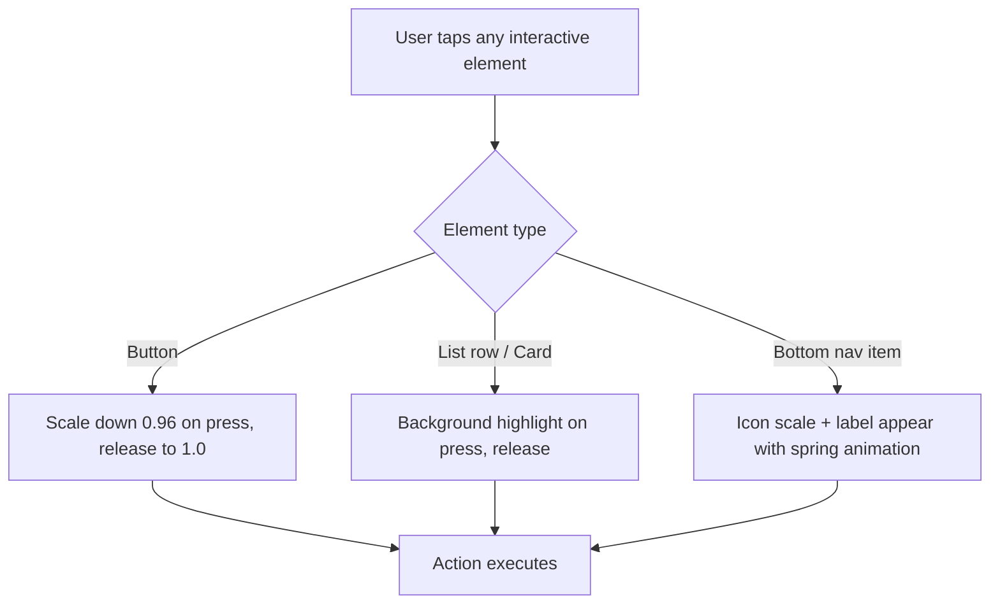
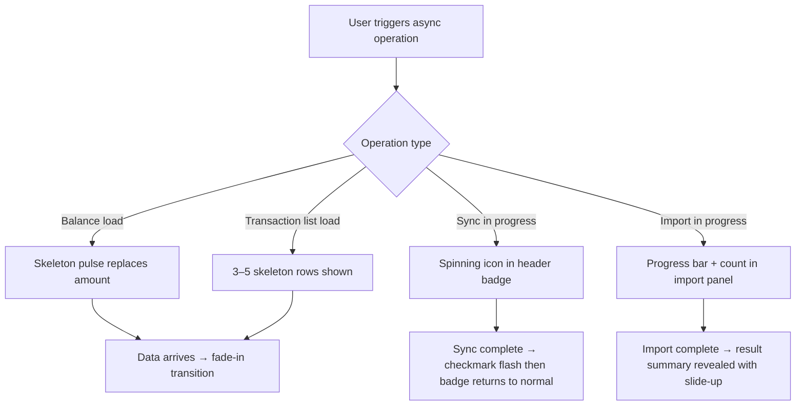
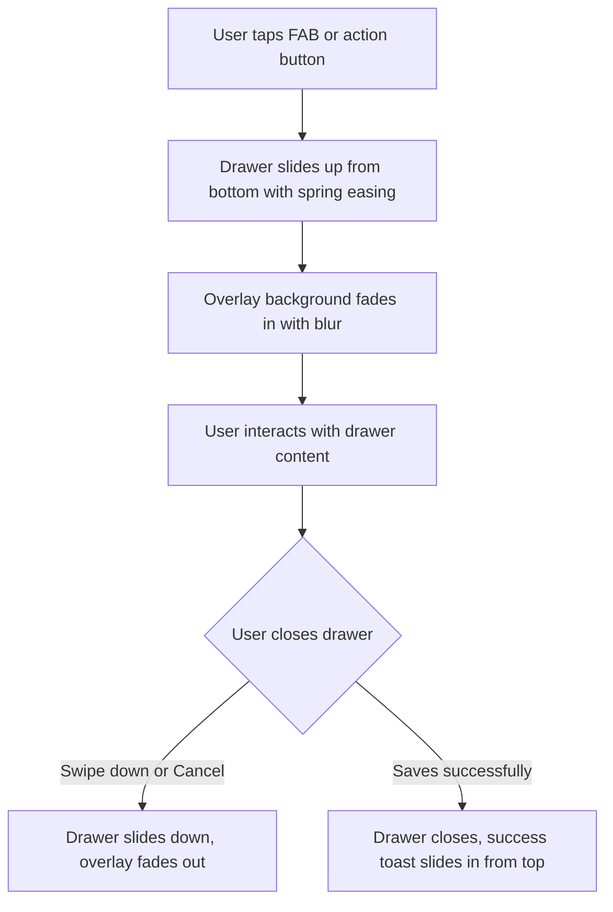

# Product Requirements Document (PRD)

**Feature:** UI/UX Polish — Mobile-First Visual Redesign  
**Product:** MizanTrack  
**Version:** 1.0  
**Date:** 2026-07-04  
**Owner:** Salman Zahid Latif  
**Status:** Draft

---

## Table of Contents

- [1. Executive Summary](#1-executive-summary)
- [2. Problem Statement](#2-problem-statement)
- [3. Goals & Non-Goals](#3-goals--non-goals)
- [4. User Flows](#4-user-flows)
- [5. Functional Requirements](#5-functional-requirements)
- [6. User Interface (UI) Design](#6-user-interface-ui-design)
- [7. Non-Functional Requirements](#7-non-functional-requirements)
- [8. Success Metrics](#8-success-metrics)
- [9. Open Questions / Risks](#9-open-questions--risks)

---

## Document Change Log

| Version | Date       | Author             | Changes         |
|---------|------------|--------------------|-----------------|
| 1.0     | 2026-07-04 | Salman Zahid Latif | Initial draft   |

---

## 1. Executive Summary

MizanTrack's current UI is functional but visually flat, with minimal depth, no tactile feedback, and interaction states that are difficult to discern on a mobile touch screen. As a PWA used primarily on iPhone and Android, the app needs visual and interaction improvements that make it feel native — responsive to every tap, visually rich with appropriate depth, and confident in communicating state changes.

This feature delivers a **mobile-first UI/UX refresh**: glassmorphic-style depth on cards and overlays, consistent shadow system, tactile touch feedback on all interactive elements, clear loading/success/error visual states, and micro-animations that confirm user actions without being distracting.

---

## 2. Problem Statement

| Pain Point | Description |
|---|---|
| No tap feedback on mobile | Tapping buttons, list rows, or cards on the PWA gives no visual confirmation that the tap was registered. Users often tap twice. |
| Flat, undifferentiated visual hierarchy | Cards, headers, modals, and content all sit at the same visual plane — no depth cues to distinguish interactive from static elements. |
| No loading or transition states | Async operations (sync, import, balance computation) show no progress; the UI appears frozen. |
| Generic appearance | The app uses default shadcn/ui styling with no visual identity. It does not feel like a finance app — it feels like a component demo. |

---

## 3. Goals & Non-Goals

### Goals

- Add a consistent **shadow system** (3 elevation levels: card, overlay, modal) across all surfaces.
- Apply a **glassmorphic** style to the header, bottom navigation bar, modals, and sheets: `backdrop-blur` + semi-transparent background.
- Implement **touch feedback** on all tappable elements: active scale-down animation, ripple, or highlight on press.
- Add **loading skeletons** for every data-dependent view (balances, transaction list, reports charts).
- Add **micro-animations** for state transitions: drawer open/close, tab switch, sync completion, import success.
- Ensure all interactive tap targets meet minimum size requirements for comfortable mobile use (min 44×44px per Apple HIG).
- Standardize the **color palette** and **typography scale** for a more polished, finance-app feel.

### Non-Goals

- Full brand redesign or logo change.
- Dark/light theme redesign (existing `next-themes` setup is preserved).
- Adding new pages or features as part of this work.
- Animation library adoption (use CSS and Tailwind utilities; avoid heavy animation frameworks).

---

## 4. User Flows

No new user flows are introduced — this feature improves the visual and interaction quality of all existing flows. Key moments that receive specific attention:

### 4.1 Tap Interaction Feedback

### 4.2 Async Operation States

### 4.3 Drawer / Sheet Open

---

## 5. Functional Requirements

### FR-UI-001: Shadow System

| ID | Requirement | Acceptance Criteria |
|---|---|---|
| FR-SHADOW-001 | Three elevation levels MUST be defined as CSS custom properties and Tailwind utility classes: `shadow-card`, `shadow-overlay`, `shadow-modal`. | AC: All three class names apply distinct box-shadows; design token values are defined in `globals.css`. |
| FR-SHADOW-002 | All `Card` components MUST use `shadow-card`. Sheets/Drawers MUST use `shadow-overlay`. Dialogs/Modals MUST use `shadow-modal`. | AC: Visual regression shows consistent shadow depth across dark and light themes. |

### FR-UI-002: Glassmorphic Surfaces

| ID | Requirement | Acceptance Criteria |
|---|---|---|
| FR-GLASS-001 | The top header MUST use a semi-transparent background with `backdrop-blur` when the page content scrolls beneath it. | AC: Scrolling the dashboard causes the header to show a frosted-glass appearance over the content. |
| FR-GLASS-002 | The bottom navigation bar MUST use a semi-transparent background with `backdrop-blur`. | AC: The bottom nav appears frosted over the page content on scroll. |
| FR-GLASS-003 | Glassmorphic styles MUST be applied only using CSS `backdrop-filter` and `bg-background/80` — no third-party library. | AC: No new animation or glass library is added to `package.json`. |
| FR-GLASS-004 | Glassmorphic styles MUST degrade gracefully on browsers that do not support `backdrop-filter` (falls back to solid background). | AC: On a browser without `backdrop-filter` support, the header/nav shows a solid opaque background. |

### FR-UI-003: Touch Feedback

| ID | Requirement | Acceptance Criteria |
|---|---|---|
| FR-TOUCH-001 | All `Button` components MUST apply a scale-down transform on the `active` pseudo-class: `active:scale-95`. | AC: Tapping any button on a touch device causes a visible press-down effect. |
| FR-TOUCH-002 | All tappable list rows (transaction rows, account cards, category items) MUST apply a background highlight on `active`. | AC: Pressing a transaction row shows a highlighted background that clears on release. |
| FR-TOUCH-003 | All interactive tap targets MUST have a minimum size of 44×44px. | AC: No interactive element passes a tap-target audit with a size below 44×44px. |
| FR-TOUCH-004 | The `cursor-pointer` CSS class MUST be present on all interactive elements for desktop users. | AC: Hovering any button or interactive element on desktop shows the pointer cursor. |

### FR-UI-004: Loading States

| ID | Requirement | Acceptance Criteria |
|---|---|---|
| FR-SKEL-001 | Every numeric balance display MUST show a skeleton pulse while its `useLiveQuery` hook returns `undefined`. | AC: On initial load or cache miss, balance cards show a pulsing placeholder, not `0` or a blank. |
| FR-SKEL-002 | The transaction list MUST show 5 skeleton rows while transactions are loading. | AC: Transaction page displays skeleton rows before real data appears. |
| FR-SKEL-003 | Chart components (TrendChart, CategoryBreakdownChart) MUST show a skeleton while data loads. | AC: Charts show a shimmer placeholder before rendering. |
| FR-SKEL-004 | The sync status badge MUST show a spinner icon during active sync and a checkmark flash on completion. | AC: Triggering sync shows a spinner; on completion the spinner is replaced by a checkmark for 2 seconds. |

### FR-UI-005: Micro-Animations

| ID | Requirement | Acceptance Criteria |
|---|---|---|
| FR-ANIM-001 | Drawers MUST animate open/close with a spring slide-up/down using CSS transitions (no JS animation library). | AC: Drawer open/close is smooth at 60fps on a mid-range Android device. |
| FR-ANIM-002 | Page transitions between bottom nav items MUST use a subtle fade or slide transition. | AC: Switching tabs does not cause a jarring flash; a ≤ 150ms fade is applied. |
| FR-ANIM-003 | Toast notifications MUST slide in from the top and slide out on dismiss. | AC: All Sonner toasts animate in/out; no abrupt appear/disappear. |
| FR-ANIM-004 | All animations MUST respect the OS `prefers-reduced-motion` media query — disabled when the user has requested reduced motion. | AC: With reduced motion enabled in accessibility settings, no CSS animations fire. |

### FR-UI-006: Typography & Color

| ID | Requirement | Acceptance Criteria |
|---|---|---|
| FR-TYPE-001 | A consistent typographic scale MUST be used: `text-2xl font-bold` for page titles, `text-lg font-semibold` for section headers, `text-sm text-muted-foreground` for labels. | AC: No ad-hoc font sizes appear outside the defined scale in any page component. |
| FR-COLOR-001 | Income amounts MUST be consistently green (`text-emerald-600 dark:text-emerald-400`); expense amounts red (`text-red-600 dark:text-red-400`); transfer amounts blue (`text-blue-600 dark:text-blue-400`). | AC: All `CurrencyAmount` components with `colorized` prop use this exact class set. |

---

## 6. User Interface (UI) Design

### Elevation Model

| Level | Usage | Shadow definition |
|---|---|---|
| `shadow-card` | Account cards, stat cards, list containers | Soft, low-spread shadow |
| `shadow-overlay` | Bottom sheets, drawers | Medium shadow with slight spread |
| `shadow-modal` | Dialogs, alert modals | Larger, more prominent shadow |

### Glassmorphic Treatment

- Header: `bg-background/80 backdrop-blur-sm border-b border-border`
- Bottom Nav: `bg-background/80 backdrop-blur-sm border-t border-border`
- Overlays behind drawers/modals: semi-transparent dark scrim with subtle blur

### Touch Interaction States

Every interactive surface passes through three visual states:
1. **Default** — resting state
2. **Active (pressed)** — `active:scale-95` + background highlight
3. **Disabled** — `opacity-50 cursor-not-allowed`

### Skeleton Components

- Pulse animation: `animate-pulse bg-muted rounded`
- Skeleton shapes match the real content dimensions exactly to avoid layout shift on load

### Animation Timing

- Micro-interactions (button press, tap highlight): 80–120ms
- Drawer open/close: 250ms spring
- Page transitions: 150ms ease-out
- Toast slide: 200ms ease-in-out
- All durations MUST respect `prefers-reduced-motion`

### PWA-Specific Considerations

- `touch-action: manipulation` on all interactive elements to eliminate the 300ms tap delay
- `-webkit-tap-highlight-color: transparent` to remove default iOS blue tap flash (replaced with custom active states)
- Safe area insets (`env(safe-area-inset-bottom)`) on the bottom nav to avoid overlap with iPhone home indicator

---

## 7. Non-Functional Requirements

### 7.1 Performance & Latency

- Animations target 60fps on mid-range Android (Snapdragon 6xx equivalent)
- `backdrop-filter` is GPU-accelerated on all modern iOS and Android; should not impact scroll performance
- Skeleton components add zero additional data fetching — they are purely UI placeholders

### 7.2 Security & Privacy

- No external font, icon, or animation CDN introduced (all existing deps already loaded locally)
- No impact on data security

### 7.3 Error Handling

| Error Scenario | User-Facing Message | Recovery Action |
|---|---|---|
| `backdrop-filter` not supported | Silent fallback to solid background | No user action required |
| Animation frame drop below 30fps | CSS animation plays at native speed regardless; no fallback needed | N/A |
| Skeleton shows for > 5s (data never arrives) | [TBD: timeout state with retry CTA?] | [TBD] |

### 7.4 Scalability

- No scalability implications — purely visual/interaction changes

### 7.5 Cost

- No external services, APIs, or libraries added
- Zero additional infrastructure cost

---

## 8. Success Metrics

| Metric | Target |
|---|---|
| Animation frame rate (drawer open/close) | ≥ 60fps on mid-range Android |
| Tap target size compliance | 100% of interactive elements ≥ 44×44px |
| Skeleton present for all async data views | 100% — no loading state shows raw `0` or blank |
| `prefers-reduced-motion` compliance | 100% — all animations disabled when OS requests it |
| User-reported "tap not registered" complaints | Reduction to 0 after feedback from primary user |

---

## 9. Open Questions / Risks

| # | Question | Impact | Priority |
|---|---|---|---|
| OQ-01 | Which specific glassmorphic accent color should be used for the header/nav in light mode vs dark mode? Currently `bg-background/80` — does this need a brand color tint? | Low | Decide in design phase |
| OQ-02 | Should the bottom nav labels animate in on first install (onboarding hint) or are they always visible? | Low | Nice-to-have |
| OQ-03 | The Skeleton timeout (OQ from §7.3 error table): should stale/never-arriving data show a retry CTA after a threshold? | Medium | Decide before dev |
| OQ-04 | Page transitions: on some PWA setups, `router.push()` in Next.js App Router does not easily support CSS transitions between pages. This may require the View Transitions API (Chrome 111+, limited iOS Safari support) or a wrapper component. | High — may not be achievable cross-browser | Evaluate in tech spike before committing |
| OQ-05 | `backdrop-filter` on Android Chrome has historically had performance issues on low-end devices. Benchmark before shipping. | Medium — could cause jank | Test in Phase 0 |
